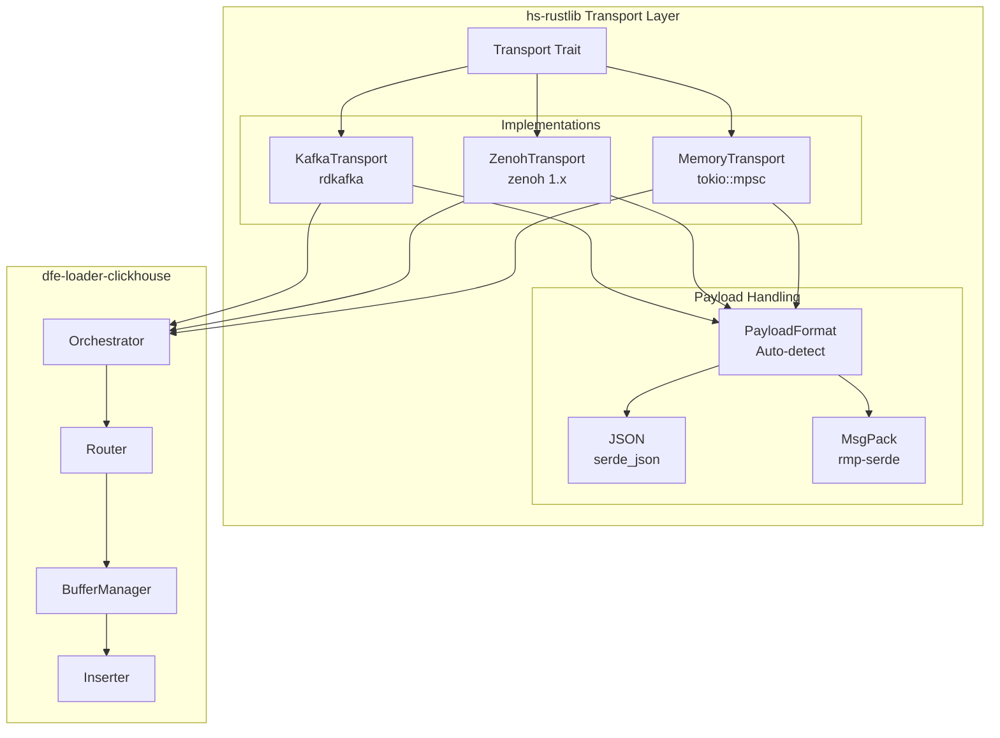

# Design Document: dfe-loader-clickhouse

**Version:** 2.1 (Arrow Architecture + Transport Abstraction)
**Date:** 2025-12-29

---

## Overview

High-performance data loader from message transports to ClickHouse using Apache Arrow.

```text
Transport ──► Parse ──► Route ──► Transform ──► Buffer ──► ClickHouse Native
(Kafka/Zenoh/Memory)  (SIMD)   (db.table)  (vectorized)  (per-table)   (Arrow protocol)
```

### Transport Selection

| Transport | Use Case | Persistence | Latency |
|-----------|----------|-------------|---------|
| **Kafka** | Production (default) | At-least-once with offset tracking | ~1-5ms |
| **Zenoh** | Dev/test, edge, real-time | In-flight only (no persistence) | ~30µs with SHM |
| **Memory** | Unit tests | None | ~1µs |

---

## Design Goals

1. **Maximize throughput**: Vectorized column operations, not row-by-row
2. **Minimize memory churn**: Chunk lifecycle, Arc-sharing, zero-copy where possible
3. **At-least-once delivery**: Kafka offset tracking per chunk
4. **Schema flexibility**: On-demand introspection, periodic refresh
5. **Clean architecture**: Immutable data, functional transforms

---

## Zero-Copy Analysis

### Where We Achieve Zero-Copy

| Stage | Zero-Copy? | Notes |
|-------|------------|-------|
| Transform unchanged columns | ✅ Yes | Arc clone, no data copy |
| Chunk partition by destination | ✅ Yes | Index-based selection |
| Chunk ack | ✅ Yes | Drop Arc reference, O(1) |
| Arrow → CH (simple types) | ✅ Yes | Columnar layout matches |

### Where Copy is Required

| Stage | Why | Optimization |
|-------|-----|--------------|
| JSON parse | Text → typed values | arrow-json SIMD |
| MsgPack parse | Binary → typed values | Direct to Arrow builders |
| Type coercion | String → Int, etc. | Vectorized column ops |
| Enrichment | New columns | Build entire column in batch |
| Complex types | Variant/Dynamic | Minimize through schema design |

---

## Core Principle: Column Operations, Not Row-by-Row

**BAD (row-by-row):**
```rust
for row in batch.iter_rows() {
    row.set("country", geoip.lookup(row.get("ip")));  // O(n) overhead per row
}
```

**GOOD (column operations):**
```rust
// Get entire IP column at once
let ips: &StringArray = batch.column("ip").as_string();

// Build entire country column at once
let mut countries = StringBuilder::with_capacity(ips.len());
for ip in ips.iter() {
    countries.append_value(geoip.lookup(ip));
}

// Create new batch with Arc-shared original + new column
let new_batch = add_column(batch, "country", countries.finish());
```

---

## Core Components

### 1. Per-Table Buffer Architecture

Each destination table (db.table) has its own ArrowBatchBuilder. This ensures schema
uniformity within each Arrow RecordBatch.

```rust
struct BufferManager {
    // Per-table buffers: key is "db.table"
    buffers: HashMap<String, TableBuffer>,
    // Cached schemas per table (from ClickHouse introspection)
    schemas: HashMap<String, TableSchema>,
}

struct TableBuffer {
    builder: ArrowBatchBuilder,       // Accumulates JSON objects
    offsets: Vec<KafkaOffset>,        // Kafka offsets for at-least-once
    created_at: Instant,              // For time-based flush
}
```

**Why per-table?**

- **Schema uniformity**: Arrow RecordBatch requires all rows to have the same schema
- **Schema introspection**: Each table's schema derived from ClickHouse `system.columns`
- **Independent flush**: High-volume tables flush more often, low-volume wait for age trigger
- **Memory efficient**: Data stays as JSON until batch is ready, then converts to Arrow

**Lifecycle:**

1. Kafka message → Parse JSON/MsgPack → Route to db.table
2. Push to per-table ArrowBatchBuilder (with Kafka offset)
3. When ready (row count, time): Build Arrow RecordBatch
4. Insert to ClickHouse via native protocol
5. Success: Ack Kafka offsets
6. Failure: Retry batch

### 2. Dynamic db.table Routing

Routing happens **PRE-flattening** on the original nested JSON/MessagePack structure.
Both formats deserialize to `serde_json::Value` with the same nested structure.

```rust
// Config (from ENV/config cascade)
struct RoutingConfig {
    db_fields: Vec<String>,      // ["org_id"]
    table_fields: Vec<String>,   // ["event_category", "tags.event_category"]
    default_db: String,          // "common"
    default_table: String,       // "common"
}

// Routing logic
fn route_to_table(event: &Value, config: &RoutingConfig) -> String {
    // Extract db from first matching field
    let db = config.db_fields.iter()
        .find_map(|path| get_nested_value(event, path))
        .map(|v| v.as_str().unwrap_or(&config.default_db))
        .unwrap_or(&config.default_db);

    // Extract table from first matching field
    let table = config.table_fields.iter()
        .find_map(|path| get_nested_value(event, path))
        .map(|v| v.as_str().unwrap_or(&config.default_table))
        .unwrap_or(&config.default_table);

    format!("{}.{}", db, table)
}

// Dot notation for nested access: "tags.event_category" → event["tags"]["event_category"]
fn get_nested_value<'a>(event: &'a Value, path: &str) -> Option<&'a Value> {
    path.split('.').try_fold(event, |v, key| v.get(key))
}
```

**Example:**

```json
{
  "org_id": "acme",
  "event_category": "auth",
  "tags": { "event_category": "login" },
  "data": { ... }
}
```

With default config:
- `db_fields = ["org_id"]` → finds "acme"
- `table_fields = ["event_category", "tags.event_category"]` → finds "auth"
- Result: `acme.auth`

### 3. Transform Pipeline (Immutable Batches)

Arrow batches are **immutable**. Transforms build **new batches** with column operations:

```rust
fn transform_pipeline(batch: RecordBatch) -> Result<RecordBatch> {
    // Each transform operates on COLUMNS, not rows
    // Unchanged columns are Arc-shared (zero-copy)

    let batch = add_destination_column(batch, &router)?;    // New column
    let batch = flatten_nested_json(batch)?;                 // Column transforms
    let batch = enrich_geoip_column(batch, "src_ip")?;       // Vectorized lookup
    let batch = add_load_timestamp_column(batch)?;           // New column

    Ok(batch)
}
```

**Column sharing example:**

```rust
fn add_column(batch: RecordBatch, name: &str, col: ArrayRef) -> RecordBatch {
    let mut columns = batch.columns().to_vec();  // Vec of Arc, no data copy
    columns.push(col);                            // Add new column
    RecordBatch::try_new(new_schema, columns)     // Build new batch
}
```

### 3. Schema Registry (On-Demand + Refresh)

```rust
struct SchemaRegistry {
    schemas: HashMap<String, TableSchema>,
    last_refresh: HashMap<String, Instant>,
    refresh_interval: Duration,
    client: Arc<ClickHouseClient>,
}

impl SchemaRegistry {
    async fn get_or_fetch(&mut self, table: &str) -> Result<&TableSchema> {
        let needs_refresh = self.last_refresh
            .get(table)
            .map(|t| t.elapsed() > self.refresh_interval)
            .unwrap_or(true);

        if needs_refresh {
            let schema = self.fetch_from_clickhouse(table).await?;
            self.schemas.insert(table.to_string(), schema);
            self.last_refresh.insert(table.to_string(), Instant::now());
        }

        Ok(self.schemas.get(table).unwrap())
    }
}
```

### 4. ClickHouse Insert (Native Protocol)

Using clickhouse-arrow fork with Variant/Dynamic/Nested types:

```rust
async fn insert_arrow(client: &Client, table: &str, batch: RecordBatch) -> Result<()> {
    // clickhouse-arrow handles Arrow → ClickHouse native serialization
    // Zero-copy for types with matching layout (Int, Float, String)
    client.insert_arrow(table, batch).await
}
```

---

## Data Flow

```text
┌─────────────────────────────────────────────────────────────────────┐
│                         Kafka Consumer                               │
│  - Stream of messages (bytes)                                       │
│  - Track partition/offset per message                               │
└────────────────────────────┬────────────────────────────────────────┘
                             │
                             ▼
┌─────────────────────────────────────────────────────────────────────┐
│                      JSON/MsgPack Parser                            │
│  - sonic-rs for JSON (SIMD)                                         │
│  - rmp-serde for MessagePack                                        │
│  - Output: serde_json::Value per message                            │
└────────────────────────────┬────────────────────────────────────────┘
                             │
                             ▼
┌─────────────────────────────────────────────────────────────────────┐
│                     Router (PRE-flattening)                          │
│  - Extract db from first matching field in priority list            │
│    Default: ["org_id"], fallback: "common"                          │
│  - Extract table from first matching field in priority list         │
│    Default: ["event_category", "tags.event_category"], fb: "common" │
│  - Dot notation for nested access (tags.event_category)             │
│  - Route to DLQ if configured                                       │
└────────────────────────────┬────────────────────────────────────────┘
                             │
                             ▼
┌─────────────────────────────────────────────────────────────────────┐
│                     Transform Pipeline                               │
│  1. Flatten: Nested JSON → flat columns                             │
│  2. Timestamp: Validate/correct timestamps                          │
│  3. Coerce: Type conversion (future: schema-aware)                  │
│  4. Enrich: GeoIP, risk score (future)                              │
│                                                                     │
│  Output: JSON Map per message                                       │
└────────────────────────────┬────────────────────────────────────────┘
                             │
                             ▼
┌─────────────────────────────────────────────────────────────────────┐
│                    Per-Table BufferManager                           │
│  - HashMap<db.table, ArrowBatchBuilder>                             │
│  - Each table has its own buffer (schema uniformity)                │
│  - Tracks Kafka offsets per buffer                                  │
│  - Schema from ClickHouse introspection                             │
└────────────────────────────┬────────────────────────────────────────┘
                             │
                             ▼ (flush trigger: rows, time per table)
┌─────────────────────────────────────────────────────────────────────┐
│                  Arrow RecordBatch Build                             │
│  - Convert buffered JSON objects to Arrow columnar format           │
│  - Single RecordBatch per table (uniform schema)                    │
│  - Efficient: batch all rows together, then build columns           │
└────────────────────────────┬────────────────────────────────────────┘
                             │
                             ▼
┌─────────────────────────────────────────────────────────────────────┐
│                    ClickHouse Inserter                               │
│  - Currently: JSON bridge (insert_arrow_via_json)                   │
│  - Future: clickhouse-arrow native protocol                         │
│  - Retry with exponential backoff                                   │
└────────────────────────────┬────────────────────────────────────────┘
                             │
                             ▼
┌─────────────────────────────────────────────────────────────────────┐
│                       Offset Ack                                     │
│  - On success: Commit Kafka offsets from batch                      │
│  - On failure: Retry batch, backpressure                            │
└─────────────────────────────────────────────────────────────────────┘
```

---

## Type Mappings

### ClickHouse → Arrow

| ClickHouse | Arrow | Notes |
|------------|-------|-------|
| Int8-64 | Int8-64 | Direct, zero-copy |
| UInt8-64 | UInt8-64 | Direct, zero-copy |
| Float32/64 | Float32/64 | Direct, zero-copy |
| String | Binary | UTF-8 not guaranteed |
| FixedString(N) | FixedSizeBinary(N) | Direct |
| UUID | FixedSizeBinary(16) | Raw bytes |
| Date/Date32 | Date32 | Direct |
| DateTime | Int32 | Unix timestamp |
| DateTime64 | Int64 | With precision |
| Array(T) | List(T) | Recursive |
| Map(K,V) | Map(K,V) | Arrow Map type |
| Tuple(...) | Struct | Named fields |
| Nullable(T) | T with null bitmap | Arrow native |
| LowCardinality(T) | Dictionary | Arrow dictionary encoding |
| Variant | Binary | Serialized |
| Dynamic | Binary | Serialized |
| JSON | Binary | Serialized |
| Nested | Struct of Lists | Parallel arrays |

---

## Memory Management

### Chunk Lifecycle

```
CREATE: Kafka batch → Arrow chunk (allocate)
BUFFER: Hold in ArrowBuffer (just pointer storage)
FLUSH:  Partition → insert (may clone for multi-table)
ACK:    Drop chunk (Arc refcount → 0 → deallocate)
```

### Arc Sharing (Zero-Copy Column Reuse)

```rust
// Original batch columns
let cols = batch.columns();  // Vec<Arc<dyn Array>>

// New batch with extra column - NO COPY of original data
let mut new_cols = cols.to_vec();  // Clone Arc pointers, not data
new_cols.push(Arc::new(new_column));
RecordBatch::try_new(schema, new_cols)
```

### Memory Pressure Handling

If memory pressure detected:

1. Reduce chunk size (smaller Kafka batches)
2. Flush more aggressively (lower thresholds)
3. Backpressure to Kafka consumer (pause)

---

## Vectorized Operations Examples

### GeoIP Enrichment (Column-wise)

```rust
fn enrich_geoip_column(batch: RecordBatch, ip_col: &str) -> Result<RecordBatch> {
    let ips = batch.column_by_name(ip_col)?.as_string();

    // Build ALL new columns at once
    let mut country = StringBuilder::with_capacity(ips.len());
    let mut city = StringBuilder::with_capacity(ips.len());
    let mut lat = Float64Builder::with_capacity(ips.len());
    let mut lon = Float64Builder::with_capacity(ips.len());

    // Single pass through IP column
    for ip in ips.iter() {
        match ip.and_then(|s| geoip.lookup(s)) {
            Some(geo) => {
                country.append_value(geo.country);
                city.append_value(geo.city);
                lat.append_value(geo.latitude);
                lon.append_value(geo.longitude);
            }
            None => {
                country.append_null();
                city.append_null();
                lat.append_null();
                lon.append_null();
            }
        }
    }

    // Build new batch with original columns (Arc-shared) + new columns
    add_columns(batch, vec![
        ("country", Arc::new(country.finish())),
        ("city", Arc::new(city.finish())),
        ("latitude", Arc::new(lat.finish())),
        ("longitude", Arc::new(lon.finish())),
    ])
}
```

### Type Coercion (Column-wise)

```rust
fn coerce_to_int64(col: &StringArray) -> Int64Array {
    let mut builder = Int64Builder::with_capacity(col.len());

    for val in col.iter() {
        match val.and_then(|s| s.parse::<i64>().ok()) {
            Some(n) => builder.append_value(n),
            None => builder.append_null(),
        }
    }

    builder.finish()
}
```

---

## Configuration

```yaml
buffer:
  flush_rows: 10000
  flush_bytes: 10485760  # 10MB
  flush_age_secs: 5

schema:
  refresh_interval_secs: 60
  on_error_refresh: true

transform:
  flatten_json: true
  flatten_separator: "."
  add_load_timestamp: true

enrichment:
  geoip:
    enabled: true
    database: "/data/GeoLite2-City.mmdb"
    columns: ["src_ip", "dst_ip"]
```

---

## Schema-Aware Transformation

### Why Introspection Matters

Schema introspection tells us **what NOT to flatten**. Without it, we'd incorrectly decompose JSON subtrees that should remain as JSON, Array, or Nested types.

**Example ClickHouse schema:**

```sql
CREATE TABLE events (
    user_id Int64,
    timestamp DateTime64(3),
    metadata JSON,              -- Keep as JSON blob!
    tags Array(String),         -- Keep as Array!
    geo Nested(lat Float64, lon Float64)  -- Keep as Nested!
)
```

**Incoming JSON:**

```json
{
  "user_id": 1,
  "timestamp": "2025-01-01T00:00:00Z",
  "metadata": {"foo": {"bar": {"deep": 1}}},
  "tags": ["auth", "login"],
  "geo": {"lat": [1.0, 2.0], "lon": [3.0, 4.0]}
}
```

**WITHOUT introspection (wrong):**

```
user_id: 1
timestamp: "2025-01-01T00:00:00Z"
metadata.foo.bar.deep: 1        ← WRONG! Should be JSON blob
tags.0: "auth"                  ← WRONG! Should be Array
tags.1: "login"
geo.lat.0: 1.0                  ← WRONG! Should be Nested
geo.lat.1: 2.0
geo.lon.0: 3.0
geo.lon.1: 4.0
```

**WITH introspection (correct):**

```
user_id: 1 (Int64)
timestamp: 1735689600000 (DateTime64)
metadata: '{"foo":{"bar":{"deep":1}}}' (JSON - serialized)
tags: ["auth", "login"] (Array<String>)
geo.lat: [1.0, 2.0] (Nested - parallel arrays)
geo.lon: [3.0, 4.0]
```

### Schema-Driven Transform Rules

```rust
fn transform_field(name: &str, value: &JsonValue, ch_type: &Type) -> ArrayRef {
    match ch_type {
        Type::Json { .. } => {
            // DON'T flatten - serialize entire subtree as JSON string
            serialize_as_json_binary(value)
        }
        Type::Array(inner) => {
            // DON'T flatten - build Arrow List with inner type
            build_list_array(value.as_array(), inner)
        }
        Type::Nested(fields) => {
            // DON'T flatten - build parallel arrays per Nested semantics
            build_nested_arrays(value.as_object(), fields)
        }
        Type::Variant(variants) => {
            // Determine actual type, serialize accordingly
            build_variant_value(value, variants)
        }
        Type::Dynamic { .. } => {
            // Runtime type detection, serialize with type tag
            build_dynamic_value(value)
        }
        // Scalar types - extract and coerce
        Type::Int64 => build_int64_array(value),
        Type::String => build_string_array(value),
        // ... etc
    }
}
```

### Flatten Only Unlisted Fields

For fields NOT in schema (extra data), we CAN flatten:

```rust
fn should_flatten(field: &str, schema: &TableSchema) -> bool {
    // Only flatten if:
    // 1. Field is NOT in ClickHouse schema (extra data)
    // 2. OR field IS in schema but type is String (flatten to dot-notation key)

    match schema.get_type(field) {
        None => true,  // Not in schema, flatten into extra_data column
        Some(Type::String) => true,  // String column, can flatten
        Some(Type::Json { .. }) => false,  // JSON column, keep structure
        Some(Type::Array(_)) => false,     // Array column, keep structure
        Some(Type::Nested(_)) => false,    // Nested column, keep structure
        Some(_) => false,  // Other typed columns, don't flatten
    }
}
```

---

## Future Optimizations

1. **Arrow Flight**: Direct Arrow IPC to ClickHouse (if supported)
2. **Dictionary encoding**: For low-cardinality string columns
3. **Predicate pushdown**: Filter before transform
4. **SIMD GeoIP**: Vectorized IP lookups
5. **Memory-mapped Arrow**: For very large batches
6. **Arrow compute kernels**: Use built-in SIMD operations

---

## Transport Abstraction (hs-rustlib)

The transport layer is implemented in `hs-rustlib` as a shared library for all HyperSec Rust projects.
This provides a consistent pattern for message transport with support for JSON/MsgPack payloads.

### Architecture



### Transport Trait

```rust
#[async_trait]
pub trait Transport: Send + Sync {
    type Token: CommitToken;

    /// Send a message to the given key (topic/key-expression).
    async fn send(&self, key: &str, payload: &[u8]) -> SendResult;

    /// Receive up to `max` messages.
    async fn recv(&self, max: usize) -> TransportResult<Vec<Message<Self::Token>>>;

    /// Commit processed messages (Kafka: offset commit, Zenoh: no-op).
    async fn commit(&self, tokens: &[Self::Token]) -> TransportResult<()>;

    /// Close the transport gracefully.
    async fn close(&self) -> TransportResult<()>;

    /// Check if transport is healthy.
    fn is_healthy(&self) -> bool;

    /// Transport name for logging/metrics.
    fn name(&self) -> &'static str;
}
```

### Message Type

```rust
pub struct Message<T: CommitToken> {
    /// Topic/key-expression (Arc-shared for efficiency).
    pub key: Option<Arc<str>>,
    /// Raw payload bytes (JSON or MsgPack).
    pub payload: Vec<u8>,
    /// Transport-specific commit token.
    pub token: T,
    /// Message timestamp (milliseconds since epoch).
    pub timestamp_ms: Option<i64>,
    /// Detected payload format.
    pub format: PayloadFormat,
}
```

### Payload Auto-Detection

```rust
impl PayloadFormat {
    pub fn detect(payload: &[u8]) -> Self {
        if payload.is_empty() {
            return Self::Json;
        }
        match payload[0] {
            b'{' | b'[' => Self::Json,              // JSON object/array
            0x80..=0x8f => Self::MsgPack,           // MsgPack fixmap
            0xde | 0xdf => Self::MsgPack,           // MsgPack map16/map32
            0x90..=0x9f => Self::MsgPack,           // MsgPack fixarray
            0xdc | 0xdd => Self::MsgPack,           // MsgPack array16/array32
            _ => Self::Json,                         // Default to JSON
        }
    }
}
```

### Feature Flags

```toml
# Cargo.toml (hs-rustlib)
[features]
transport = ["tokio", "async-trait", "serde_json", "rmp-serde", "chrono"]
transport-memory = ["transport"]
transport-kafka = ["transport", "rdkafka"]
transport-zenoh = ["transport", "zenoh"]
transport-all = ["transport-memory", "transport-kafka", "transport-zenoh"]
```

### Transport Configurations

#### Kafka (Production Default)

```rust
let config = KafkaConfig {
    brokers: vec!["kafka:9092".to_string()],
    group: "dfe-loader".to_string(),
    topics: vec!["events".to_string()],
    security_protocol: "SASL_SSL".to_string(),
    sasl_mechanism: Some("SCRAM-SHA-512".to_string()),
    ..Default::default()
};
let transport = KafkaTransport::new(&config).await?;
```

#### Zenoh (Dev/Test)

```rust
let config = ZenohConfig::peer(vec!["events/**".to_string()]);
// or with routers:
let config = ZenohConfig::client(
    vec!["tcp/zenoh-router:7447".to_string()],
    vec!["events/**".to_string()],
);
let transport = ZenohTransport::new(&config).await?;
```

#### Memory (Unit Tests)

```rust
let config = MemoryConfig::default();
let transport = MemoryTransport::new(&config);

// Inject test messages
transport.inject(Some("test-topic"), payload).await?;
```

### Performance Considerations

1. **Arc<str> for topics**: Topics are cached and Arc-shared to avoid repeated allocations
2. **Batch receiving**: `recv(max)` returns up to `max` messages in one call
3. **Non-blocking sends**: Memory/Zenoh use try_send to avoid blocking on full buffers
4. **Payload format detection**: Single byte check, no parsing overhead

### Local Performance Deviations

While `hs-rustlib` provides the baseline transport pattern, this project MAY deviate locally
for performance-critical paths:

- **sonic-rs for JSON**: SIMD-accelerated JSON parsing (vs serde_json in hs-rustlib)
- **Direct Arrow conversion**: Skip intermediate Value representation where possible
- **Mison structural indexing**: Schema-guided field extraction without full parse

The local implementation MUST remain compatible with the transport abstraction's Message type
and payload format conventions.

---

**Last Updated:** 2025-12-29
