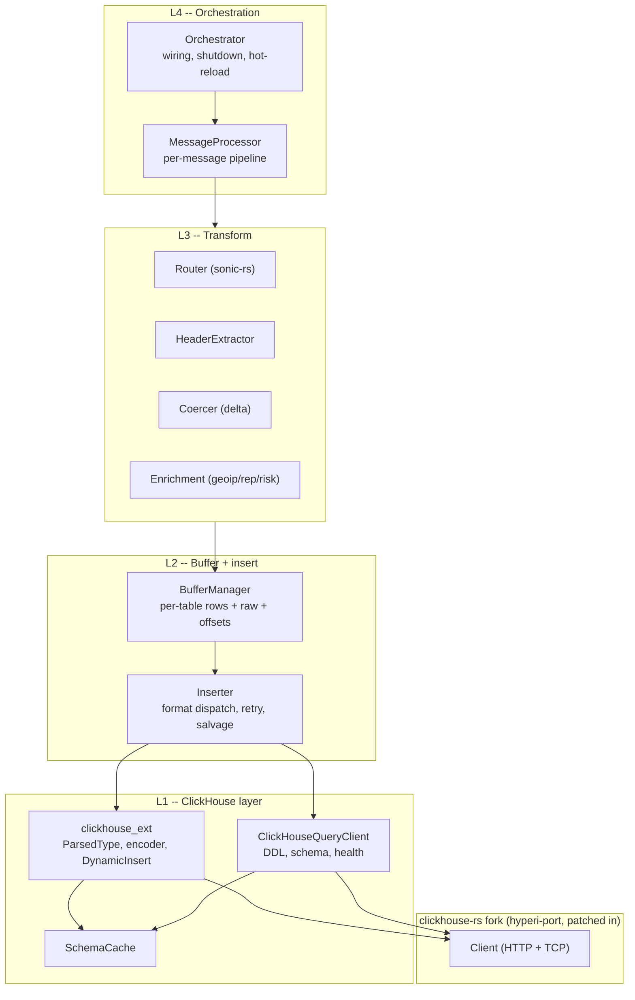
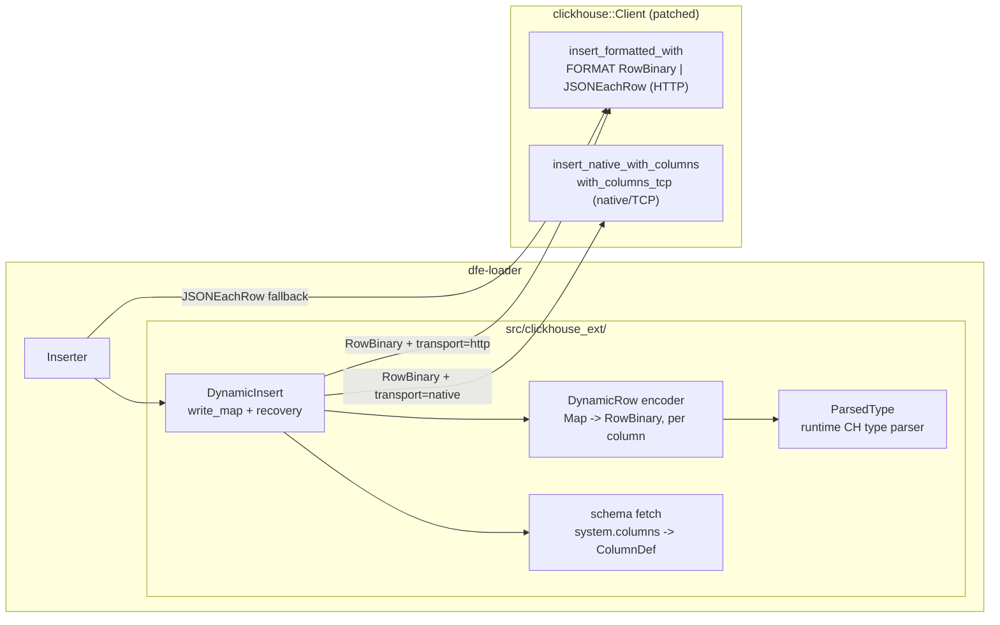
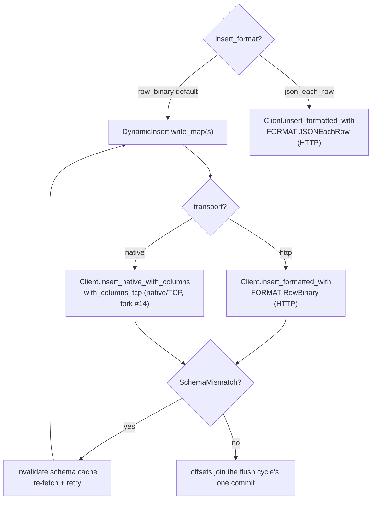

<!--
  Project:      dfe-loader
  File:         docs/ARCHITECTURE.md
  Purpose:      System architecture: layers, the clickhouse_ext boundary, insert dispatch
  Language:     Markdown

  License:      BUSL-1.1
  Copyright:    (c) 2026 HYPERI PTY LIMITED
-->

# Architecture

dfe-loader is a per-message hot path with a per-table batching tail. A message arrives as bytes, gets routed and promoted into a typed row, accumulates in a per-table buffer, and flushes to ClickHouse as a batch. Kafka offsets commit once per flush cycle, never past a row not placed yet -- at-least-once.

Everything on the hot path is shaped by one rule: do the cheap thing per
message, defer the expensive thing to flush. Parse once (SIMD, zero-copy),
promote only schema columns, keep the full payload as a reference-counted
`Arc<[u8]>`, and splice it as `_json` only at serialise time.

## Layers

A higher layer depends on lower layers, never the reverse. The only external
dependency for the insert path is the patched `clickhouse::Client`.

## The clickhouse_ext boundary

The hyperi-port fork keeps insertion typed (`T: Row`, compile-time schema) --
that is the right upstream default. dfe-loader inserts runtime-shaped
`Map<String,Value>` rows whose columns come from `system.columns` at runtime.
That dynamic layer is HyperI-specific and lives in this repo, on top of the
upstream `Client`:

The encoder has two emission modes off the same `ColumnDef` schema: row-wise
`encode()` bytes for the HTTP `FORMAT RowBinary` sink, and per-column
`Serialize` for the native/TCP `with_columns_tcp` sink. `clickhouse_ext` uses
only the fork's stable public surface (`Client`, `insert_formatted_with`,
`insert_native_with_columns`, `row`/`rowbinary` primitives), so it is unaffected
by the fork's routine cascade re-pushes. See
[clickhouse/CLICKHOUSE-EXT.md](clickhouse/CLICKHOUSE-EXT.md).

## Insert dispatch

The RowBinary path splits by transport: HTTP ships row-wise `FORMAT RowBinary`
through `insert_formatted_with`; native/TCP ships per-column blocks through
`insert_native_with_columns` (`with_columns_tcp`). `json_each_row + native` is
rejected at config-check -- JSONEachRow goes over HTTP, and a native client has
no HTTP insert endpoint for it. RowBinary is the portable default, valid on both
transports.

## Capture modes

`capture_mode` decides what gets stored alongside the promoted columns.
Resolution is three-level, highest wins: DDL `@capture_mode` comment >
per-table config > global default.

| Mode | `_json` | `_raw` | Use |
|------|---------|--------|-----|
| `full` (default) | full payload (JSON type) | extracted from `raw_source_fields` | path queries + text search |
| `raw_only` | NULL | full Kafka payload (String) | CH CPU saving, no JSON-type overhead |
| `extracted_only` | NULL | NULL | promoted columns only |

All three still promote schema columns; the difference is whether (and where)
the full payload is kept.

## Resilience

- **Batch salvage** -- on a data error, binary-split the batch to isolate the
  bad row(s), DLQ only those, keep the good ones.
- **Sink-down gate** -- a flush cycle in which every insert failed opens the
  circuit gate on the KEDA scaling signal, and the next successful insert closes
  it. A failed insert never sends its batch to the DLQ.
- **Schema-cache recovery** -- on `SchemaMismatch` (e.g. `ALTER ... ADD COLUMN`),
  invalidate and re-fetch, then retry.
- **One commit per flush cycle** -- offsets commit once per cycle, and on each partition stop below the lowest offset not placed yet. A failed batch or a dead letter the DLQ refused is held and retried with jittered backoff, and holds its partition's commit until it lands. A dead letter no DLQ backend can ever hold is dropped and counted instead (`pipeline_dead_letters_dropped_total{reason}`). A held batch whose table ClickHouse has since reported absent is retried against the default table.

## Source of truth

| Data | Source |
|------|--------|
| Version | `git describe --tags` / `VERSION` |
| Tasks | GitHub Issues / `TODO.md` |
| History | `git log` |
| Static context | `CLAUDE.md` |
