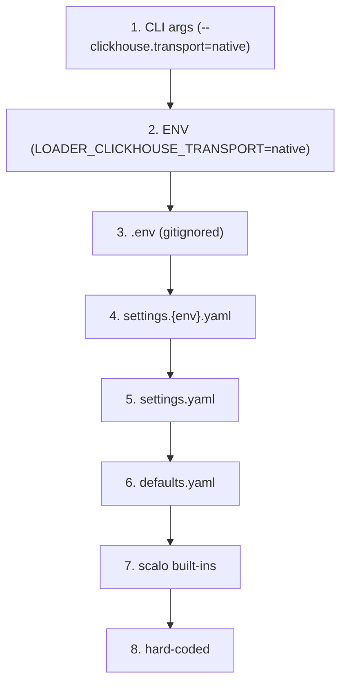

<!--
  Project:      dfe-loader
  File:         docs/CONFIGURATION.md
  Purpose:      Config cascade and the settings that change behaviour
  Language:     Markdown

  License:      BUSL-1.1
  Copyright:    (c) 2026 HYPERI PTY LIMITED
-->

# Configuration

dfe-loader is configured through an 8-layer cascade (scalo). Higher
layers win. Every setting has a safe default, so an empty config boots.

ENV names are auto-derived: `clickhouse.transport` -> `LOADER_CLICKHOUSE_TRANSPORT`.

The scaling gate (`scaling.enabled`, `scaling.memory_gate_threshold`) is read by
scalo's own cascade, which discovers `defaults.yaml` / `settings.yaml` but never
the file named by `--config`, so set it with `DFE_LOADER_SCALING__ENABLED` and
`DFE_LOADER_SCALING__MEMORY_GATE_THRESHOLD`. A value for it in the `--config`
file drives the loader's own weights and is reported as a mismatch at startup.

> A config value is only useful if the ACTION matches it. The integration tests
> assert the observable outcome (the row written, the transport used), not just
> that the value parsed -- see [the test note](#verifying-config-drives-behaviour).

## Settings that change behaviour

### ClickHouse insert path

| Setting | Values | Effect |
|---------|--------|--------|
| `clickhouse.transport` | `native` (default), `http` | TCP native protocol (port 9000/9440) vs HTTP (8123/8543) |
| `clickhouse.insert_format` | `row_binary` (default), `json_each_row` | binary (server skips JSON parsing) vs self-describing JSON |
| `clickhouse.hosts` | list | multi-host failover (native pool round-robins, skips a refusing endpoint) |
| `clickhouse.database` | string, `dfe` (default) | database the connection targets -- DDL, schema reflection, and any table name that arrives without a `db.` prefix |

`clickhouse.database` is the CONNECTION database and is separate from
`routing.default_db` (also `dfe`), which is the database a routed row lands in.
Both are cascade-overridable like any other setting -- `LOADER_CLICKHOUSE_DATABASE`
or `clickhouse.database` in yaml.

The transport and format compose. The default `native + row_binary` is the
fast path; `json_each_row` is the diagnostic fallback:

| `insert_format` | `transport = http` | `transport = native` |
|-----------------|--------------------|----------------------|
| `row_binary` (default) | `insert_formatted_with` FORMAT RowBinary | `insert_native_with_columns` (`with_columns_tcp`) |
| `json_each_row` | `insert_formatted_with` FORMAT JSONEachRow | **rejected at config-check** |

**Guarded combination:** `insert_format = json_each_row` with `transport =
native` is rejected at `config-check`. JSONEachRow is sent over HTTP, and a
native client has no HTTP insert endpoint for it. RowBinary works on both
transports -- see [clickhouse/INSERT-FORMATS.md](clickhouse/INSERT-FORMATS.md).

### Transport security (TLS, private CAs)

One trust mechanism covers both transports. By default a TLS connection trusts
the OS native root store plus the compiled Mozilla (webpki) bundle. Internal
clusters behind a private CA are supported by pointing at the CA PEM -- no proxy
termination, no `InsecureSkipVerify`.

| Setting | Values | Effect |
|---------|--------|--------|
| `clickhouse.tls` | bool | TLS for the connection (HTTPS 8543 / secure native 9440) |
| `clickhouse.tls_ca_file` | path | private CA PEM (may bundle many certs; all are loaded). Augments native + webpki |
| `clickhouse.tls_ca_exclusive` | bool | trust ONLY `tls_ca_file`, ignore native + webpki |

A CA file with no usable certificate is a hard error (it never silently falls
back to public roots). See [clickhouse/TLS.md](clickhouse/TLS.md).

### Capture (what gets stored)

| Setting | Values | Effect |
|---------|--------|--------|
| `metadata.capture_mode` | `full` (default), `raw_only`, `extracted_only` | `_json` + `_raw` population -- see [ARCHITECTURE.md](ARCHITECTURE.md#capture-modes) |
| `metadata.table_capture_modes` | map | per-table override of `capture_mode` |
| DDL `@capture_mode: <mode>` | comment tag | highest-priority override, per table |

Precedence, highest wins: **DDL tag > per-table > global**.

### Routing

| Setting | Effect |
|---------|--------|
| `routing.db_fields` | fields whose value sets the database (empty = shared `default_db`) |
| `routing.table_fields` | fields whose value sets the table (dot-notation for nested) |
| `routing.default_db` / `default_table` | fallbacks when no field matches |
| `routing.route_all_by_org` / `routed_orgs` | per-org database routing |

### Enrichment, resilience

| Setting | Effect |
|---------|--------|
| `enrichment.geoip` / `reputation` / `risk` | inject enriched columns on the promoted row |
| `buffer.flush_rows` / `flush_bytes` / `flush_age_secs` | per-table flush triggers |

Insert retry, batch salvage and insert concurrency are not settings. Every build retries a transient insert failure up to 5 times with jittered backoff, binary-splits a batch with a data error down to the bad rows, and runs at most 8 inserts at once. A batch that still fails is held and retried as described in [OPERATIONS.md](OPERATIONS.md).

`schema.refresh_on_error` (default `true`) decides whether a RowBinary insert that fails on schema drift drops the table's cached schema. With `false` the stale schema is kept until it expires -- see [clickhouse/SCHEMA-CACHE.md](clickhouse/SCHEMA-CACHE.md#mismatch-recovery).

## Hot-reload

Config hot-reloads on change. Some fields are safe to apply live; some require a
restart and are logged as a warning rather than silently applied:

- **Restart-required:** `clickhouse.transport`, ClickHouse URL/hosts,
  `clickhouse.insert_format`, TLS settings (`tls`, `tls_ca_file`,
  `tls_ca_exclusive`), Kafka connection -- all of these are baked into the
  `Client` at build time.
- **Safe to reload:** buffer thresholds, capture modes, enrichment toggles,
  routing rules.

## Verifying config drives behaviour

Config-loading is necessary but not sufficient -- the ACTION must align with the
setting. dfe-loader's tests assert the observable outcome:

- `capture_mode=raw_only` -> the row actually written has `_raw` = the full
  payload and `_json` NULL (offline processor test).
- `insert_format` + `transport` -> the row actually lands over the configured
  format/transport (live integration test, docker or dev cluster).
- ENV over yaml -> the resolved setting actually changes the behaviour, not just
  the parsed value.

See `src/pipeline/processor.rs` (capture-mode action tests) and
`tests/integration/` (live insert tests).
