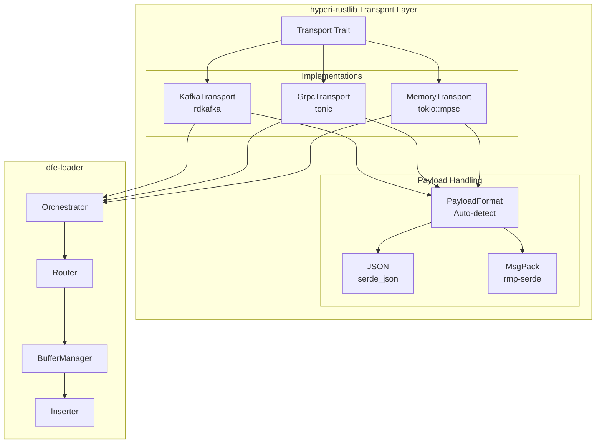

# Design Document: dfe-loader

**Version:** 3.0 (JSONEachRow Architecture + gRPC Transport)
**Date:** 2026-03-09

---

## Overview

High-performance data loader from message transports to ClickHouse via HTTP JSONEachRow.

```text
Transport ──► Parse ──► Route ──► Transform ──► Buffer ──► ClickHouse HTTP
(Kafka/gRPC/Memory)   (SIMD)   (db.table)   (flatten)  (per-table)   (JSONEachRow)
```

### Transport Selection

| Transport | Use Case | Persistence | Latency |
|-----------|----------|-------------|---------|
| **Kafka** | Production (durable) | At-least-once with offset tracking | ~1-5ms |
| **gRPC** | Dev/test, prod mesh (low-latency) | Sender-side WAL (receiver buffer) | ~200µs |
| **Memory** | Unit tests | None | ~1µs |

See [GRPC-MESH.md](./GRPC-MESH.md) for the complete gRPC transport design.

---

## Design Goals

1. **Schema flexibility**: Accept any JSON structure, unknown fields pass through
2. **At-least-once delivery**: Kafka offset tracking per batch
3. **Minimise memory churn**: Batched processing, pre-allocated collections
4. **Operational simplicity**: HTTP inserts, no native protocol dependency
5. **Clean architecture**: Immutable data, functional transforms

---

## Core Components

### 1. Per-Table Buffer Architecture

Each destination table (db.table) has its own row buffer. This ensures batch inserts
are grouped by table (required for JSONEachRow inserts targeting a specific table).

```rust
struct BufferManager {
    // Per-table buffers: key is "db.table"
    buffers: HashMap<String, TableBuffer>,
}

struct TableBuffer {
    rows: Vec<Map<String, Value>>,    // Accumulated JSON rows
    offsets: Vec<KafkaOffset>,        // Kafka offsets for at-least-once
    created_at: Instant,              // For time-based flush
    size_bytes: usize,                // Approximate memory tracking
}
```

**Why per-table?**

- **ClickHouse target:** JSONEachRow inserts are per-table; all rows in a batch go to one table
- **Independent flush:** High-volume tables flush more often, low-volume wait for age trigger
- **Schema flexibility:** Each row is a `Map<String, Value>` — no fixed schema required
- **Memory bounded:** Rows accumulate until flush threshold (rows, bytes, or age)

**Lifecycle:**

1. Kafka message → Parse JSON/MsgPack → Route to db.table
2. Push `Map<String, Value>` to per-table buffer (with Kafka offset)
3. When ready (row count, bytes, or time): Serialise to JSONEachRow NDJSON
4. Insert to ClickHouse via `reqwest` HTTP POST
5. Success: Commit Kafka offsets
6. Failure: Retry batch

### 2. Dynamic db.table Routing

Routing happens **PRE-flattening** on the original nested JSON/MessagePack structure.
Both formats deserialize to `serde_json::Value` with the same nested structure.

```rust
// Config (from ENV/config cascade)
struct RoutingConfig {
    db_fields: Vec<String>,      // ["org_id"]
    table_fields: Vec<String>,   // ["event_category", "tags.event_category"]
    default_db: String,          // "common"
    default_table: String,       // "common"
}

// Routing logic
fn route_to_table(event: &Value, config: &RoutingConfig) -> String {
    // Extract db from first matching field
    let db = config.db_fields.iter()
        .find_map(|path| get_nested_value(event, path))
        .map(|v| v.as_str().unwrap_or(&config.default_db))
        .unwrap_or(&config.default_db);

    // Extract table from first matching field
    let table = config.table_fields.iter()
        .find_map(|path| get_nested_value(event, path))
        .map(|v| v.as_str().unwrap_or(&config.default_table))
        .unwrap_or(&config.default_table);

    format!("{}.{}", db, table)
}

// Dot notation for nested access: "tags.event_category" → event["tags"]["event_category"]
fn get_nested_value<'a>(event: &'a Value, path: &str) -> Option<&'a Value> {
    path.split('.').try_fold(event, |v, key| v.get(key))
}
```

**Example:**

```json
{
  "org_id": "acme",
  "event_category": "auth",
  "tags": { "event_category": "login" },
  "data": { ... }
}
```

With default config:

- `db_fields = ["org_id"]` → finds "acme"
- `table_fields = ["event_category", "tags.event_category"]` → finds "auth"
- Result: `acme.auth`

### 3. Transform Pipeline (Per-Row)

Each message is transformed individually before being pushed to the per-table buffer:

```rust
fn transform_pipeline(value: Value, raw: Option<&[u8]>) -> Result<Map<String, Value>> {
    let result = transformer.transform_with_raw(value, raw, None)?;
    Ok(result.data)
}
```

The `Transformer` applies:
1. **Timestamp extraction and validation** — extracts `_timestamp`, validates range
2. **Common header injection** — injects `_org_id`, `_source`, `_timestamp_received`
3. **JSON flattening** — nested objects flattened to dot-notation keys
4. **Field sanitisation** — strip leading `@`, handle numeric prefixes, collapse underscores
5. **Enrichment** — GeoIP, reputation, risk scoring (each optional)
6. **CEL computed columns** — evaluate `@computed` expressions from DDL column comments

`_json` is injected by the buffer manager directly from raw Kafka bytes (not by the transformer).

### 3. Schema Cache (Read-Only)

```rust
// SchemaCache stores ColumnInfo per table, fetched from system.columns.
// Used for: CEL expression evaluation, auto-init DDL, computed column dispatch.
// NOT used for insert schema validation — JSONEachRow is schema-flexible.

struct SchemaCache {
    entries: DashMap<String, SchemaCacheEntry>,
    ttl: Duration,
    client: Arc<HttpClickHouseClient>,
}

impl SchemaCache {
    async fn get(&self, table: &str) -> Option<Vec<ColumnInfo>> {
        // Returns cached columns if fresh, fetches from system.columns if stale
    }
}
```

### 4. ClickHouse Insert (HTTP JSONEachRow)

Two clients in `HttpClickHouseClient`:

```rust
struct HttpClickHouseClient {
    // Official clickhouse crate — DDL, queries, schema introspection
    ch_client: clickhouse::Client,
    // reqwest — data inserts via JSONEachRow
    http_client: reqwest::Client,
    insert_url: String,
}

impl HttpClickHouseClient {
    // Data insert: serialise rows to NDJSON, POST to /{db}/{table}?format=JSONEachRow
    async fn insert_json_rows(&self, table: &str, rows: &[Map<String, Value>]) -> Result<usize>;

    // DDL / queries use clickhouse::Client
    async fn execute_ddl(&self, query: &str) -> Result<()>;
    async fn fetch_columns(&self, db: &str, table: &str) -> Result<Vec<ColumnInfo>>;
}
```

Unknown fields in the JSON are silently ignored by ClickHouse (default behaviour).
This means the loader never needs to pre-validate field names against the schema.

---

## Data Flow

```text
┌─────────────────────────────────────────────────────────────────────┐
│                         Kafka Consumer                               │
│  - Stream of messages (bytes)                                       │
│  - Track partition/offset per message                               │
└────────────────────────────┬────────────────────────────────────────┘
                             │
                             ▼
┌─────────────────────────────────────────────────────────────────────┐
│                      JSON/MsgPack Parser                            │
│  - sonic-rs for JSON (SIMD)                                         │
│  - rmp-serde for MessagePack                                        │
│  - Output: serde_json::Value per message                            │
└────────────────────────────┬────────────────────────────────────────┘
                             │
                             ▼
┌─────────────────────────────────────────────────────────────────────┐
│                     Router (PRE-flattening)                          │
│  - Extract db from first matching field in priority list            │
│    Default: ["org_id"], fallback: "common"                          │
│  - Extract table from first matching field in priority list         │
│    Default: ["event_category", "tags.event_category"], fb: "common" │
│  - Dot notation for nested access (tags.event_category)             │
│  - Route to DLQ if configured                                       │
└────────────────────────────┬────────────────────────────────────────┘
                             │
                             ▼
┌─────────────────────────────────────────────────────────────────────┐
│                     Transform Pipeline                               │
│  1. Flatten: Nested JSON → flat columns                             │
│  2. Timestamp: Validate/correct timestamps                          │
│  3. Coerce: Type conversion (future: schema-aware)                  │
│  4. Enrich: GeoIP, risk score (future)                              │
│                                                                     │
│  Output: JSON Map per message                                       │
└────────────────────────────┬────────────────────────────────────────┘
                             │
                             ▼
┌─────────────────────────────────────────────────────────────────────┐
│                    Per-Table BufferManager                           │
│  - HashMap<db.table, Vec<Map<String, Value>>>                       │
│  - Each table has its own row buffer                                │
│  - Tracks Kafka offsets per buffer                                  │
│  - Flush trigger: row count, bytes, or age                          │
└────────────────────────────┬────────────────────────────────────────┘
                             │
                             ▼ (flush trigger: rows, bytes, time per table)
┌─────────────────────────────────────────────────────────────────────┐
│                  JSONEachRow Serialisation                           │
│  - Serialise Vec<Map<String, Value>> to NDJSON bytes                │
│  - One JSON object per line                                         │
│  - Unknown fields pass through to ClickHouse (silently ignored)     │
└────────────────────────────┬────────────────────────────────────────┘
                             │
                             ▼
┌─────────────────────────────────────────────────────────────────────┐
│                    ClickHouse Inserter                               │
│  - reqwest HTTP POST to /{db}/{table}?format=JSONEachRow            │
│  - HttpClickHouseClient (reqwest + clickhouse crate)                │
│  - Retry with exponential backoff                                   │
└────────────────────────────┬────────────────────────────────────────┘
                             │
                             ▼
┌─────────────────────────────────────────────────────────────────────┐
│                       Offset Ack                                     │
│  - On success: Commit Kafka offsets from batch                      │
│  - On failure: Retry batch, backpressure                            │
└─────────────────────────────────────────────────────────────────────┘
```

---

## Type Handling

ClickHouse handles most type coercion server-side for JSONEachRow inserts. The loader
sends JSON strings/numbers/booleans; ClickHouse converts on ingest.

| ClickHouse Type | JSON Value Sent | Notes |
|-----------------|-----------------|-------|
| Int8-Int256 | number | ClickHouse parses as integer |
| Float32/64 | number | ClickHouse parses as float |
| String | string | Pass-through |
| DateTime64(3) | `"2024-01-15T10:30:00.123Z"` | ISO 8601 string |
| UUID | string | ClickHouse parses RFC 4122 format |
| Bool | boolean or number | 0/1 or true/false |
| Array(T) | JSON array | Elements must match inner type |
| JSON type | string or object | ClickHouse parses at insert time |
| LowCardinality(T) | same as T | Dictionary encoding is server-side |
| Nullable(T) | null or T value | null JSON maps to NULL |

Unknown fields are silently ignored by ClickHouse (default JSONEachRow behaviour).
This is the key advantage over Arrow: no fixed-schema enforcement on the loader side.

**⚠️ Open item:** A gap analysis is needed to identify which coercions the old
`clickhouse-arrow` fork performed client-side that ClickHouse does NOT cover
automatically (e.g. epoch auto-detection, overflow handling, Array inner types).
See `TODO.md` "CRITICAL: Type Coercion Gap Analysis".

---

## Memory Management

### Row Buffer Lifecycle

```
PARSE:  Kafka bytes → serde_json::Value (sonic-rs SIMD)
ROUTE:  Extract db.table from Value (pre-flatten)
TRANSFORM: Value → Map<String, Value> (flatten, inject fields)
BUFFER: Push Map into per-table Vec<Map>
FLUSH:  Serialise Vec to NDJSON bytes → HTTP POST
ACK:    Commit Kafka offsets, clear Vec
```

### Memory Pressure Handling

If memory pressure detected (via ScalingPressure metric):

1. Flush all buffers immediately (regardless of row count / time threshold)
2. Reduce max batch size on next cycle
3. ScalingPressure metric rises → KEDA scales pods up

---

## Configuration

```yaml
buffer:
  flush_rows: 10000
  flush_bytes: 10485760  # 10MB
  flush_age_secs: 5

clickhouse:
  url: http://localhost:8123
  database: dfe
  username: default
  password: ""

schema:
  cache_ttl_secs: 300  # Used for CEL expression dispatch; NOT for insert validation
  refresh_on_error: true

transform:
  flatten_json: true
  flatten_separator: "."

enrichment:
  geoip:
    enabled: true
    database: "/data/GeoLite2-City.mmdb"
```

---

## Flattening Behaviour

The transformer flattens all nested JSON objects to dot-notation keys by default.
No schema introspection is required — ClickHouse receives the flattened fields and
handles type coercion server-side.

**Input:**

```json
{
  "user_id": 1,
  "metadata": {"foo": {"bar": {"deep": 1}}},
  "tags": ["auth", "login"],
  "source": {"ip": "10.0.0.1", "port": 54321}
}
```

**After flattening:**

```
user_id: 1
metadata.foo.bar.deep: 1
tags: ["auth", "login"]       ← arrays are NOT flattened (kept as JSON array)
source.ip: "10.0.0.1"
source.port: 54321
```

Arrays are preserved as-is (JSON array value). Only objects are flattened.
This matches ClickHouse JSONEachRow expectations for `Array(T)` columns.

**Phase 5.6 note:** For columns typed as `JSON`, `Nested`, or `Variant` in ClickHouse,
additional client-side handling may be needed. See TODO Phase 5.6 for the gap analysis.

---

## Future Optimisations

1. **Native protocol via clickhouse-rs fork**: Lower server-side CPU — see TODO Phase 5.5
2. **Batch JSON serialisation**: Use `sonic-rs` for NDJSON serialisation in insert path
3. **SIMD GeoIP**: Vectorised IP lookups across a batch
4. **Workspace crate extraction**: Split `crates/clickhouse`, `crates/buffer` — see TODO Phase 7

---

## Transport Abstraction (hyperi-rustlib)

The transport layer is implemented in `hyperi-rustlib` as a shared library for all HyperI Rust projects.
This provides a consistent pattern for message transport with support for JSON/MsgPack payloads.

### Architecture



### Transport Trait

```rust
#[async_trait]
pub trait Transport: Send + Sync {
    type Token: CommitToken;

    /// Send a message to the given key (topic/key-expression).
    async fn send(&self, key: &str, payload: &[u8]) -> SendResult;

    /// Receive up to `max` messages.
    async fn recv(&self, max: usize) -> TransportResult<Vec<Message<Self::Token>>>;

    /// Commit processed messages (Kafka: offset commit, gRPC: response ACK).
    async fn commit(&self, tokens: &[Self::Token]) -> TransportResult<()>;

    /// Close the transport gracefully.
    async fn close(&self) -> TransportResult<()>;

    /// Check if transport is healthy.
    fn is_healthy(&self) -> bool;

    /// Transport name for logging/metrics.
    fn name(&self) -> &'static str;
}
```

### Message Type

```rust
pub struct Message<T: CommitToken> {
    /// Topic/key-expression (Arc-shared for efficiency).
    pub key: Option<Arc<str>>,
    /// Raw payload bytes (JSON or MsgPack).
    pub payload: Vec<u8>,
    /// Transport-specific commit token.
    pub token: T,
    /// Message timestamp (milliseconds since epoch).
    pub timestamp_ms: Option<i64>,
    /// Detected payload format.
    pub format: PayloadFormat,
}
```

### Payload Auto-Detection

```rust
impl PayloadFormat {
    pub fn detect(payload: &[u8]) -> Self {
        if payload.is_empty() {
            return Self::Json;
        }
        match payload[0] {
            b'{' | b'[' => Self::Json,              // JSON object/array
            0x80..=0x8f => Self::MsgPack,           // MsgPack fixmap
            0xde | 0xdf => Self::MsgPack,           // MsgPack map16/map32
            0x90..=0x9f => Self::MsgPack,           // MsgPack fixarray
            0xdc | 0xdd => Self::MsgPack,           // MsgPack array16/array32
            _ => Self::Json,                         // Default to JSON
        }
    }
}
```

### Feature Flags

```toml
# Cargo.toml (hyperi-rustlib)
[features]
transport = ["tokio", "async-trait", "serde_json", "rmp-serde", "chrono"]
transport-memory = ["transport"]
transport-kafka = ["transport", "rdkafka"]
transport-grpc = ["transport", "tonic", "prost"]
transport-all = ["transport-memory", "transport-kafka", "transport-grpc"]
```

### Transport Configurations

#### Kafka (Production — Durable)

```rust
let config = KafkaConfig {
    brokers: vec!["kafka:9092".to_string()],
    group: "dfe-loader".to_string(),
    topics: vec!["events".to_string()],
    security_protocol: "SASL_SSL".to_string(),
    sasl_mechanism: Some("SCRAM-SHA-512".to_string()),
    ..Default::default()
};
let transport = KafkaTransport::new(&config).await?;
```

#### gRPC (Dev/Test + Production Mesh)

```rust
let config = GrpcConfig {
    listen_addr: "0.0.0.0:50051".to_string(),
    target_addrs: vec!["loader:50051".to_string()],
    max_message_size: 16 * 1024 * 1024,  // 16MB
    ..Default::default()
};
let transport = GrpcTransport::new(&config).await?;
```

See [GRPC-MESH.md](./GRPC-MESH.md) for the complete gRPC transport design,
including v1/v2 proto evolution, tonic-health integration, and mesh topology.

#### Memory (Unit Tests)

```rust
let config = MemoryConfig::default();
let transport = MemoryTransport::new(&config);

// Inject test messages
transport.inject(Some("test-topic"), payload).await?;
```

### Performance Considerations

1. **Arc<str> for topics**: Topics are cached and Arc-shared to avoid repeated allocations
2. **Batch receiving**: `recv(max)` returns up to `max` messages in one call
3. **Non-blocking sends**: Memory transport uses try_send to avoid blocking on full buffers
4. **Payload format detection**: Single byte check, no parsing overhead
5. **gRPC native ACK**: Response IS the acknowledgement — no custom protocol needed
6. **gRPC backpressure**: HTTP/2 flow control built into the wire protocol

### Local Performance Deviations

While `hyperi-rustlib` provides the baseline transport pattern, this project deviates
locally for performance-critical paths:

- **sonic-rs for JSON**: SIMD-accelerated JSON parsing (vs serde_json in hyperi-rustlib)
- **`get_from_slice` for routing**: Extract `org_id`/`event_category` from raw bytes
  without building a full DOM tree — avoids parse overhead on the routing hot path

The local implementation remains compatible with the transport abstraction's Message type
and payload format conventions.

---

**Last Updated:** 2026-03-09
