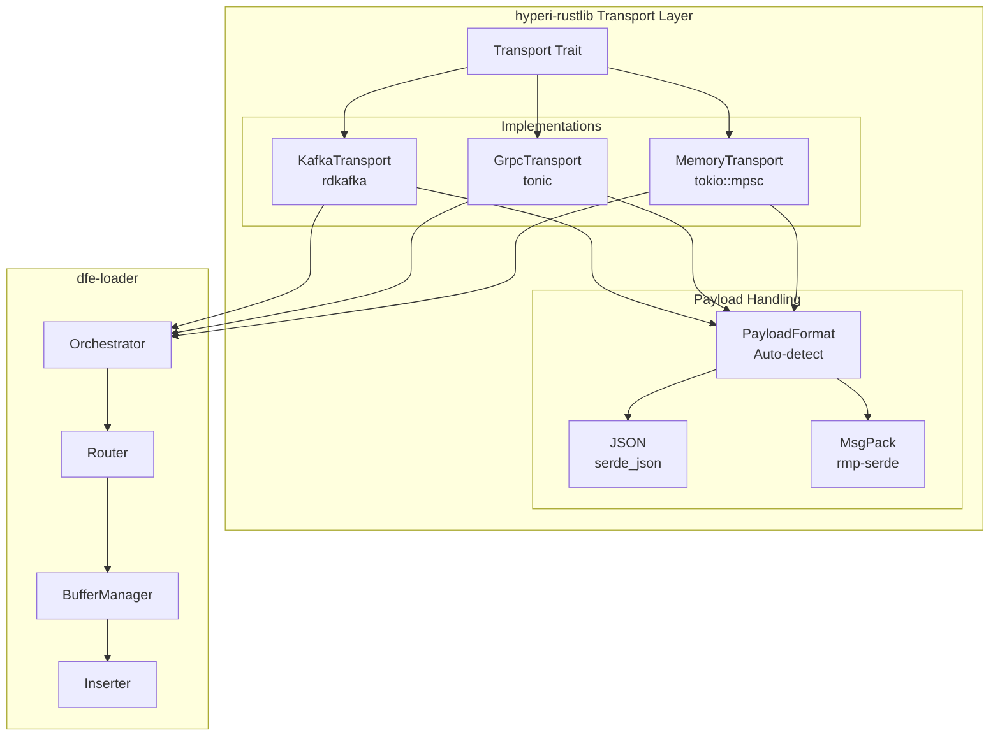

# Design Document: dfe-loader

**Version:** 4.0 (Schema-Guided Extraction + Zero-Copy _json)
**Date:** 2026-03-11

---

## Overview

High-performance data loader from message transports to ClickHouse via HTTP JSONEachRow.

```text
Transport ──► Arc<[u8]> ──► Route ──► Extract ──► Coerce+Enrich ──► Buffer ──► ClickHouse HTTP
(Kafka/gRPC/Memory)  (zero-copy)  (db.table)  (schema-guided)  (promoted cols)  (per-table)  (JSONEachRow)
```

### Transport Selection

| Transport | Use Case | Persistence | Latency |
|-----------|----------|-------------|---------|
| **Kafka** | Production (durable) | At-least-once with offset tracking | ~1-5ms |
| **gRPC** | Dev/test, prod mesh (low-latency) | Sender-side WAL (receiver buffer) | ~200µs |
| **Memory** | Unit tests | None | ~1µs |

See [GRPC-MESH.md](./GRPC-MESH.md) for the complete gRPC transport design.

---

## Design Goals

1. **Schema flexibility**: Accept any JSON structure, unknown fields preserved in `_json`
2. **At-least-once delivery**: Kafka offset tracking per batch, committed independently
3. **CPU efficiency**: SIMD JSON ops (sonic-rs), zero-copy `_json`, coercion only on promoted cols
4. **Operational simplicity**: HTTP inserts by default; native protocol via fork (opt-in)
5. **Clean architecture**: Immutable data, schema-guided promotion, bounded concurrency

---

## Core Components

### 1. Per-Table Buffer Architecture

Each destination table (db.table) has its own row buffer. This ensures batch inserts
are grouped by table (required for JSONEachRow inserts targeting a specific table).

```rust
struct BufferManager {
    // Per-table buffers: key is "db.table"
    buffers: HashMap<String, TableBuffer>,
}

struct TableBuffer {
    rows: Vec<Map<String, Value>>,    // Promoted schema cols + enrichment
    offsets: Vec<KafkaOffset>,        // Kafka offsets for at-least-once
    raw_payloads: Vec<Arc<[u8]>>,     // Raw Kafka bytes — zero-copy for _json splice
    created_at: Instant,              // For time-based flush
}

struct FlushBatch {
    table: CompactString,             // "db.table" (stack-allocated for ≤24 bytes)
    rows: Vec<Map<String, Value>>,    // Promoted cols only — NOT the full payload
    offsets: Vec<KafkaOffset>,        // Committed per-batch independently
    raw_payloads: Vec<Arc<[u8]>>,     // Parallel to rows — spliced as `_json` at serialise time
}
```

**Why per-table?**

- **ClickHouse target:** JSONEachRow inserts are per-table; all rows in a batch go to one table
- **Independent flush:** High-volume tables flush more often, low-volume wait for age trigger
- **Schema flexibility:** Each row is a `Map<String, Value>` — no fixed schema required
- **Memory bounded:** Rows accumulate until flush threshold (rows, bytes, or age)

**Lifecycle:**

1. Kafka message → `Arc<[u8]>` once from raw bytes (zero-copy reference-counted)
2. Route to `db.table` via sonic-rs `get_from_slice` (SIMD, no full DOM parse)
3. Extract schema-promoted fields via `sonic_rs::get_from_slice` per column (O(schema_cols))
4. Coerce promoted fields only (delta coercions, O(schema_cols × 1 branch))
5. Enrich promoted fields (GeoIP, reputation, risk — inject flat cols)
6. Push promoted `Map` + `Arc<[u8]>` to per-table buffer (with Kafka offset)
7. When ready (row count or age): serialise promoted cols as NDJSON, splice raw bytes as `_json`
8. Insert to ClickHouse via `reqwest` HTTP POST
9. Success: Commit **this batch's** Kafka offsets (independent of other tables)
10. Failure: Retry batch

### 2. Dynamic db.table Routing

Routing happens **PRE-flattening** on the original nested JSON/MessagePack structure.
Both formats deserialize to `serde_json::Value` with the same nested structure.

```rust
// Config (from ENV/config cascade)
struct RoutingConfig {
    db_fields: Vec<String>,      // ["org_id"]
    table_fields: Vec<String>,   // ["event_category", "tags.event_category"]
    default_db: String,          // "common"
    default_table: String,       // "common"
}

// Routing logic
fn route_to_table(event: &Value, config: &RoutingConfig) -> String {
    // Extract db from first matching field
    let db = config.db_fields.iter()
        .find_map(|path| get_nested_value(event, path))
        .map(|v| v.as_str().unwrap_or(&config.default_db))
        .unwrap_or(&config.default_db);

    // Extract table from first matching field
    let table = config.table_fields.iter()
        .find_map(|path| get_nested_value(event, path))
        .map(|v| v.as_str().unwrap_or(&config.default_table))
        .unwrap_or(&config.default_table);

    format!("{}.{}", db, table)
}

// Dot notation for nested access: "tags.event_category" → event["tags"]["event_category"]
fn get_nested_value<'a>(event: &'a Value, path: &str) -> Option<&'a Value> {
    path.split('.').try_fold(event, |v, key| v.get(key))
}
```

**Example:**

```json
{
  "org_id": "acme",
  "event_category": "auth",
  "tags": { "event_category": "login" },
  "data": { ... }
}
```

With default config:

- `db_fields = ["org_id"]` → finds "acme"
- `table_fields = ["event_category", "tags.event_category"]` → finds "auth"
- Result: `acme.auth`

### 3. Schema-Guided Field Extraction (Per-Row)

```rust
// Hot path: one Arc creation, zero full parses
let raw: Arc<[u8]> = Arc::from(msg.payload.as_slice());

// Route: SIMD field access, no DOM
let table = router.route_from_bytes(&raw)?;

// Extract: one sonic-rs get_from_slice per schema column
let schema = schema_cache.get(&table);
let mut promoted = extractor.extract(&raw, schema.as_deref())?;
// promoted contains only: header fields + schema-matched cols
// ~10-30 entries vs potentially 200+ in source payload

// Coerce: delta coercions only on promoted cols (O(schema_cols × 1 branch))
if let (Some(coercer), Some(schema)) = (&coercer, &schema) {
    coercer.coerce_row(&mut promoted, schema)?;
}

// Enrich: inject flat cols from GeoIP/rep/risk
enrich(&mut promoted, &enrichment);

// Buffer: promoted map + raw Arc for _json splice at flush time
buffer_manager.push(&table, promoted, offset, Some(raw));
```

**`_json` is NEVER inserted into the promoted Map.** It is spliced at serialisation time
as a zero-copy append — no heap allocation until the final HTTP POST body is assembled.

The extractor extracts:
1. **Header fields always** — `_timestamp`, `_org_id`, `_source`, `_timestamp_received`
2. **Schema-promoted fields** — one `sonic_rs::get_from_slice` per column in `system.columns`
3. **Nothing else** — all other source fields remain accessible only via `_json`

### 3. Schema Cache (Read-Only)

```rust
// SchemaCache stores ColumnInfo per table, fetched from system.columns.
// Used for: CEL expression evaluation, auto-init DDL, computed column dispatch.
// NOT used for insert schema validation — JSONEachRow is schema-flexible.

struct SchemaCache {
    entries: DashMap<String, SchemaCacheEntry>,
    ttl: Duration,
    client: Arc<HttpClickHouseClient>,
}

impl SchemaCache {
    async fn get(&self, table: &str) -> Option<Vec<ColumnInfo>> {
        // Returns cached columns if fresh, fetches from system.columns if stale
    }
}
```

### 4. _json Column: The Catch-All

Every row written to ClickHouse includes a `_json` column containing the complete,
unmodified Kafka message payload as a native ClickHouse JSON type.

**This is the zero-copy path:**

```
Kafka bytes → Arc<[u8]> → spliced into NDJSON body at flush time
                          (no allocation, no parse, no re-encode)
```

**`_json` semantics:**
- Contains the full original source payload — nothing stripped, nothing modified
- Field access via ClickHouse path syntax: `_json.user.name`, `_json.tags[0]`
- All unknown/unpromoted fields are accessible via `_json`
- This allows ad-hoc querying of any source field without schema changes

**When `_json` is sufficient:** For exploratory queries or low-frequency analytics,
`_json` path access works. ClickHouse reads only the sub-column path needed.

**When dedicated columns are required:**
> For efficient, high-frequency queries on a field, that field MUST have a
> dedicated typed column. `_json` provides access but at higher CPU cost
> (JSON sub-column extraction vs native column read). To add a field as a
> dedicated column: add it to the ClickHouse DDL — the loader will
> automatically promote and coerce it on the next schema cache refresh.

**`_json` key collision:** If the source payload already contains a top-level
`_json` key (rare), the loader deep-merges existing `_json` contents into the
source top-level before serialising the merged result as `_json`. This preserves
all data — no field is silently dropped.

**Common header fields are always promoted** regardless of payload mode:
`_timestamp`, `_org_id`, `_source`, `_timestamp_received`. These are required
for DFE operational correctness (routing, tenancy, TTL, audit).

### 5. ClickHouse Insert (HTTP JSONEachRow)

Two clients in `HttpClickHouseClient`:

```rust
struct HttpClickHouseClient {
    // Official clickhouse crate — DDL, queries, schema introspection
    ch_client: clickhouse::Client,
    // reqwest — data inserts via JSONEachRow
    http_client: reqwest::Client,
    insert_url: String,
}

impl HttpClickHouseClient {
    // Data insert: serialise promoted cols to NDJSON, splice _json from raw bytes
    async fn insert_json_rows(
        &self,
        table: &str,
        rows: &[Map<String, Value>],
        raw_payloads: &[Arc<[u8]>],
    ) -> Result<usize>;

    // DDL / queries use clickhouse::Client
    async fn execute_ddl(&self, query: &str) -> Result<()>;
    async fn fetch_columns(&self, db: &str, table: &str) -> Result<Vec<ColumnInfo>>;
}
```

NDJSON body assembly (zero-copy fast path, ~99% of messages):
```
{<promoted_cols_json_without_closing_brace>,"_json":<raw_arc_bytes>}\n
```

The `_json` value is the original payload bytes spliced directly — no re-encoding.
ClickHouse receives valid JSON on the wire because the source payload IS valid JSON.

---

## Data Flow

```text
┌─────────────────────────────────────────────────────────────────────┐
│                         Transport Consumer                           │
│  - Kafka / gRPC / Memory                                            │
│  - Track partition/offset per message                               │
└────────────────────────────┬────────────────────────────────────────┘
                             │ msg.payload (Vec<u8>), format: JSON or MsgPack
                             ▼
┌─────────────────────────────────────────────────────────────────────┐
│         JSON Normalisation (single-byte format auto-detect)          │
│  Cost: one byte read, one branch — O(1), sub-nanosecond             │
│                                                                     │
│  if payload[0] == b'{' | b'['  (0x7b or 0x5b)  → JSON             │
│    Arc<[u8]> from raw bytes — ZERO COPY                             │
│                                                                     │
│  if payload[0] in 0x80..=0x9f | 0xde | 0xdf  → MsgPack            │
│    rmp-serde decode → serde_json encode → Arc<[u8]>                │
│                                                                     │
│  Reliability: JSON object/array starts are always < 0x80;           │
│  MsgPack map/array starts are always >= 0x80 → ranges are           │
│  mutually exclusive for top-level objects (structured event data).  │
│  Edge case: MsgPack bare primitives (int, nil, str) as top-level   │
│  are misdetected as JSON — not applicable to event pipelines.       │
│                                                                     │
│  JSON and MsgPack messages can be mixed on the same Kafka topic     │
│  Arc bytes are ALWAYS valid JSON after this step                    │
└───────────────────────────┬─────────────────────────────────────────┘
                            │ Arc<[u8]> (JSON bytes)
                            ▼
┌─────────────────────────────────────────────────────────────────────┐
│                     Router (sonic-rs SIMD)                           │
│  - get_from_slice on raw bytes — no full DOM parse                  │
│  - Extract db and table fields (dot notation for nested)            │
│  - Route to DLQ if configured                                       │
└────────────────────────────┬────────────────────────────────────────┘
                             │ (table name, Arc<[u8]>)
                             ▼
┌─────────────────────────────────────────────────────────────────────┐
│                  HeaderExtractor (sonic-rs SIMD)                     │
│  ALWAYS extracts (common header — required for DFE):                │
│    _timestamp, _org_id, _source, _timestamp_received                │
│                                                                     │
│  CONDITIONALLY extracts (schema-guided):                            │
│    For each column in schema: get_from_slice(raw, col_name)         │
│    Only fields with a matching ClickHouse column are promoted       │
│    All other source fields remain in _json (untouched)              │
│                                                                     │
│  Output: Map<String, Value> with ~10-30 entries                     │
│  (vs 200+ if we flattened the full payload)                         │
└────────────────────────────┬────────────────────────────────────────┘
                             │ (promoted Map, Arc<[u8]>)
                             ▼
┌─────────────────────────────────────────────────────────────────────┐
│                   Delta Coercion (promoted cols only)                │
│  Runs ONLY on the promoted Map — O(schema_cols × 1 branch)          │
│  Handles 4 cases JSONEachRow cannot do server-side:                 │
│    - Epoch ms/μs/ns → DateTime64 ISO string (magnitude detection)  │
│    - ISO 8601 T separator → space (default parser incompatibility)  │
│    - UUID without hyphens → RFC 4122 format                         │
│    - IPv4 integer → dotted-decimal string                           │
└────────────────────────────┬────────────────────────────────────────┘
                             │ (coerced promoted Map, Arc<[u8]>)
                             ▼
┌─────────────────────────────────────────────────────────────────────┐
│           Enrichment Pipeline (GeoIP / Reputation / Risk)            │
│  - Injects flat columns into promoted Map                           │
│  - Only runs on promoted cols (not on _json)                        │
└────────────────────────────┬────────────────────────────────────────┘
                             │ (enriched promoted Map, Arc<[u8]>)
                             ▼
┌─────────────────────────────────────────────────────────────────────┐
│                    Per-Table BufferManager                           │
│  - HashMap<db.table, TableBuffer>                                   │
│  - TableBuffer stores BOTH promoted Map AND raw Arc<[u8]>           │
│  - Tracks Kafka offsets per buffer                                  │
│  - Flush trigger: row count or age                                  │
└────────────────────────────┬────────────────────────────────────────┘
                             │ FlushBatch { rows, raw_payloads, offsets }
                             ▼ (flush trigger: rows or time per table)
┌─────────────────────────────────────────────────────────────────────┐
│                  NDJSON Body Assembly (zero-copy)                    │
│  For each (promoted_map, raw_bytes) pair:                           │
│    {<promoted_cols>,"_json":<raw_bytes>}\n                          │
│  Fast path (~99%): raw bytes spliced directly (no alloc)            │
│  Slow path (source has _json key): parse + deep-merge + re-encode  │
└────────────────────────────┬────────────────────────────────────────┘
                             │ NDJSON bytes
                             ▼
┌─────────────────────────────────────────────────────────────────────┐
│                    ClickHouse Inserter                               │
│  - reqwest HTTP POST to /{db}/{table}?format=JSONEachRow            │
│  - Retry with exponential backoff + batch salvage                   │
│  - Circuit breaker per table                                        │
└────────────────────────────┬────────────────────────────────────────┘
                             │
                             ▼
┌─────────────────────────────────────────────────────────────────────┐
│                  Per-Batch Offset Commit                             │
│  - Each table's offsets committed independently                     │
│  - Table A success/failure does NOT affect Table B offsets          │
│  - Failed rows: batch salvage → DLQ (bounded channel, try_send)     │
└─────────────────────────────────────────────────────────────────────┘
```

---

## Type Handling

ClickHouse handles most type coercion server-side for JSONEachRow inserts. The loader
sends JSON strings/numbers/booleans; ClickHouse converts on ingest.

| ClickHouse Type | JSON Value Sent | Notes |
|-----------------|-----------------|-------|
| Int8-Int256 | number | ClickHouse parses as integer |
| Float32/64 | number | ClickHouse parses as float |
| String | string | Pass-through |
| DateTime64(3) | `"2024-01-15T10:30:00.123Z"` | ISO 8601 string |
| UUID | string | ClickHouse parses RFC 4122 format |
| Bool | boolean or number | 0/1 or true/false |
| Array(T) | JSON array | Elements must match inner type |
| JSON type | string or object | ClickHouse parses at insert time |
| LowCardinality(T) | same as T | Dictionary encoding is server-side |
| Nullable(T) | null or T value | null JSON maps to NULL |

Unknown fields are silently ignored by ClickHouse (default JSONEachRow behaviour).
This is the key advantage over Arrow: no fixed-schema enforcement on the loader side.

The loader performs **delta coercions** client-side — only the 4 cases that
ClickHouse JSONEachRow cannot handle server-side:

| Delta coercion | Why needed |
|---|---|
| Epoch ms/μs/ns → DateTime64 ISO string | CH takes integer at face value at column precision |
| ISO 8601 `T` separator → space | Default `basic` parser rejects T |
| UUID without hyphens → RFC 4122 | CH UUID rejects bare hex |
| IPv4 integer → dotted-decimal | CH IPv4 rejects integers |

All other conversions (String↔numeric, 1/0→Bool, null→DEFAULT) are handled
server-side by ClickHouse. See `src/transform/coerce.rs` `CoercionMode::Delta`.

---

## Memory Management

### Row Buffer Lifecycle

```
RECEIVE: Kafka bytes → 1-byte format detect → Arc<[u8]> JSON bytes
         JSON: zero-copy Arc; MsgPack: decode→encode, one allocation
         (JSON/MsgPack mix on same topic is fully supported)
ROUTE:   get_from_slice on Arc bytes (SIMD, no full parse)
EXTRACT: get_from_slice per schema col → promoted Map (~10-30 entries)
COERCE:  delta coercions on promoted Map only (O(schema_cols))
ENRICH:  GeoIP/rep/risk → flat cols in promoted Map
BUFFER:  Push (promoted Map, Arc<[u8]>) to per-table buffer
FLUSH:   Serialise promoted Map → NDJSON, splice raw Arc bytes as _json
POST:    HTTP POST NDJSON body → ClickHouse
ACK:     Commit this table's Kafka offsets (independent per table)
```

### Memory Pressure Handling

If memory pressure detected (via ScalingPressure metric):

1. Flush all buffers immediately (regardless of row count / time threshold)
2. Reduce max batch size on next cycle
3. ScalingPressure metric rises → KEDA scales pods up

---

## Configuration

```yaml
buffer:
  flush_rows: 10000
  flush_bytes: 10485760  # 10MB
  flush_age_secs: 5

clickhouse:
  url: http://localhost:8123
  database: dfe
  username: default
  password: ""

schema:
  cache_ttl_secs: 300  # Used for CEL expression dispatch; NOT for insert validation
  refresh_on_error: true

transform:
  flatten_json: true
  flatten_separator: "."

enrichment:
  geoip:
    enabled: true
    database: "/data/GeoLite2-City.mmdb"
```

---

## Flattening Behaviour

The transformer flattens all nested JSON objects to dot-notation keys by default.
No schema introspection is required — ClickHouse receives the flattened fields and
handles type coercion server-side.

**Input:**

```json
{
  "user_id": 1,
  "metadata": {"foo": {"bar": {"deep": 1}}},
  "tags": ["auth", "login"],
  "source": {"ip": "10.0.0.1", "port": 54321}
}
```

**After flattening:**

```
user_id: 1
metadata.foo.bar.deep: 1
tags: ["auth", "login"]       ← arrays are NOT flattened (kept as JSON array)
source.ip: "10.0.0.1"
source.port: 54321
```

Arrays are preserved as-is (JSON array value). Only objects are flattened.
This matches ClickHouse JSONEachRow expectations for `Array(T)` columns.

**Phase 5.6 note:** For columns typed as `JSON`, `Nested`, or `Variant` in ClickHouse,
additional client-side handling may be needed. See TODO Phase 5.6 for the gap analysis.

---

## clickhouse-rs Fork (Phase 5.5)

The project uses the upstream `clickhouse` crate (HTTP only) by default.
A HyperI fork at `/projects/clickhouse-rs` adds:

- Native TCP protocol (lower CPU, higher throughput for bulk inserts)
- HTTP `TableBatcher<T>` (server-side buffering)
- Connection pooling via Deadpool
- `LowCardinality` INSERT encoder + LC(Nullable(T)) reader fix
- JSON, Variant, Dynamic, Nested, BFloat16, Time, AggregateFunction types

**dfe-loader is the test harness for this fork.** Once the fork branches are
merged and published, dfe-loader validates native protocol + batching end-to-end.

### Swap Mechanism (`[patch.crates-io]`)

To test the fork locally, add to the bottom of `Cargo.toml`:

```toml
[patch.crates-io]
clickhouse = { path = "../clickhouse-rs" }
```

To revert to upstream: remove or comment out the `[patch]` section.
Zero changes to the main `[dependencies]` declaration required.

The fork will also be published to crates.io (as a versioned pre-release)
so CI can test it without local path dependencies.

See TODO Phase 5.5 for the merge order and task list.

## Future Optimisations

1. **SIMD GeoIP**: Vectorised IP lookups across a batch
2. **Workspace crate extraction**: Split `crates/clickhouse`, `crates/buffer` — see TODO Phase 7

---

## Parser Selection History

All JSON parser decisions are recorded here as permanent rationale — each choice was the
result of a targeted bake-off against the specific DFE use-case, not general benchmarks.

### Why sonic-rs (retained)

sonic-rs is the production JSON parser for all DFE hot-path operations:
- `from_slice::<Value>` — full DOM parse for routing and schema-guided extraction
- `get_from_slice` — zero-copy lazy field access for routing-only paths

Bench: `benches/bakeoff.rs`, `benches/simdjson_spike.rs`

### Mison — evaluated, rejected (2025-Q4, Phase 0)

**Result:** 4–7% throughput improvement over sonic-rs in targeted benchmarks.

**Rejection reason:** Improvement was insufficient to justify maintaining a separate codebase
(mison required a fork with custom Rust bindings). The cost/benefit was negative.
All mison code was deleted in Phase 0 (commit `2a7a635`).

**Bench:** separate bake-off repo (not retained — results documented here only).

### simd-json (0.17) — evaluated, rejected (2026-03-11, post-Phase 5.7)

**Bench:** `benches/simdjson_spike.rs` — flat30 and nested payloads, 15/30 schema columns,
batch sizes 100/1K/10K.

**Results (batch=10K, median):**

| Approach | flat/30col | nested/15col | Notes |
|---|---|---|---|
| `sonic_selective` — `get_from_slice × N` | 198 ms | 180 ms | Was original impl |
| `sonic_dom` — `from_slice × 1 + .get() × N` | **72 ms** | **43 ms** | **Current impl** |
| `simd_dom+clone` — simd-json + mandatory clone | 49 ms | 41 ms | Requires `Vec<u8>` clone |
| sonic routing parse | 49.7 ms | 37.3 ms | |
| simd routing+clone | 39.8 ms | 36.8 ms | |

**Rejection reasons:**

1. **Mandatory clone**: simd-json requires `&mut [u8]` (in-place string unescaping). The DFE
   pipeline holds payloads as `Arc<[u8]>` for zero-copy `_json` splice. Every parse would need
   `raw.to_vec()` — a full memcpy per message. This is architecturally incompatible.

2. **Net gain too small**: After implementing `sonic_dom` (single full parse, same dependency),
   simd-json is only ~25–30% faster for flat payloads and ~5% for nested. Extraction is <10%
   of total pipeline time (dominated by 40–75 ms network I/O per batch). Net pipeline
   improvement: ~2.5–3% — below the 5% mison rejection threshold.

3. **No lazy field access**: sonic-rs `get_from_slice` navigates to a field without building
   any DOM. simd-json has no equivalent — it always builds a full tape first.

**Action taken:** `HeaderExtractor` switched from `get_from_slice × N` to `sonic_rs::from_slice`
+ O(1) hash lookups — 3–4× extraction speedup, zero new dependencies (commit `7d17a8d`).

---

## Transport Abstraction (hyperi-rustlib)

The transport layer is implemented in `hyperi-rustlib` as a shared library for all HyperI Rust projects.
This provides a consistent pattern for message transport with support for JSON/MsgPack payloads.

### Architecture



### Transport Trait

```rust
#[async_trait]
pub trait Transport: Send + Sync {
    type Token: CommitToken;

    /// Send a message to the given key (topic/key-expression).
    async fn send(&self, key: &str, payload: &[u8]) -> SendResult;

    /// Receive up to `max` messages.
    async fn recv(&self, max: usize) -> TransportResult<Vec<Message<Self::Token>>>;

    /// Commit processed messages (Kafka: offset commit, gRPC: response ACK).
    async fn commit(&self, tokens: &[Self::Token]) -> TransportResult<()>;

    /// Close the transport gracefully.
    async fn close(&self) -> TransportResult<()>;

    /// Check if transport is healthy.
    fn is_healthy(&self) -> bool;

    /// Transport name for logging/metrics.
    fn name(&self) -> &'static str;
}
```

### Message Type

```rust
pub struct Message<T: CommitToken> {
    /// Topic/key-expression (Arc-shared for efficiency).
    pub key: Option<Arc<str>>,
    /// Raw payload bytes (JSON or MsgPack).
    pub payload: Vec<u8>,
    /// Transport-specific commit token.
    pub token: T,
    /// Message timestamp (milliseconds since epoch).
    pub timestamp_ms: Option<i64>,
    /// Detected payload format.
    pub format: PayloadFormat,
}
```

### Payload Auto-Detection

```rust
impl PayloadFormat {
    pub fn detect(payload: &[u8]) -> Self {
        if payload.is_empty() {
            return Self::Json;
        }
        match payload[0] {
            b'{' | b'[' => Self::Json,              // JSON object/array
            0x80..=0x8f => Self::MsgPack,           // MsgPack fixmap
            0xde | 0xdf => Self::MsgPack,           // MsgPack map16/map32
            0x90..=0x9f => Self::MsgPack,           // MsgPack fixarray
            0xdc | 0xdd => Self::MsgPack,           // MsgPack array16/array32
            _ => Self::Json,                         // Default to JSON
        }
    }
}
```

### Feature Flags

```toml
# Cargo.toml (hyperi-rustlib)
[features]
transport = ["tokio", "async-trait", "serde_json", "rmp-serde", "chrono"]
transport-memory = ["transport"]
transport-kafka = ["transport", "rdkafka"]
transport-grpc = ["transport", "tonic", "prost"]
transport-all = ["transport-memory", "transport-kafka", "transport-grpc"]
```

### Transport Configurations

#### Kafka (Production — Durable)

```rust
let config = KafkaConfig {
    brokers: vec!["kafka:9092".to_string()],
    group: "dfe-loader".to_string(),
    topics: vec!["events".to_string()],
    security_protocol: "SASL_SSL".to_string(),
    sasl_mechanism: Some("SCRAM-SHA-512".to_string()),
    ..Default::default()
};
let transport = KafkaTransport::new(&config).await?;
```

#### gRPC (Dev/Test + Production Mesh)

```rust
let config = GrpcConfig {
    listen_addr: "0.0.0.0:50051".to_string(),
    target_addrs: vec!["loader:50051".to_string()],
    max_message_size: 16 * 1024 * 1024,  // 16MB
    ..Default::default()
};
let transport = GrpcTransport::new(&config).await?;
```

See [GRPC-MESH.md](./GRPC-MESH.md) for the complete gRPC transport design,
including v1/v2 proto evolution, tonic-health integration, and mesh topology.

#### Memory (Unit Tests)

```rust
let config = MemoryConfig::default();
let transport = MemoryTransport::new(&config);

// Inject test messages
transport.inject(Some("test-topic"), payload).await?;
```

### Performance Considerations

1. **Arc<str> for topics**: Topics are cached and Arc-shared to avoid repeated allocations
2. **Batch receiving**: `recv(max)` returns up to `max` messages in one call
3. **Non-blocking sends**: Memory transport uses try_send to avoid blocking on full buffers
4. **Payload format detection**: Single byte check, no parsing overhead
5. **gRPC native ACK**: Response IS the acknowledgement — no custom protocol needed
6. **gRPC backpressure**: HTTP/2 flow control built into the wire protocol

### Local Performance Deviations

While `hyperi-rustlib` provides the baseline transport pattern, this project deviates
locally for performance-critical paths:

- **sonic-rs for JSON**: SIMD-accelerated JSON parsing (vs serde_json in hyperi-rustlib)
- **`get_from_slice` for routing**: Extract `org_id`/`event_category` from raw bytes
  without building a full DOM tree — avoids parse overhead on the routing hot path

The local implementation remains compatible with the transport abstraction's Message type
and payload format conventions.

---

**Last Updated:** 2026-03-09
