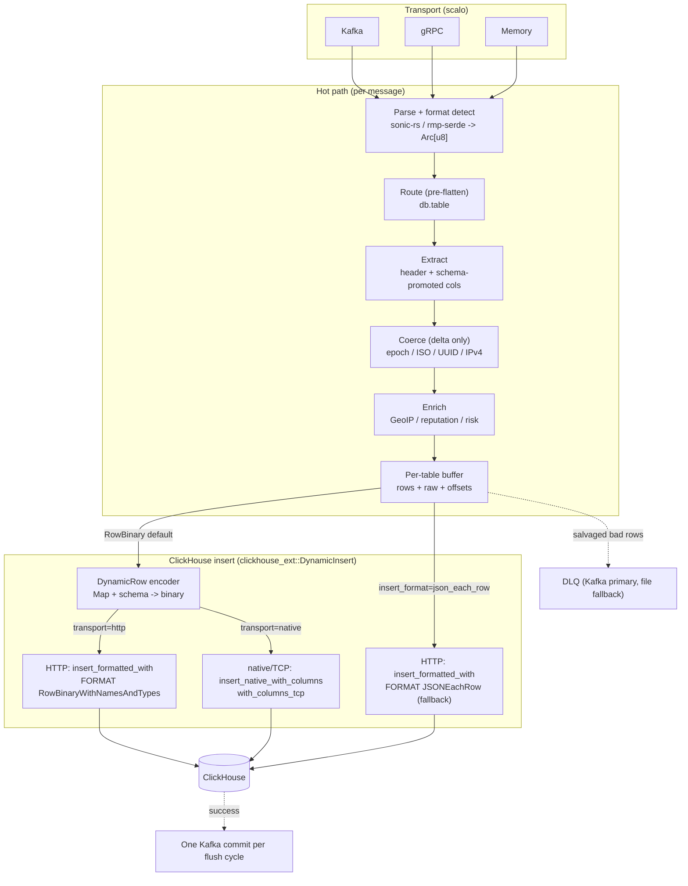

<!--
  Project:      dfe-loader
  File:         docs/README.md
  Purpose:      Documentation index for dfe-loader
  Language:     Markdown

  License:      BUSL-1.1
  Copyright:    (c) 2026 HYPERI PTY LIMITED
-->

# dfe-loader docs

High-performance loader from message transports (Kafka, gRPC, Memory) into
ClickHouse. Point it at a topic, give it a routing rule, and it parses, routes,
promotes schema columns, enriches, buffers per table, and inserts -- RowBinary
by default so ClickHouse skips JSON parsing, with at-least-once Kafka delivery.

This is the index. Read [ARCHITECTURE.md](ARCHITECTURE.md) for the 10,000-foot
view, [clickhouse/](clickhouse/) for the insert layer (the part that changed in
the hyperi-port migration), and [pipeline/](pipeline/) for the hot path.

---

## What dfe-loader does for you

| You give it | It handles | You don't write |
|-------------|------------|-----------------|
| A Kafka/gRPC/Memory topic | JSON + MessagePack auto-detect, SIMD parse (sonic-rs), zero-copy `Arc<[u8]>` | A consumer, a parser, a format sniffer |
| A routing rule (`db_fields`/`table_fields`) | Pre-flatten routing to `db.table`, dot-notation nested access, DLQ on miss | A router, a dispatch table |
| A ClickHouse table | Schema reflected from `system.columns`, fields promoted to typed columns, the rest kept in `_json` | A schema mapping, an ORM, a migration |
| `insert_format` (default RowBinary) | Dynamic `Map<String,Value>` -> RowBinary over the unified `Client` (HTTP or TCP); JSONEachRow fallback | A serialiser, a type encoder, a wire format |
| `capture_mode` (full/raw_only/json_only/extracted_only) | `_json` and `_raw` population per table, overridable per-table and per-DDL | Conditional capture plumbing |
| Enrichment toggles (geoip/reputation/risk) | Flat enriched columns injected on the promoted row only | Lookup, caching, CIDR matching |
| Nothing extra | Per-table buffering, batch salvage, held-batch retry, schema-cache recovery, one offset commit per flush cycle | The resilience layer |

Everything else in these docs is "and here is how the pieces work".

---

## 10,000-foot view

---

## Where things live

| Area | Doc | Covers |
|------|-----|--------|
| System shape | [ARCHITECTURE.md](ARCHITECTURE.md) | Layers, the `clickhouse_ext` boundary, the fork dependency |
| Configuration | [CONFIGURATION.md](CONFIGURATION.md) | The cascade and the settings that change behaviour |
| Operations | [OPERATIONS.md](OPERATIONS.md) | Running, config-check, metrics/top, hot-reload, DLQ |
| Build features | [FEATURE-FLAGS.md](FEATURE-FLAGS.md) | Cargo features and the fork patch mechanism |
| Insert layer | [clickhouse/](clickhouse/) | RowBinary vs JSONEachRow, `clickhouse_ext`, schema cache, type handling, TLS, DDL directives |
| Hot path | [pipeline/](pipeline/) | Routing, extraction, coercion, enrichment, capture modes, buffering |
| Transports | [transport/](transport/) | Kafka / gRPC / Memory, the common header |
| Deployment | [deployment/](deployment/) | Container + chart publishing, schemas |
| Performance | [performance/](performance/) | Hot-path optimisations, parser-selection history, PGO/BOLT |

---

## The fork dependency, in one line

dfe-loader inserts through a HyperI fork of `clickhouse-rs` (the `hyperi-port/*`
chain), pinned via `[patch.crates-io]` to an immutable tag. The dynamic
RowBinary layer that the fork deliberately keeps out of scope -- runtime
`Map<String,Value>` encoding -- lives in this repo at `src/clickhouse_ext/`. See
[clickhouse/CLICKHOUSE-EXT.md](clickhouse/CLICKHOUSE-EXT.md).
