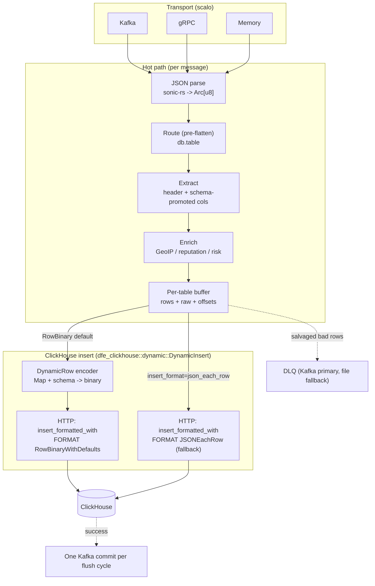

<!--
  Project:      dfe-loader
  File:         docs/README.md
  Purpose:      Documentation index for dfe-loader
  Language:     Markdown

  License:      BUSL-1.1
  Copyright:    (c) 2026 HYPERI PTY LIMITED
-->

# dfe-loader docs

High-performance loader from message transports (Kafka, gRPC, Memory) into
ClickHouse. Point it at a topic, give it a routing rule, and it parses, routes,
promotes schema columns, enriches, buffers per table, and inserts -- RowBinary
by default so ClickHouse skips JSON parsing, with at-least-once Kafka delivery.

This is the index. Read [architecture.md](architecture.md) for the 10,000-foot
view, [clickhouse/](clickhouse/) for the insert layer, and
[pipeline/](pipeline/) for the hot path.

---

## What dfe-loader does for you

| You give it | It handles | You don't write |
|-------------|------------|-----------------|
| A Kafka/gRPC/Memory topic | JSON parse (sonic-rs, SIMD), zero-copy `Arc<[u8]>`, anything not JSON dead-lettered | A consumer, a parser, an input gate |
| The routing fields (`table_fields`, `org_routes`) | Pre-flatten routing to `db.table`, dot-notation nested access, the default table on a miss | A router, a dispatch table |
| A ClickHouse table | Schema reflected from `system.columns`, fields promoted to typed columns, the rest kept in `_json` | A schema mapping, an ORM, a migration |
| `insert_format` (default RowBinary) | Dynamic `Map<String,Value>` -> RowBinary over the HTTP `Client`; JSONEachRow fallback | A serialiser, a type encoder, a wire format |
| `capture_mode` (full/raw_only/json_only/extracted_only) | `_json` and `_raw` population per table, overridable per-table and per-DDL | Conditional capture plumbing |
| Enrichment toggles (geoip/reputation/risk) | Flat enriched columns injected on the promoted row only | Lookup, caching, CIDR matching |
| Nothing extra | Per-table buffering, batch salvage, held-batch retry, schema-cache recovery, one offset commit per flush cycle | The resilience layer |

Everything else in these docs is "and here is how the pieces work".

---

## 10,000-foot view

```mermaid
flowchart TB
    subgraph Ingress["Transport (scalo)"]
        K["Kafka"]
        G["gRPC"]
        M["Memory"]
    end

    subgraph Hot["Hot path (per message)"]
        P["JSON parse<br/>sonic-rs -> Arc[u8]"]
        R["Route (pre-flatten)<br/>db.table"]
        X["Extract<br/>header + schema-promoted cols"]
        E["Enrich<br/>GeoIP / reputation / risk"]
        B["Per-table buffer<br/>rows + raw + offsets"]
    end

    subgraph Sink["ClickHouse insert (dfe_clickhouse::dynamic::DynamicInsert)"]
        CE["DynamicRow encoder<br/>Map + schema -> binary"]
        HTTP["HTTP: insert_formatted_with<br/>FORMAT RowBinaryWithDefaults"]
        JF["HTTP: insert_formatted_with<br/>FORMAT JSONEachRow (fallback)"]
    end

    CH[("ClickHouse")]
    DLQ["DLQ (Kafka primary, file fallback)"]

    K & G & M --> P --> R --> X --> E --> B
    B -->|RowBinary default| CE
    CE --> HTTP --> CH
    B -->|insert_format=json_each_row| JF --> CH
    B -.salvaged bad rows.-> DLQ
    CH -.success.-> Commit["One Kafka commit per flush cycle"]
```

---

## Where things live

| Area | Doc | Covers |
|------|-----|--------|
| System shape | [architecture.md](architecture.md) | Layers, the dynamic insert, the client crates |
| Configuration | [configuration.md](configuration.md) | The cascade and the settings that change behaviour |
| Operations | [operations.md](operations.md) | Running, config-check, metrics/top, hot-reload, DLQ |
| Build features | [feature-flags.md](feature-flags.md) | Cargo features and the ClickHouse client crates |
| Insert layer | [clickhouse/](clickhouse/) | RowBinary vs JSONEachRow, the dynamic insert, schema cache, type handling, TLS, DDL directives |
| Hot path | [pipeline/](pipeline/) | Routing, extraction, enrichment, capture modes, buffering |
| Transports | [transport/](transport/) | Kafka / gRPC / Memory, the common header |
| Deployment | [deployment/](deployment/) | Container + chart publishing, schemas |
| Performance | [performance/](performance/) | Hot-path optimisations, parser-selection history, PGO/BOLT |

---

## The client dependency, in one line

dfe-loader inserts through the official `clickhouse` crate from crates.io, with `dfe-clickhouse` reading the server's exception code out of a rejection. The dynamic RowBinary layer the `clickhouse` crate keeps out of scope -- runtime `Map<String,Value>` encoding -- comes from `dfe-clickhouse`'s `dynamic` module. See [clickhouse/clickhouse-ext.md](clickhouse/clickhouse-ext.md).
