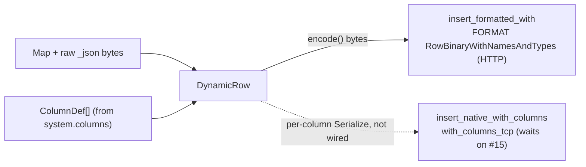

<!--
  Project:      dfe-loader
  File:         docs/clickhouse/CLICKHOUSE-EXT.md
  Purpose:      The clickhouse_ext layer -- dynamic RowBinary insert over the fork
  Language:     Markdown

  License:      BUSL-1.1
  Copyright:    (c) 2026 HYPERI PTY LIMITED
-->

# clickhouse_ext

`src/clickhouse_ext/` is the HyperI dynamic-insert layer over the clickhouse-rs
`hyperi-port` fork. The fork ships a single `Client` (HTTP + TCP) and public
RowBinary/Native primitives, but keeps insertion typed (`T: Row`). dfe-loader
inserts runtime-shaped `Map<String,Value>` rows, so the dynamic encoding lives
here, on top of the upstream `Client`.

## Modules

| Module | Responsibility |
|--------|----------------|
| `parsed_type` | Parse a `system.columns` type string into a structured `ParsedType` (Nullable, LowCardinality, Array, Map, DateTime64, Decimal, Enum, ...) |
| `encode` | `DynamicRow`: a `Map<String,Value>` + its `ColumnDef` schema. Row-wise `encode()` bytes feed the HTTP FORMAT RowBinaryWithNamesAndTypes sink; the per-column `Serialize` mode is kept for the native/TCP sink that waits on clickhouse-rs#15 |
| `schema` | Fetch a table's columns from `system.columns`; TTL cache with invalidation |
| `insert` | `DynamicInsert`: lazy schema fetch, `write_map` / `write_map_with_raw`, schema-mismatch recovery |
| `error` | `DynamicError` (`SchemaMismatch`, `UnsupportedType`, ...) |

## The seam

`DynamicInsert` opens its sink on the first row. There is one sink today:

- **HTTP** -> `Client::insert_formatted_with("INSERT ... FORMAT
  RowBinaryWithNamesAndTypes")`, fed a header of column names and the types
  they were encoded for, then row-wise `encode()` bytes. ClickHouse parses the
  rows directly, row by row, so the loader never relies on server-side block
  framing.
- **native/TCP** -> `Client::insert_native_with_columns(table, &columns)` ->
  `with_columns_tcp`, fed the per-column `Serialize` mode (the fork's
  [hyperi-io/clickhouse-rs#14](https://github.com/hyperi-io/clickhouse-rs/issues/14)),
  is NOT wired. It waits on
  [hyperi-io/clickhouse-rs#15](https://github.com/hyperi-io/clickhouse-rs/issues/15),
  and `clickhouse.protocol: native` is refused at startup until then.

JSON columns (including `_json`) are written as a length-prefixed string; on the
RowBinary path the loader sets `input_format_binary_read_json_as_string=1` so
the server reads that string as a JSON value.



## Schema-mismatch recovery

`DynamicInsert` fetches schema lazily and caches it. When ClickHouse rejects an
insert with a drift signal (`TYPE_MISMATCH`, `NO_SUCH_COLUMN`, `CANNOT_PARSE`,
code 117, ...), it surfaces `DynamicError::SchemaMismatch`; the `Inserter`
invalidates the cache so the next attempt re-fetches and re-encodes against the
current schema. A column whose type changed is caught by the header: the server
refuses bytes encoded for the old type (code 117) instead of reading them as
other rows. See [INSERT-FORMATS.md](INSERT-FORMATS.md#when-the-schema-drifts).

## Consuming the fork

The fork is patched in via `[patch.crates-io]` in `Cargo.toml`, pinned to an
**immutable git tag**, never a branch.

```toml
[patch.crates-io]
clickhouse = { git = "https://github.com/hyperi-io/clickhouse-rs.git", tag = "<consumer-pin-tag>" }
```

The `hyperi-port/*` branches are force-pushed on every cascade (bug fixes fold
into the existing branches by design), so a branch pin floats and old lockfiles
rot once the orphaned commit is collected. A tag keeps its commit alive across
those re-pushes, so a consumer pin stays reproducible and only moves when the
tag is deliberately bumped. Bump = repoint the tag + `cargo update -p
clickhouse`.

## What stays out of clickhouse_ext

- The transport, pool, handshake, and Native block framing -- those are the
  fork's job.
- Typed (`#[derive(Row)]`) inserts -- use `Client` directly.
- DDL, queries, schema introspection -- `ClickHouseQueryClient` over `Client`.
