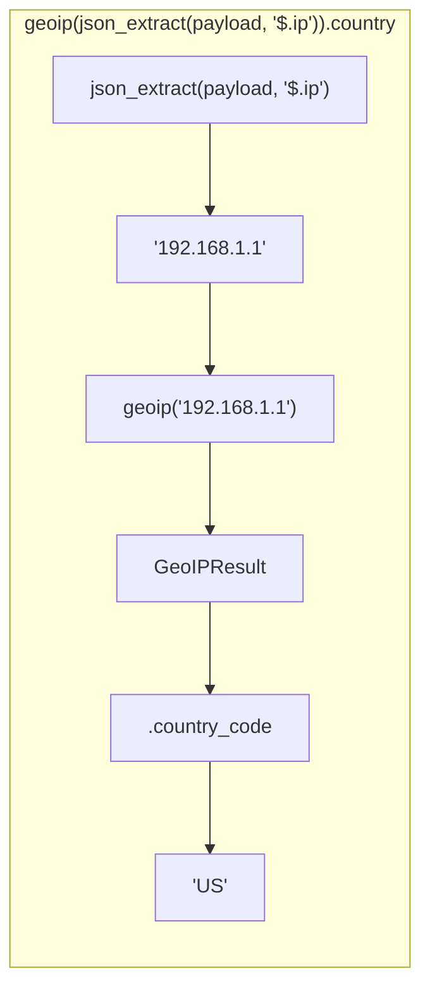
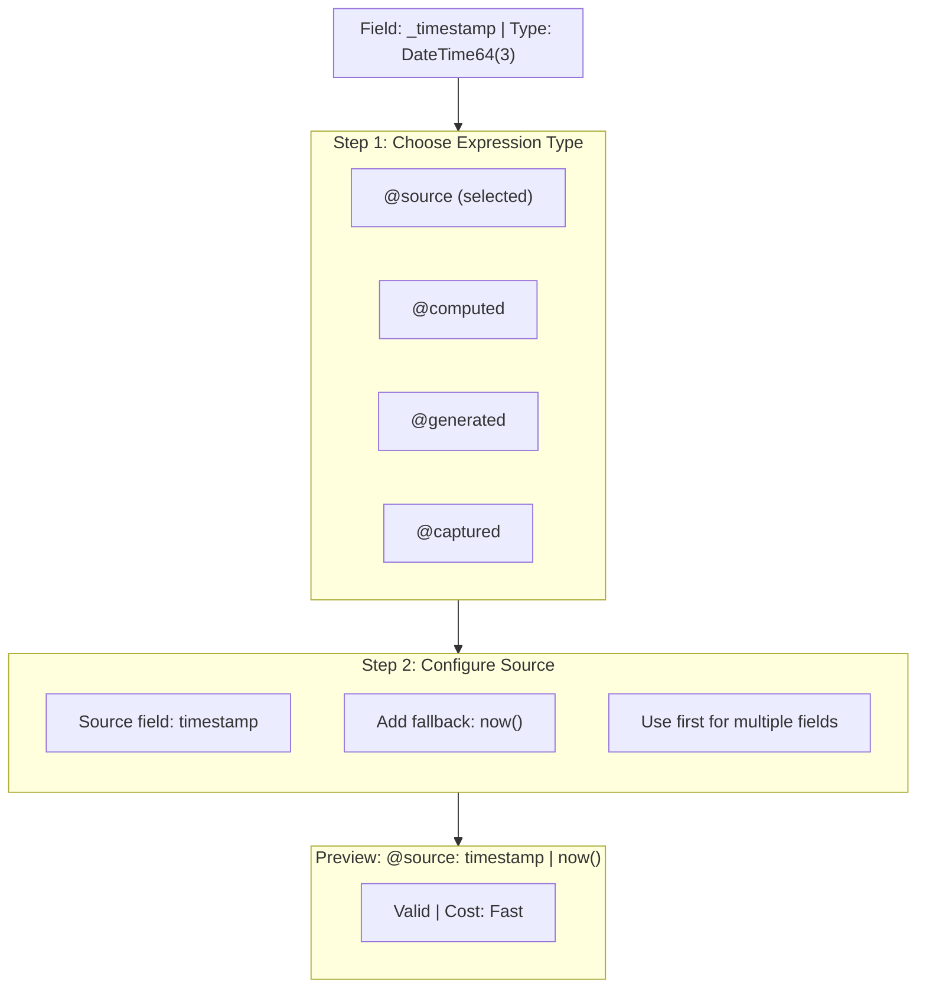
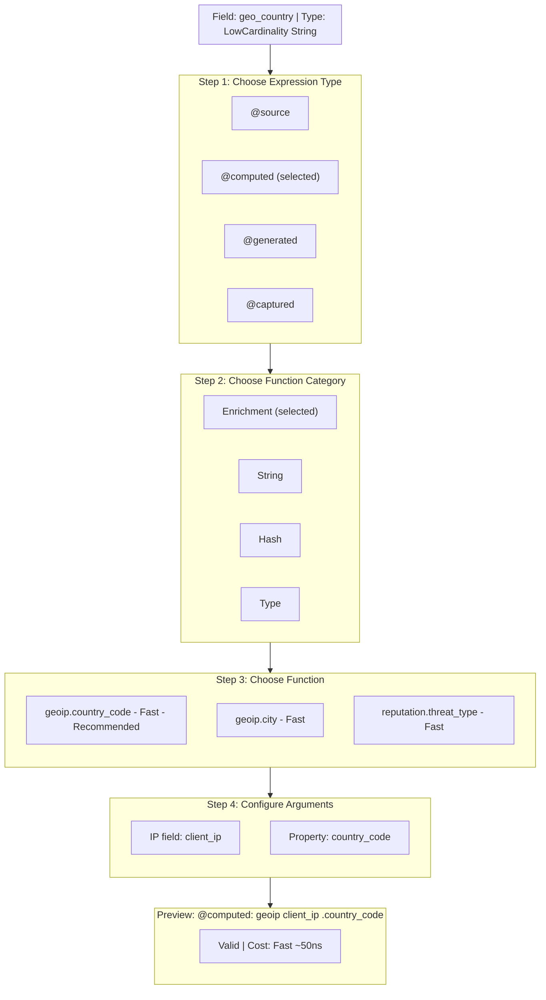
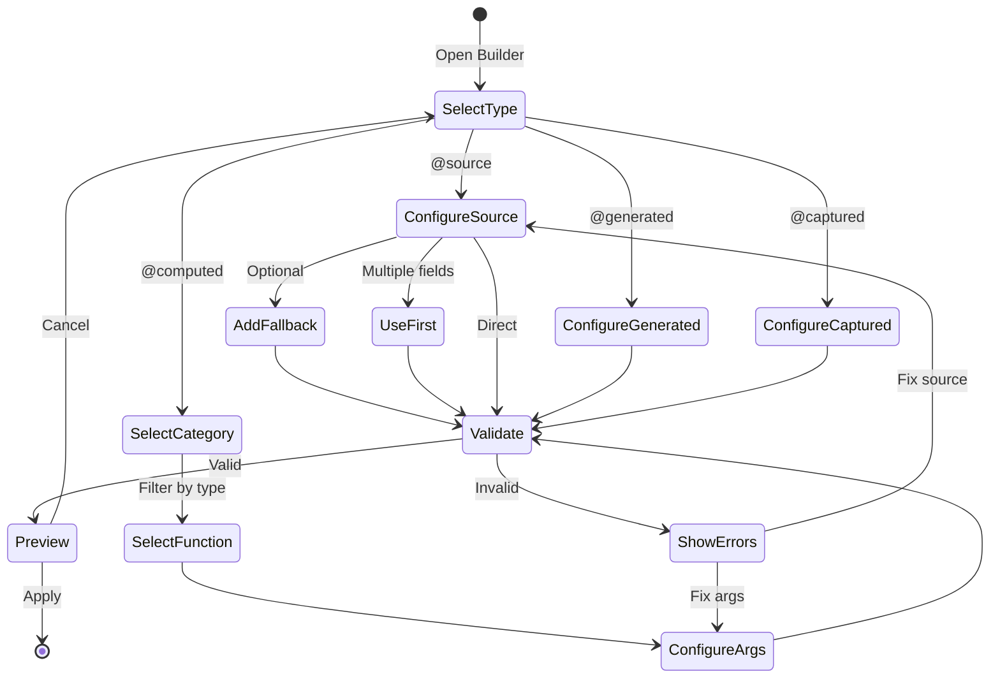
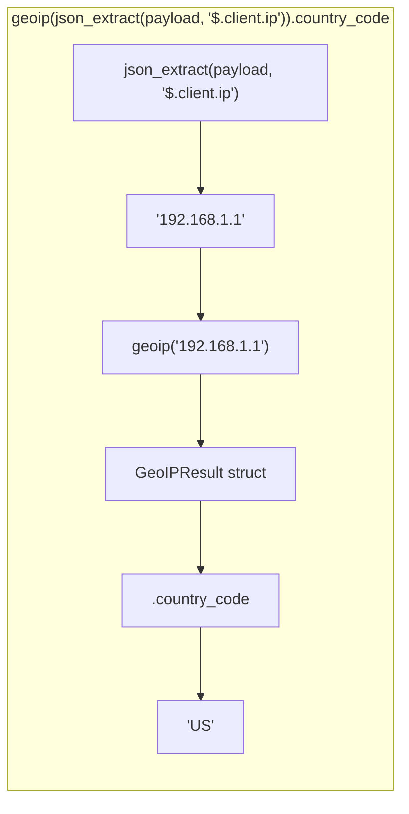
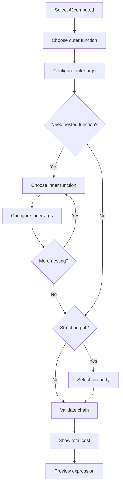

<!--
  Project:      dfe-loader
  File:         docs/clickhouse/DDL-DIRECTIVES.md
  Purpose:      DDL field-mapping expression language and @-comment directives
  Language:     Markdown

  License:      BUSL-1.1
  Copyright:    (c) 2026 HYPERI PTY LIMITED
-->

# DDL field-mapping directives

dfe-loader reads the schema from ClickHouse, not from a config file -- but a
plain `CREATE TABLE` does not say where each column's value comes from. That is
what these `@`-comment directives do. You write them as comments above (or
beside, in CSV) each column, and the data-prep stage reads them to decide
whether a column is copied from the source payload, renamed, generated by the
database, captured from the raw bytes, or computed by an enrichment function.

The directives are documentation that the loader honours: `@source` copies a
field, `@renamed` moves one (zero-copy), `@generated` defers to a DEFAULT clause,
`@captured` keeps raw input, and `@computed` runs a function chain. Every
`@computed` function carries a CPU cost tier so you can keep the hot path fast.
This page is the full reference -- grammar, the directive list, the function
catalogue with costs, table-level tags, and the control-plane API spec that lets
a UI compose and validate these expressions.

For the column types these directives target, see [TYPES.md](TYPES.md); for how
capture interacts with `_json` and `_raw`, see capture modes in
[../ARCHITECTURE.md](../ARCHITECTURE.md).

## Directive resolution

```mermaid
flowchart TB
    COL["Column in reflected schema<br/>+ @-comment directive"]
    K{"Which directive?"}
    GEN["@generated<br/>omit from insert<br/>DB DEFAULT fills it"]
    SRC["@source: field<br/>read input, optional fallback"]
    REN["@renamed: field<br/>data.remove() -> destination<br/>no-op if destination exists"]
    CAP["@captured<br/>keep raw input<br/>(String or as JSON)"]
    CMP["@computed: fn(...)<br/>evaluate function chain"]
    CFG["@config: path<br/>(pairs with @source/@captured)"]
    OUT["Value written to output column"]

    COL --> K
    K -->|@generated| GEN
    K -->|@source| SRC
    K -->|@renamed| REN
    K -->|@captured| CAP
    K -->|@computed| CMP
    SRC -. overridable by .- CFG
    CAP -. overridable by .- CFG
    SRC --> OUT
    REN --> OUT
    CAP --> OUT
    CMP --> OUT
    GEN -.-> SKIP["(field omitted)"]
```

## Overview

This expression language describes how source data fields map to destination
columns during the **data preparation stage** of the pipeline. It is used in:

- dfe-schemas YAML definitions, in a column's `expr` field
- The column COMMENTs those become in the deployed DDL
- Any table definition that needs field mapping documentation

## Expression types

### @source

Copy a value from source data during data prep.

```
@source: field_name
@source: field_name | fallback
@source: first(field1/field2/field3)
```

| Syntax | Description |
|--------|-------------|
| `@source: field` | Copy from source field, NULL if missing |
| `@source: field \| now()` | Copy from source, use `now()` if missing/invalid |
| `@source: field \| default_value` | Copy from source with custom fallback |
| `@source: first(a/b/c)` | First non-null from ordered list (/ separator) |

**Examples:**

```sql
-- @source: timestamp | now()
`event_time` DateTime64(3),

-- @source: first(user_id/uid/id)
`user_id` String,

-- @source: status_code
`http_status` UInt16,
```

### @generated

Value generated by the database (DEFAULT clause). Data prep **omits** this field.

```
@generated: expression
```

| Example | Description |
|---------|-------------|
| `@generated: now64(3)` | Database generates timestamp on insert |
| `@generated: generateUUIDv7()` | Database generates time-ordered UUID |
| `@generated: rowNumberInBlock()` | Database generates row number |

**Examples:**

```sql
-- @generated: now64(3)
`inserted_at` DateTime64(3) DEFAULT now64(3),

-- @generated: generateUUIDv7()
`id` UUID DEFAULT generateUUIDv7(),
```

### @captured

Value captured from raw input before transformation.

```
@captured: description
```

| Example | Description |
|---------|-------------|
| `@captured: raw_payload` | Original bytes as string |
| `@captured: raw_payload as JSON` | Original bytes stored as JSON type |
| `@captured: kafka_headers` | Message metadata |

**Examples:**

```sql
-- @captured: raw_payload
`original_message` String,

-- @captured: raw_payload as JSON
`message_json` JSON,
```

### @config

Indicates the mapping is configurable. Always paired with another expression.

```
@config: config.path
@config: config.path (default: "value")
```

**Examples:**

```sql
-- @source: org_id
-- @config: routing.org_id_field (default: "org_id")
`_org_id` String,

-- @source: first(tags/_tags/meta)
-- @config: metadata.tags_fields
`_tags` JSON,
```

### @computed

Value computed from other fields during data prep. This is where enrichment,
transformation, and derivation happens.

```
@computed: expression
```

#### Compound expressions (chaining)

Expressions can be composed/chained to build complex transformations. The inner
expression is evaluated first, then passed to the outer function.

**Syntax:**

```
@computed: outer_function(inner_expression)
```

**Examples:**

```sql
-- Extract IP from JSON field, then do GeoIP lookup
-- @computed: geoip(json_extract(payload, "$.client.ip")).country_code
`geo_country` LowCardinality(String),

-- Extract country from nested JSON, then uppercase it
-- @computed: upper(json_extract(metadata, "$.location.country"))
`country_upper` String,

-- Hash the result of concatenating multiple fields
-- @computed: xxhash64(concat(org_id, ":", user_id))
`identity_hash` UInt64,

-- Risk score from IP extracted from JSON
-- @computed: risk(json_extract(request, "$.headers.x-forwarded-for")).score
`risk_score` UInt8,

-- Conditional based on computed value
-- @computed: if(len(json_extract(body, "$.message")) > 1000, "long", "short")
`message_size` LowCardinality(String),

-- Multi-level nesting: extract, transform, hash
-- @computed: xxhash32(lower(trim(json_extract(user_data, "$.email"))))
`email_hash` UInt32,
```

**Evaluation order (inside-out):**



**Chaining rules:**

| Pattern | Example | Description |
|---------|---------|-------------|
| `func(field)` | `geoip(client_ip)` | Simple function call |
| `func(func(field))` | `upper(trim(name))` | Nested functions |
| `func(expr).property` | `geoip(ip).city` | Function with accessor |
| `func(func(field)).property` | `geoip(json_extract(...)).asn` | Nested with accessor |
| `func(a, b, c)` | `concat(a, ":", b)` | Multi-argument function |
| `func(func(a), func(b))` | `concat(lower(a), upper(b))` | Nested multi-arg |

**Cost accumulation:**

When chaining, costs add up. Consider the chain:

```sql
-- @computed: geoip(json_extract(payload, "$.ip")).country_code
```

| Step | Function | Cost |
|------|----------|------|
| 1 | `json_extract` | Avoid ~1us |
| 2 | `geoip` | Fast ~50ns (cached) |
| 3 | `.country_code` | Fast ~5ns |
| **Total** | | **~1.05us** |

The chain is dominated by the JSON extraction. **Recommendation:** Extract
fields during initial JSON parse, not via `@computed` chains.

**Hot-path safe chains:**

```sql
-- Good: All fast operations
-- @computed: xxhash64(concat(org_id, timestamp_ms(epoch)))

-- Good: Cached enrichment
-- @computed: risk(client_ip).level

-- Caution: String allocation
-- @computed: upper(lower(trim(username)))

-- Avoid: JSON in chain
-- @computed: geoip(json_extract(data, "$.ip")).country
```

**Alternative: pre-extracted fields**

Instead of JSON extraction in chains, use `@source` with dot notation:

```sql
-- Option 1: JSON extraction in @computed (slow)
-- @computed: geoip(json_extract(payload, "$.client.ip")).country

-- Option 2: Pre-extract with @source, then compute (faster)
-- @source: payload.client.ip
`_client_ip` String,

-- @computed: geoip(_client_ip).country
`geo_country` String,
```

Option 2 extracts during initial parse (SIMD-accelerated), avoiding repeated
JSON traversal.

#### GeoIP enrichment

**Cost: O(1) cached** | LRU cache hit ~50ns, miss ~2us (MMDB lookup)

Lookup geographic information from IP addresses using MaxMind MMDB databases.

```sql
-- @computed: geoip(client_ip).country_code
`geo_country` LowCardinality(String),

-- @computed: geoip(client_ip).city
`geo_city` String,

-- @computed: geoip(client_ip).latitude
`geo_lat` Float64,

-- @computed: geoip(client_ip).longitude
`geo_lon` Float64,

-- @computed: geoip(client_ip).timezone
`geo_tz` String,

-- @computed: geoip(client_ip).asn
`geo_asn` UInt32,

-- @computed: geoip(client_ip).asn_org
`geo_asn_org` String,

-- @computed: geoip(client_ip).is_private
`is_internal` Bool,
```

**Available geoip fields:**

| Field | Type | Cost | Description |
|-------|------|------|-------------|
| `country_code` | String | O(1) | ISO 3166-1 alpha-2 (e.g., "US", "GB") |
| `country_name` | String | O(1) | Country name in English |
| `city` | String | O(1) | City name |
| `latitude` | Float64 | O(1) | Latitude coordinate |
| `longitude` | Float64 | O(1) | Longitude coordinate |
| `timezone` | String | O(1) | IANA timezone (e.g., "America/New_York") |
| `postal_code` | String | O(1) | Postal/ZIP code |
| `subdivision` | String | O(1) | State/province name |
| `subdivision_code` | String | O(1) | State/province ISO code |
| `asn` | UInt32 | O(1) | Autonomous System Number |
| `asn_org` | String | O(1) | AS organisation name |
| `is_private` | Bool | O(1) | RFC1918/loopback/link-local (fast path, no MMDB) |
| `accuracy_radius` | UInt16 | O(1) | Accuracy in kilometres |

**Implementation notes:**

- Private IP detection is a fast path (~10ns) that bypasses MMDB entirely
- Batch deduplication processes unique IPs once per batch
- LRU cache: 100K entries, 25% eviction on capacity

#### Reputation enrichment

**Cost: O(1) cached** | FxHashMap lookup ~20ns, LRU cache 100K entries

Check IP addresses against threat intelligence feeds and blocklists.

```sql
-- @computed: reputation(client_ip).threat_type
`threat_type` LowCardinality(String),

-- @computed: reputation(client_ip).threat_source
`threat_source` LowCardinality(String),

-- @computed: reputation(client_ip).is_vpn
`is_vpn` Bool,

-- @computed: reputation(client_ip).is_tor
`is_tor` Bool,

-- @computed: reputation(client_ip).is_proxy
`is_proxy` Bool,

-- @computed: reputation(client_ip).is_datacenter
`is_datacenter` Bool,

-- @computed: reputation(client_ip).is_botnet
`is_botnet` Bool,

-- @computed: reputation(client_ip).abuse_score
`abuse_score` UInt8,
```

**Available reputation fields:**

| Field | Type | Cost | Description |
|-------|------|------|-------------|
| `threat_type` | String | O(1) | vpn/proxy/tor/relay/datacenter/botnet/spam/scanner/malware/phishing |
| `threat_source` | String | O(1) | TorProject/FireHol/AbuseIPDB/AbuseCH/Spamhaus/CrowdSec/GreyNoise |
| `is_vpn` | Bool | O(1) | Known VPN endpoint |
| `is_proxy` | Bool | O(1) | Open proxy |
| `is_tor` | Bool | O(1) | Tor exit node |
| `is_relay` | Bool | O(1) | Apple/iCloud Private Relay |
| `is_datacenter` | Bool | O(1) | Hosting/cloud provider |
| `is_residential` | Bool | O(1) | Residential proxy |
| `is_botnet` | Bool | O(1) | Known botnet C2 |
| `is_spam` | Bool | O(1) | Spam source |
| `is_scanner` | Bool | O(1) | Internet scanner |
| `is_malicious` | Bool | O(1) | Any malicious activity |
| `abuse_score` | UInt8 | O(1) | 0-100 abuse confidence |

**Implementation notes:**

- Dual storage: O(1) FxHashMap for individual IPs + CIDR prefix matching
- Atomic hit/miss counters for cache monitoring

#### Risk scoring

**Cost: O(1)** | Integer math only, ~100ns per IP

Composite risk score from multiple enrichment sources.

```sql
-- @computed: risk(client_ip).score
`risk_score` UInt8,

-- @computed: risk(client_ip).level
`risk_level` LowCardinality(String),

-- @computed: risk(client_ip).geo_score
`risk_geo` UInt8,

-- @computed: risk(client_ip).reputation_score
`risk_reputation` UInt8,

-- @computed: risk(client_ip).factors
`risk_factors` Array(String),
```

**Available risk fields:**

| Field | Type | Cost | Description |
|-------|------|------|-------------|
| `score` | UInt8 | O(1) | Weighted composite 0-100 |
| `level` | String | O(1) | minimal/low/medium/high/critical |
| `geo_score` | UInt8 | O(1) | Geographic risk component |
| `reputation_score` | UInt8 | O(1) | Reputation risk component |
| `privacy_score` | UInt8 | O(1) | Privacy service usage |
| `threat_score` | UInt8 | O(1) | Active threat indicators |
| `factors` | Array(String) | O(1) | Human-readable risk flags |

**Risk levels:** minimal (0-19), low (20-39), medium (40-59), high (60-79),
critical (80-100)

**Risk factors (array):** high_risk_country, tor_detected, vpn_detected,
proxy_detected, datacenter_ip, known_botnet, spam_source, scanner_detected,
high_abuse_score

**Implementation notes:**

- All u8 integer math, no floating point in hot path
- Configurable weights (default: geo 15%, rep 25%, priv 25%, threat 35%)
- Presets: UsEnterprise, EuEnterprise, ApacEnterprise, Global, HighSecurity

#### String functions

**Cost: O(n) allocates** | Most functions allocate new strings

```sql
-- @computed: len(message)
`message_len` UInt32,

-- @computed: lower(username)
`username_lower` String,

-- @computed: upper(status)
`status_upper` String,

-- @computed: trim(input)
`input_clean` String,

-- @computed: substr(message, 0, 100)
`message_preview` String,

-- @computed: concat(first_name, " ", last_name)
`full_name` String,

-- @computed: replace(path, "/api/v1", "")
`path_short` String,

-- @computed: split(tags, ",")
`tag_array` Array(String),
```

| Function | Cost | Allocates | Description |
|----------|------|-----------|-------------|
| `len(s)` | O(1) | No | String length in bytes |
| `lower(s)` | O(n) | Yes | Lowercase copy |
| `upper(s)` | O(n) | Yes | Uppercase copy |
| `trim(s)` | O(n) | Yes | Whitespace trimmed copy |
| `substr(s, start, len)` | O(len) | Yes | Substring copy |
| `concat(...)` | O(n) | Yes | Concatenated string |
| `replace(s, old, new)` | O(n) | Yes | String with replacements |
| `split(s, delim)` | O(n) | Yes | Array of strings |

**Performance notes:**

- `len()` is the only zero-allocation string function
- Use string functions sparingly in high-volume hot paths
- Consider doing string transformations in ClickHouse materialised views instead

#### Numeric functions

**Cost: O(1)** | Pure arithmetic, no allocations

```sql
-- @computed: duration_ms / 1000
`duration_sec` Float64,

-- @computed: bytes_sent + bytes_received
`bytes_total` UInt64,

-- @computed: round(latency_ms, 2)
`latency_rounded` Float64,

-- @computed: abs(delta)
`delta_abs` Int64,

-- @computed: min(timeout, 30000)
`timeout_capped` UInt32,

-- @computed: max(retries, 1)
`retries_min` UInt32,
```

| Function | Cost | Description |
|----------|------|-------------|
| `+`, `-`, `*`, `/` | O(1) | Arithmetic operators (~1ns) |
| `round(n, places)` | O(1) | Round to decimal places |
| `abs(n)` | O(1) | Absolute value |
| `min(a, b)` | O(1) | Minimum of two values |
| `max(a, b)` | O(1) | Maximum of two values |
| `floor(n)` | O(1) | Round down |
| `ceil(n)` | O(1) | Round up |

**Performance notes:**

- All numeric operations are hot-path safe
- Integer operations preferred over floating point when possible

#### Hash functions

**Cost: Varies** | Non-crypto hashes are hot-path safe, crypto hashes are
expensive

```sql
-- @computed: hash(org_id, timestamp)
`dedup_key` UInt64,

-- @computed: xxhash64(message)
`message_hash` UInt64,

-- @computed: xxhash32(message)
`message_hash32` UInt32,

-- @computed: fnv1a(short_key)
`key_hash` UInt64,

-- @computed: md5(payload)
`payload_hash` FixedString(16),

-- @computed: sha256(secret)
`secret_hash` FixedString(32),
```

| Function | Cost | Output | Description |
|----------|------|--------|-------------|
| `hash(...)` | O(n) ~50ns | UInt64 | Fast multi-field hash (xxhash64-based) |
| `xxhash64(s)` | O(n) ~30ns | UInt64 | Fast non-crypto hash, SIMD-optimised |
| `xxhash32(s)` | O(n) ~25ns | UInt32 | Smaller output, slightly faster |
| `fnv1a(s)` | O(n) ~10ns | UInt64 | Fastest for tiny inputs (<32 bytes) |
| `md5(s)` | O(n) ~500ns | 16 bytes | Crypto hash - avoid in hot path |
| `sha256(s)` | O(n) ~800ns | 32 bytes | Crypto hash - avoid in hot path |

**Performance notes:**

- Use `xxhash64` or `xxhash32` for deduplication and bucketing
- Use `fnv1a` for very short strings (keys, IDs <32 bytes)
- Avoid `md5`/`sha256` in hot paths - 10-20x slower than xxhash
- Crypto hashes only when cryptographic properties are required

#### Date/time functions

**Cost: Varies** | Epoch conversion is fast, parsing is expensive

```sql
-- @computed: timestamp_ms(epoch_ms)
`event_time` DateTime64(3),

-- @computed: timestamp_s(epoch_s)
`event_time_s` DateTime,

-- @computed: add_hours(timestamp, 8)
`local_time` DateTime,

-- @computed: date_trunc("hour", timestamp)
`hour_bucket` DateTime,

-- @computed: parse_timestamp(date_string, "%Y-%m-%d")
`parsed_date` DateTime,
```

| Function | Cost | Description |
|----------|------|-------------|
| `timestamp_ms(n)` | O(1) ~5ns | Epoch milliseconds to DateTime64(3) |
| `timestamp_s(n)` | O(1) ~5ns | Epoch seconds to DateTime |
| `add_hours(ts, n)` | O(1) ~10ns | Add hours to timestamp |
| `add_days(ts, n)` | O(1) ~10ns | Add days to timestamp |
| `date_trunc(unit, ts)` | O(1) ~20ns | Truncate to hour/day/month |
| `parse_timestamp(s, fmt)` | O(n) ~500ns | Parse string - avoid in hot path |

**Performance notes:**

- Prefer epoch integers over string timestamps in source data
- `parse_timestamp` requires format string parsing - 50-100x slower than epoch
- If parsing is unavoidable, cache format parsing where possible

#### Conditional functions

**Cost: O(1)** | Branch logic with minimal overhead

```sql
-- @computed: if(status >= 400, "error", "ok")
`status_category` LowCardinality(String),

-- @computed: coalesce(user_id, session_id, "anonymous")
`actor_id` String,

-- @computed: case(method, "GET" => "read", "POST" => "write", _ => "other")
`operation_type` LowCardinality(String),

-- @computed: nullif(value, "")
`value_or_null` Nullable(String),
```

| Function | Cost | Description |
|----------|------|-------------|
| `if(cond, then, else)` | O(1) ~5ns | Ternary conditional |
| `coalesce(...)` | O(n) ~5ns each | First non-null value |
| `case(val, ...)` | O(n) ~10ns each | Pattern matching (n = branches) |
| `nullif(val, match)` | O(1) ~5ns | NULL if equals match |

**Performance notes:**

- All conditionals are hot-path safe
- `coalesce` short-circuits on first non-null
- `case` is linear in number of branches (keep <10 for hot paths)

#### Type coercion

**Cost: Varies** | Numeric casts are fast, parsing is expensive

```sql
-- @computed: cast(port, "UInt16")
`port` UInt16,

-- @computed: to_string(error_code)
`error_code_str` String,

-- @computed: to_ipv4(ip_string)
`client_ip` IPv4,

-- @computed: to_uuid(id_string)
`request_id` UUID,
```

| Function | Cost | Allocates | Description |
|----------|------|-----------|-------------|
| `cast(n, "UInt16")` | O(1) ~2ns | No | Numeric type cast |
| `cast(n, "Float64")` | O(1) ~2ns | No | Numeric type cast |
| `to_string(n)` | O(n) ~50ns | Yes | Number to string |
| `to_ipv4(s)` | O(n) ~100ns | No | Parse IP address |
| `to_ipv6(s)` | O(n) ~150ns | No | Parse IPv6 address |
| `to_uuid(s)` | O(1) ~80ns | No | Parse UUID string |
| `to_bool(s)` | O(1) ~10ns | No | Parse boolean |

**Performance notes:**

- Numeric casts between integer/float types are essentially free
- String parsing (IP, UUID) has overhead but no allocation
- Prefer numeric source data over string representations

#### JSON functions

**Cost: Expensive** | Requires DOM traversal or parsing - avoid in hot path

```sql
-- @computed: json_extract(payload, "$.user.id")
`user_id` String,

-- @computed: json_extract_int(payload, "$.count")
`count` Int64,

-- @computed: json_keys(metadata)
`metadata_keys` Array(String),

-- @computed: json_length(items)
`item_count` UInt32,
```

| Function | Cost | Allocates | Description |
|----------|------|-----------|-------------|
| `json_extract(j, path)` | O(n) ~1us | Yes | Extract value by JSONPath |
| `json_extract_int(j, path)` | O(n) ~1us | No | Extract integer by path |
| `json_extract_bool(j, path)` | O(n) ~1us | No | Extract boolean by path |
| `json_keys(j)` | O(n) ~2us | Yes | Get all keys as array |
| `json_length(j)` | O(n) ~500ns | No | Count elements/keys |

**Performance notes:**

- JSON functions require parsing/traversing the JSON structure
- 100-1000x slower than direct field access
- **Recommendation:** Extract fields during initial parse, not via @computed
- If JSON extraction is needed, prefer doing it in ClickHouse SQL queries

#### Array functions

**Cost: Varies** | Length is O(1), search/transform is O(n)

```sql
-- @computed: array_length(tags)
`tag_count` UInt32,

-- @computed: array_contains(roles, "admin")
`is_admin` Bool,

-- @computed: array_join(tags, ",")
`tags_string` String,

-- @computed: array_distinct(categories)
`unique_categories` Array(String),
```

| Function | Cost | Allocates | Description |
|----------|------|-----------|-------------|
| `array_length(a)` | O(1) ~5ns | No | Array length |
| `array_first(a)` | O(1) ~5ns | No | First element |
| `array_last(a)` | O(1) ~5ns | No | Last element |
| `array_contains(a, v)` | O(n) | No | Linear search |
| `array_join(a, sep)` | O(n) | Yes | Concatenate to string |
| `array_distinct(a)` | O(n log n) | Yes | Unique elements |
| `array_sort(a)` | O(n log n) | Yes | Sorted copy |
| `array_reverse(a)` | O(n) | Yes | Reversed copy |

**Performance notes:**

- `array_length`, `array_first`, `array_last` are hot-path safe
- `array_contains` is O(n) - avoid for large arrays in hot path
- `array_distinct` and `array_sort` allocate new arrays

### @renamed

Field is renamed from source (no transformation, just name change). Uses
`data.remove()` for zero-copy ownership transfer -- the source field is removed
and its value moves to the destination.

```
@renamed: original_name
@renamed: first(field1/field2/field3)
```

| Syntax | Description |
|--------|-------------|
| `@renamed: field` | Rename source field to destination, NULL if missing |
| `@renamed: first(a/b/c)` | First non-null from ordered list (/ separator), renamed to destination |

**Semantics:**

- **Zero-copy rename**: Source field is removed (`data.remove()`), value
  transferred to destination. No clone.
- **Silent no-op if destination exists**: If the destination field is already
  present in the data, the rename is skipped entirely. This prevents overwriting
  upstream-populated fields.
- **First-match wins**: With `first()`, fields are tried in order. The first
  present field is renamed; remaining candidates are left untouched.

**Examples:**

```sql
-- @renamed: timestamp
`_timestamp` DateTime64(3),

-- @renamed: org
`_org_id` String,

-- @renamed: first(logoriginal/_raw/raw/raw_log/message)
`_raw` Nullable(String) CODEC(ZSTD(3)),
```

**Implementation:**

```rust
// @renamed: field
if !data.contains_key("_destination") {
    if let Some(val) = data.remove("source_field") {
        data.insert("_destination".to_string(), val);
    }
}

// @renamed: first(a/b/c)
if !data.contains_key("_destination") {
    for field in &["a", "b", "c"] {
        if let Some(val) = data.remove(*field) {
            data.insert("_destination".to_string(), val);
            break;
        }
    }
}
```

## Operators

### Fallback operator (`|`)

Provides a fallback when the source is missing or invalid:

```
@source: field | fallback_expression
```

- `now()` - Current timestamp
- `uuid()` - Generate UUID (v7, time-ordered)
- `null` - Explicit NULL
- `"literal"` - String literal (quote it)
- `0`, `false` - Numeric/boolean literals

This vocabulary is closed. A fallback outside it is a field reference the
loader cannot resolve, so it is ignored and the column is left absent rather
than filled with the text of the expression - `@source: first(_source) |
topic_name` leaves `_source` absent, it does not write the string
`topic_name`. The loader logs the ignored fallback once per five minutes.

### List operator (`/`)

Separates alternatives in `first()`:

```
@source: first(field1/field2/field3)
```

- Tries each field in order
- Uses first non-null value
- Returns NULL if all missing

## CSV schema format

```csv
column,type,default,nullable,codec,source,comment
```

The `source` column contains the expression:

```csv
column,type,default,nullable,codec,source,comment
event_time,DateTime64(3),,false,Delta/ZSTD(1),@source: timestamp | now(),When event occurred
id,UUID,generateUUIDv7(),false,,@generated: generateUUIDv7(),Unique identifier
tags,JSON,,true,ZSTD(3),@source: first(tags/_tags/meta),Event metadata
```

## SQL DDL format

Expressions appear as comments above the column definition:

```sql
CREATE TABLE events (
    -- @generated: now64(3)
    `inserted_at` DateTime64(3) DEFAULT now64(3),

    -- @source: timestamp | now()
    `event_time` DateTime64(3),

    -- @source: user_id
    -- @config: routing.user_id_field
    `user_id` String,

    -- @captured: raw_payload as JSON
    -- @config: metadata.capture_json (default: true)
    `original` JSON,

    -- @source: first(tags/_tags/metadata.tags)
    -- @config: metadata.tags_fields
    `tags` JSON
)
```

## Data prep behaviour

### Field extraction

1. **@source** fields are read from input, optionally transformed, written to
   output
2. **@generated** fields are omitted - database provides value
3. **@captured** fields are captured before any transformation
4. **@computed** fields are calculated during transformation
5. **@renamed** fields are zero-copy renames (silent no-op if destination
   already present)

### Input vs output names

Expressions document the **input** field name. The column name is the **output**:

```sql
-- @source: timestamp       <- reads "timestamp" from input
`_timestamp` DateTime64(3)  <- writes to "_timestamp" in output
```

### Field removal

By default, routing/extracted fields can be removed after extraction to avoid
duplication. This is configurable per deployment.

## Implementation reference

The data prep stage (transformer) implements these expressions:

| Expression | Implementation |
|------------|----------------|
| `@source: field` | `data.remove("field")` or `data.get("field")` |
| `@source: field \| now()` | Fallback to `Utc::now()` if missing/invalid |
| `@source: first(a/b)` | Try each field, return first non-null |
| `@generated: expr` | Field omitted from insert, DB DEFAULT used |
| `@captured: payload` | Captured before flatten/transform |
| `@computed: expr` | Custom logic per expression |
| `@renamed: field` | `data.remove("field")` -> destination; no-op if destination exists |
| `@renamed: first(a/b)` | Try each field via `remove()`, first match renamed; no-op if destination exists |

## CPU cost summary

Quick reference for hot-path function selection.

### Cost tiers

| Tier | Time | Description |
|------|------|-------------|
| **Fast** | <100ns | Safe for all hot paths |
| **Moderate** | 100ns-1us | Use sparingly, may allocate |
| **Expensive** | >1us | Avoid in hot path |

### Function categories by cost

**Hot-path safe (use freely):**

- All enrichment lookups (geoip, reputation, risk) - cached
- Numeric operations (+, -, *, /, round, abs, min, max)
- Conditional logic (if, coalesce, case, nullif)
- Numeric type casts
- Array metadata (length, first, last)
- Hash functions (xxhash64, xxhash32, fnv1a)
- Epoch timestamp conversion (timestamp_ms, timestamp_s)

**Use sparingly (allocates or O(n)):**

- String functions (lower, upper, trim, substr, concat, replace, split)
- IP/UUID parsing (to_ipv4, to_ipv6, to_uuid)
- Array operations (contains, join, distinct, sort)

**Avoid in hot path:**

- Cryptographic hashes (md5, sha256) - 10-20x slower
- Timestamp parsing (parse_timestamp) - format string overhead
- JSON functions (json_extract, json_keys) - DOM traversal

### Allocation guide

| Allocates | Functions |
|-----------|-----------|
| Never | len, numeric ops, conditionals, numeric casts, xxhash*, fnv1a, array_length |
| Sometimes | to_ipv4, to_uuid (error paths only) |
| Always | String transforms, array_join, array_distinct, json_extract |

## Python REST API library specification

A Python library for UI control planes to compose and validate DDL expressions.

### Overview

```
ddl-expression-api/
|-- ddl_expression/
|   |-- __init__.py
|   |-- parser.py          # Expression parser
|   |-- validator.py       # Syntax and semantic validation
|   |-- builder.py         # Expression builders
|   |-- schema.py          # Pydantic models
|   `-- cost.py            # CPU cost analysis
|-- api/
|   |-- __init__.py
|   |-- app.py             # FastAPI application
|   `-- routes/
|       |-- validate.py    # Validation endpoints
|       |-- build.py       # Builder endpoints
|       `-- schema.py      # Schema endpoints
`-- tests/
```

### Core models (Pydantic)

```python
from enum import Enum
from typing import Optional, List, Union
from pydantic import BaseModel, Field

class ExpressionType(str, Enum):
    SOURCE = "source"
    GENERATED = "generated"
    CAPTURED = "captured"
    CONFIG = "config"
    COMPUTED = "computed"
    RENAMED = "renamed"

class CostTier(str, Enum):
    FAST = "fast"           # <100ns
    MODERATE = "moderate"   # 100ns-1us
    EXPENSIVE = "expensive" # >1us

class FunctionInfo(BaseModel):
    name: str
    category: str  # geoip, reputation, string, numeric, hash, datetime, conditional, coercion, json, array
    cost_tier: CostTier
    cost_estimate_ns: int
    allocates: bool
    description: str
    signature: str  # e.g., "geoip(ip_field).country_code"
    return_type: str
    parameters: List["ParameterInfo"]

class ParameterInfo(BaseModel):
    name: str
    type: str
    required: bool = True
    description: str

class Expression(BaseModel):
    type: ExpressionType
    raw: str  # Original expression string
    parsed: "ParsedExpression"
    cost: Optional["CostAnalysis"] = None
    errors: List["ValidationError"] = []
    warnings: List["ValidationWarning"] = []

class ParsedExpression(BaseModel):
    """Structured representation of parsed expression"""
    # For @source
    field: Optional[str] = None
    fallback: Optional[str] = None
    alternatives: Optional[List[str]] = None  # for first(a/b/c)

    # For @computed
    function: Optional[str] = None
    arguments: Optional[List[Union[str, "ParsedExpression"]]] = None
    accessor: Optional[str] = None  # e.g., ".country_code" for geoip()

    # For @config
    config_path: Optional[str] = None
    default_value: Optional[str] = None

class CostAnalysis(BaseModel):
    tier: CostTier
    estimate_ns: int
    allocates: bool
    hot_path_safe: bool
    recommendation: Optional[str] = None

class ValidationError(BaseModel):
    code: str  # e.g., "UNKNOWN_FUNCTION", "INVALID_SYNTAX"
    message: str
    position: Optional[int] = None
    suggestion: Optional[str] = None

class ValidationWarning(BaseModel):
    code: str  # e.g., "EXPENSIVE_FUNCTION", "ALLOCATES"
    message: str
    recommendation: Optional[str] = None
```

### Type-aware function filtering

The UI can filter available functions based on target column type. This enables
"hand-holding" where users pick from a filtered list of compatible functions.

#### Type categories

Based on the ClickHouse type system in `src/clickhouse_ext/` (ParsedType):

```python
class TypeCategory(str, Enum):
    STRING = "String"      # String, FixedString
    INT = "Int"            # Int8-Int256
    UINT = "UInt"          # UInt8-UInt256
    FLOAT = "Float"        # Float32, Float64
    DECIMAL = "Decimal"    # Decimal, Decimal32-256
    BOOL = "Bool"          # Bool
    DATE = "Date"          # Date, Date32
    DATETIME = "DateTime"  # DateTime
    DATETIME64 = "DateTime64"  # DateTime64(precision)
    UUID = "UUID"          # UUID
    IPV4 = "IPv4"          # IPv4
    IPV6 = "IPv6"          # IPv6
    ARRAY = "Array"        # Array(T)
    MAP = "Map"            # Map(K, V)
    JSON = "JSON"          # JSON, Object
    ENUM = "Enum"          # Enum8, Enum16
    GEO = "Geo"            # Point, Polygon, etc.
```

#### Function-to-type compatibility matrix

```python
FUNCTION_TYPE_COMPATIBILITY = {
    # Enrichment functions - output specific types
    "geoip.country_code": ["String"],
    "geoip.city": ["String"],
    "geoip.latitude": ["Float"],
    "geoip.longitude": ["Float"],
    "geoip.timezone": ["String"],
    "geoip.asn": ["UInt"],
    "geoip.asn_org": ["String"],
    "geoip.is_private": ["Bool"],
    "reputation.threat_type": ["String"],
    "reputation.is_vpn": ["Bool"],
    "reputation.is_tor": ["Bool"],
    "reputation.abuse_score": ["UInt"],
    "risk.score": ["UInt"],
    "risk.level": ["String"],
    "risk.factors": ["Array"],

    # String functions - only for String columns
    "len": ["UInt"],           # Returns number
    "lower": ["String"],
    "upper": ["String"],
    "trim": ["String"],
    "substr": ["String"],
    "concat": ["String"],
    "replace": ["String"],
    "split": ["Array"],

    # Numeric functions - only for numeric columns
    "+": ["Int", "UInt", "Float", "Decimal"],
    "-": ["Int", "UInt", "Float", "Decimal"],
    "*": ["Int", "UInt", "Float", "Decimal"],
    "/": ["Float", "Decimal"],
    "round": ["Float", "Decimal"],
    "abs": ["Int", "UInt", "Float", "Decimal"],
    "min": ["Int", "UInt", "Float", "Decimal", "DateTime", "DateTime64", "Date"],
    "max": ["Int", "UInt", "Float", "Decimal", "DateTime", "DateTime64", "Date"],

    # Hash functions - various outputs
    "hash": ["UInt"],
    "xxhash64": ["UInt"],
    "xxhash32": ["UInt"],
    "fnv1a": ["UInt"],
    "md5": ["String"],          # FixedString(16) in ClickHouse
    "sha256": ["String"],       # FixedString(32) in ClickHouse

    # Date/time functions - for temporal columns
    "timestamp_ms": ["DateTime64"],
    "timestamp_s": ["DateTime"],
    "add_hours": ["DateTime", "DateTime64"],
    "add_days": ["DateTime", "DateTime64", "Date"],
    "date_trunc": ["DateTime", "DateTime64", "Date"],
    "parse_timestamp": ["DateTime", "DateTime64"],

    # Conditional functions - various types
    "if": ["*"],               # Inherits from branches
    "coalesce": ["*"],         # Inherits from first non-null
    "case": ["*"],             # Inherits from branches
    "nullif": ["*"],           # Same as input

    # Type coercion - specific outputs
    "cast": ["*"],             # Target type specified
    "to_string": ["String"],
    "to_ipv4": ["IPv4"],
    "to_ipv6": ["IPv6"],
    "to_uuid": ["UUID"],
    "to_bool": ["Bool"],

    # JSON functions - for String/JSON columns
    "json_extract": ["String", "JSON"],
    "json_extract_int": ["Int"],
    "json_extract_bool": ["Bool"],
    "json_keys": ["Array"],
    "json_length": ["UInt"],

    # Array functions - for Array columns
    "array_length": ["UInt"],
    "array_first": ["*"],       # Element type
    "array_last": ["*"],        # Element type
    "array_contains": ["Bool"],
    "array_join": ["String"],
    "array_distinct": ["Array"],
    "array_sort": ["Array"],
}
```

#### GET /api/v1/functions/for-type

Get functions compatible with a target column type.

**Request:** `GET /api/v1/functions/for-type?type=DateTime64(3)`

**Response:**

```json
{
  "target_type": "DateTime64(3)",
  "category": "DateTime64",
  "compatible_functions": [
    {
      "name": "timestamp_ms",
      "signature": "timestamp_ms(epoch_ms)",
      "description": "Convert epoch milliseconds to DateTime64",
      "cost_tier": "fast",
      "recommended": true
    },
    {
      "name": "add_hours",
      "signature": "add_hours(timestamp, n)",
      "description": "Add hours to timestamp",
      "cost_tier": "fast"
    },
    {
      "name": "date_trunc",
      "signature": "date_trunc(\"hour\", timestamp)",
      "description": "Truncate to time unit",
      "cost_tier": "fast"
    },
    {
      "name": "parse_timestamp",
      "signature": "parse_timestamp(str, format)",
      "description": "Parse string to timestamp",
      "cost_tier": "expensive",
      "warning": "Avoid in hot path - 50-100x slower than epoch"
    }
  ],
  "source_expressions": [
    {
      "template": "@source: {field} | now()",
      "description": "Copy from source with now() fallback"
    },
    {
      "template": "@source: first({fields})",
      "description": "First non-null from field list"
    }
  ]
}
```

#### POST /api/v1/suggest

Get contextual suggestions for building an expression.

**Request:**

```json
{
  "partial_expression": "@computed: geoip(",
  "target_type": "String",
  "cursor_position": 18
}
```

**Response:**

```json
{
  "suggestions": [
    {
      "text": "client_ip",
      "type": "field",
      "description": "Available source field"
    }
  ],
  "completions": [
    {
      "text": "geoip(client_ip).country_code",
      "description": "ISO country code",
      "compatible": true
    },
    {
      "text": "geoip(client_ip).city",
      "description": "City name",
      "compatible": true
    },
    {
      "text": "geoip(client_ip).latitude",
      "description": "Latitude coordinate",
      "compatible": false,
      "reason": "Returns Float, target is String"
    }
  ]
}
```

### REST API endpoints

#### POST /api/v1/validate

Validate an expression and return detailed analysis.

**Request:**

```json
{
  "expression": "@computed: geoip(client_ip).country_code",
  "context": {
    "available_fields": ["client_ip", "user_id", "timestamp"],
    "target_type": "LowCardinality(String)"
  }
}
```

**Response:**

```json
{
  "valid": true,
  "expression": {
    "type": "computed",
    "raw": "@computed: geoip(client_ip).country_code",
    "parsed": {
      "function": "geoip",
      "arguments": ["client_ip"],
      "accessor": "country_code"
    },
    "cost": {
      "tier": "fast",
      "estimate_ns": 50,
      "allocates": false,
      "hot_path_safe": true
    },
    "errors": [],
    "warnings": []
  }
}
```

**Error response:**

```json
{
  "valid": false,
  "expression": {
    "type": "computed",
    "raw": "@computed: unknownfn(x)",
    "parsed": null,
    "errors": [
      {
        "code": "UNKNOWN_FUNCTION",
        "message": "Function 'unknownfn' is not defined",
        "position": 11,
        "suggestion": "Did you mean 'geoip', 'reputation', or 'risk'?"
      }
    ],
    "warnings": []
  }
}
```

#### POST /api/v1/validate/batch

Validate multiple expressions at once.

**Request:**

```json
{
  "expressions": [
    "@source: timestamp | now()",
    "@computed: geoip(client_ip).country_code",
    "@generated: generateUUIDv7()"
  ],
  "context": {
    "available_fields": ["client_ip", "timestamp"]
  }
}
```

**Response:**

```json
{
  "results": [
    {"valid": true, "expression": {...}},
    {"valid": true, "expression": {...}},
    {"valid": true, "expression": {...}}
  ],
  "summary": {
    "total": 3,
    "valid": 3,
    "invalid": 0,
    "warnings": 0
  }
}
```

#### GET /api/v1/functions

List all available functions with metadata.

**Response:**

```json
{
  "functions": [
    {
      "name": "geoip",
      "category": "enrichment",
      "cost_tier": "fast",
      "cost_estimate_ns": 50,
      "allocates": false,
      "description": "GeoIP lookup with LRU caching",
      "signature": "geoip(ip_field).{property}",
      "return_type": "varies",
      "parameters": [
        {"name": "ip_field", "type": "String", "required": true, "description": "Field containing IP address"}
      ],
      "properties": [
        {"name": "country_code", "type": "String", "description": "ISO 3166-1 alpha-2"},
        {"name": "city", "type": "String", "description": "City name"},
        {"name": "latitude", "type": "Float64", "description": "Latitude coordinate"}
      ]
    }
  ],
  "categories": ["enrichment", "string", "numeric", "hash", "datetime", "conditional", "coercion", "json", "array"]
}
```

#### GET /api/v1/functions/{name}

Get detailed information about a specific function.

#### POST /api/v1/build/source

Build a @source expression.

**Request:**

```json
{
  "field": "timestamp",
  "fallback": "now()",
  "alternatives": null
}
```

**Response:**

```json
{
  "expression": "@source: timestamp | now()",
  "parsed": {...},
  "cost": {...}
}
```

#### POST /api/v1/build/computed

Build a @computed expression with validation.

**Request:**

```json
{
  "function": "geoip",
  "arguments": ["client_ip"],
  "accessor": "country_code"
}
```

**Response:**

```json
{
  "expression": "@computed: geoip(client_ip).country_code",
  "parsed": {...},
  "cost": {
    "tier": "fast",
    "estimate_ns": 50,
    "allocates": false,
    "hot_path_safe": true
  }
}
```

#### POST /api/v1/cost/analyze

Analyse CPU cost of an expression or set of expressions.

**Request:**

```json
{
  "expressions": [
    "@computed: geoip(client_ip).country_code",
    "@computed: md5(payload)",
    "@computed: lower(username)"
  ]
}
```

**Response:**

```json
{
  "analysis": [
    {"expression": "...", "tier": "fast", "estimate_ns": 50, "hot_path_safe": true},
    {"expression": "...", "tier": "expensive", "estimate_ns": 500, "hot_path_safe": false},
    {"expression": "...", "tier": "moderate", "estimate_ns": 100, "hot_path_safe": true}
  ],
  "summary": {
    "total_estimate_ns": 650,
    "hot_path_safe": false,
    "recommendations": [
      "Replace md5(payload) with xxhash64(payload) for 10x speedup",
      "Consider moving string operations to ClickHouse materialised views"
    ]
  }
}
```

#### GET /api/v1/schema/column

Get the DDL expression for a standard column.

**Request:** `GET /api/v1/schema/column?name=_timestamp`

**Response:**

```json
{
  "column": "_timestamp",
  "type": "DateTime64(3)",
  "expression": "@source: timestamp | now()",
  "codec": "Delta/ZSTD(1)",
  "nullable": false,
  "comment": "Event occurrence time"
}
```

#### GET /api/v1/schema/common-header

Get all common header column definitions.

### Python client library

```python
from ddl_expression import ExpressionClient, ExpressionBuilder

# Client for REST API
client = ExpressionClient("http://localhost:8000")

# Validate an expression
result = client.validate("@computed: geoip(client_ip).country_code")
if result.valid:
    print(f"Cost tier: {result.expression.cost.tier}")
else:
    for error in result.expression.errors:
        print(f"Error: {error.message}")

# Build expressions programmatically
builder = ExpressionBuilder()

# Source with fallback
expr = builder.source("timestamp").fallback("now()").build()
# -> "@source: timestamp | now()"

# Source with alternatives
expr = builder.source().first(["tags", "_tags", "meta"]).build()
# -> "@source: first(tags/_tags/meta)"

# Computed expression
expr = builder.computed("geoip", ["client_ip"]).accessor("country_code").build()
# -> "@computed: geoip(client_ip).country_code"

# Analyse cost
cost = client.analyze_cost([
    "@computed: xxhash64(payload)",
    "@computed: lower(username)"
])
print(f"Total cost: {cost.summary.total_estimate_ns}ns")
print(f"Hot path safe: {cost.summary.hot_path_safe}")
```

### Error codes

| Code | Description |
|------|-------------|
| `INVALID_SYNTAX` | Expression syntax is malformed |
| `UNKNOWN_TYPE` | Expression type not recognised (@source, @computed, etc.) |
| `UNKNOWN_FUNCTION` | Function name not in registry |
| `INVALID_ARGUMENTS` | Wrong number or type of arguments |
| `UNKNOWN_ACCESSOR` | Property accessor not valid for function |
| `FIELD_NOT_FOUND` | Referenced field not in available_fields context |
| `TYPE_MISMATCH` | Expression result type does not match target_type |
| `CIRCULAR_REFERENCE` | Expression references itself |

### Warning codes

| Code | Description |
|------|-------------|
| `EXPENSIVE_FUNCTION` | Function is not hot-path safe (>1us) |
| `ALLOCATES` | Function allocates memory |
| `PREFER_ALTERNATIVE` | A faster alternative exists |
| `DEPRECATED` | Function is deprecated |

### Implementation notes

1. **Parser**: Use a simple recursive descent parser for the expression language
2. **Validation**: Two-phase validation (syntax then semantics)
3. **Cost database**: Static registry of function costs from this specification
4. **Caching**: Cache parsed expressions by hash for repeated validation
5. **OpenAPI**: Generate OpenAPI 3.0 spec for client generation

### Dependencies

```txt
fastapi>=0.100.0
pydantic>=2.0.0
uvicorn>=0.23.0
python-multipart>=0.0.6
```

### UI builder flow

The control plane UI should implement a step-by-step expression builder:

**Source expression builder flow:**



**Computed expression builder flow:**



**Expression builder state machine:**



**Type filtering logic:**

```python
def get_filtered_functions(target_type: str, category: Optional[str] = None) -> List[FunctionInfo]:
    """
    Get functions compatible with target type.

    1. Parse target type to get category (String, DateTime64, etc.)
    2. Filter FUNCTION_TYPE_COMPATIBILITY for matches
    3. Optionally filter by function category (enrichment, string, etc.)
    4. Sort by recommendation (hot-path safe first)
    """
    parsed = parse_clickhouse_type(target_type)
    type_category = parsed.coercer_category()

    compatible = []
    for func_name, output_types in FUNCTION_TYPE_COMPATIBILITY.items():
        if "*" in output_types or type_category in output_types:
            func_info = get_function_info(func_name)
            if category is None or func_info.category == category:
                compatible.append(func_info)

    # Sort: fast functions first, then by name
    return sorted(compatible, key=lambda f: (
        0 if f.cost_tier == "fast" else 1 if f.cost_tier == "moderate" else 2,
        f.name
    ))
```

### Rust type safety reference

The dfe-loader Rust implementation provides robust type safety. The Python API
should mirror this behaviour. The type parser and coercer live in
`src/clickhouse_ext/` (ParsedType) and `src/transform/`.

**Type parsing (ParsedType, in `src/clickhouse_ext/`):**

```rust
// ParsedType handles all ClickHouse type variations
pub struct ParsedType {
    pub raw: String,           // Original: "LowCardinality(Nullable(String))"
    pub base: String,          // Base type: "String"
    pub nullable: bool,        // Wrapped in Nullable()
    pub low_cardinality: bool, // Wrapped in LowCardinality()
    pub array_element: Option<Box<ParsedType>>,  // For Array(T)
    pub map_types: Option<(Box<ParsedType>, Box<ParsedType>>), // For Map(K,V)
    pub precision: Option<u8>, // DateTime64(3), Decimal(18,4)
    pub scale: Option<u8>,     // Decimal scale
    pub timezone: Option<String>, // DateTime64(3, 'UTC')
    pub fixed_size: Option<usize>, // FixedString(32)
}

// Category mapping for coercion dispatch
pub fn coercer_category(&self) -> &str {
    match self.base.as_str() {
        "String" | "FixedString" => "String",
        "Int8" | "Int16" | "Int32" | "Int64" | "Int128" | "Int256" => "Int",
        "UInt8" | "UInt16" | "UInt32" | "UInt64" | "UInt128" | "UInt256" => "UInt",
        "Float32" | "Float64" => "Float",
        "Decimal" | "Decimal32" | "Decimal64" | "Decimal128" | "Decimal256" => "Decimal",
        "Bool" => "Bool",
        "Date" | "Date32" => "Date",
        "DateTime" => "DateTime",
        "DateTime64" => "DateTime64",
        "UUID" => "UUID",
        "IPv4" => "IPv4",
        "IPv6" => "IPv6",
        "Array" => "Array",
        "Map" => "Map",
        "JSON" | "Object" => "JSON",
        "Enum8" | "Enum16" => "Enum",
        _ => "String",  // Safe fallback
    }
}
```

**Type coercion (`src/transform/coerce.rs`):**

```rust
// Dispatch to type-specific coercer
pub fn coerce_value(&self, value: &Value, target: &ParsedType) -> Result<Value> {
    if value.is_null() || self.is_null_value(value) {
        return self.handle_null(target);
    }

    match target.coercer_category() {
        "String" => self.coerce_string(value, target),
        "Int" => self.coerce_int(value),
        "UInt" => self.coerce_uint(value),
        "Float" => self.coerce_float(value),
        "DateTime64" => self.coerce_datetime64(value, target),
        "UUID" => self.coerce_uuid(value),
        "IPv4" => self.coerce_ipv4(value),
        // ... etc
        _ => self.coerce_string(value, target),  // Safe fallback
    }
}
```

**Key type safety rules:**

1. **Nullable handling:** `Nullable(T)` allows NULL, non-nullable columns get
   defaults
2. **Overflow protection:** Integer overflow detected and rejected
3. **String null detection:** Recognises "null", "NULL", "None", "", etc.
4. **Date/time normalisation:** Auto-detects epoch seconds/millis/micros/nanos
5. **UUID normalisation:** Handles hyphenated, non-hyphenated, braced formats
6. **IP address validation:** Validates format before accepting

**Python API should implement equivalent validation:**

```python
def validate_type_compatibility(expression: Expression, target_type: str) -> ValidationResult:
    """
    Validate expression output is compatible with target column type.

    Rules:
    1. Exact match: expression output == target category
    2. Numeric promotion: Int -> Float allowed, not reverse
    3. String fallback: anything can coerce to String
    4. Array element: Array(T) expression must match Array(T) column
    """
    parsed_target = parse_clickhouse_type(target_type)
    expr_output = get_expression_output_type(expression)

    if expr_output == parsed_target.coercer_category():
        return ValidationResult(compatible=True)

    # Numeric promotion
    if expr_output in ("Int", "UInt") and parsed_target.coercer_category() == "Float":
        return ValidationResult(compatible=True, warning="Implicit numeric promotion")

    # String accepts anything
    if parsed_target.coercer_category() == "String":
        return ValidationResult(compatible=True, warning="Value will be stringified")

    return ValidationResult(
        compatible=False,
        error=f"Type mismatch: {expr_output} cannot coerce to {parsed_target.coercer_category()}"
    )
```

## Compound expressions (chaining)

Expressions can be chained to perform multi-step transformations. The inner-most
expression evaluates first, with results flowing outward.

### Syntax

```
@computed: outer_function(inner_function(field)).property
@computed: function1(function2(function3(field)))
```

### Examples

**Extract country code from IP embedded in JSON:**

```sql
-- Parse JSON payload, extract client.ip, then GeoIP lookup for country
-- @computed: geoip(json_extract(payload, "$.client.ip")).country_code
`geo_country` LowCardinality(String),
```

**Hash a normalised email:**

```sql
-- Lowercase email, then hash it
-- @computed: sha256(lower(email))
`email_hash` FixedString(64),
```

**Risk score from extracted IP:**

```sql
-- Extract IP from nested field, compute risk score
-- @computed: risk_score(json_extract(metadata, "$.source.ip")).composite
`risk_composite` UInt8,
```

**Timestamp from string in JSON:**

```sql
-- Extract timestamp string from JSON, parse to DateTime64
-- @computed: parse_datetime(json_extract(event, "$.occurred_at"), "%Y-%m-%dT%H:%M:%S")
`event_time` DateTime64(3),
```

### Evaluation order



### Chaining rules

| Rule | Description |
|------|-------------|
| **Type compatibility** | Inner function output must match outer function input type |
| **Property access** | `.property` only valid on struct-returning functions (geoip, reputation, risk_score) |
| **Null propagation** | If any step returns NULL, the entire chain returns NULL |
| **Error handling** | First error stops evaluation, returns NULL (not exception) |

### Cost accumulation

Costs are **additive** - each function in the chain adds its cost:

| Chain | Cost Breakdown | Total |
|-------|----------------|-------|
| `geoip(client_ip).country` | geoip ~50ns | ~50ns (Fast) |
| `geoip(json_extract(data, "$.ip")).country` | json_extract ~500ns + geoip ~50ns | ~550ns (Moderate) |
| `risk_score(json_extract(data, "$.ip")).composite` | json_extract ~500ns + geoip ~50ns + reputation ~50ns + risk ~10ns | ~610ns (Moderate) |
| `sha256(lower(json_extract(data, "$.email")))` | json_extract ~500ns + lower ~20ns + sha256 ~200ns | ~720ns (Moderate) |

### Hot-path safe chains

Prefer chains that stay under 100ns total:

```sql
-- FAST: Direct field + fast function
-- @computed: geoip(client_ip).country_code
`geo_country` LowCardinality(String),

-- FAST: Simple string transform
-- @computed: lower(email)
`email_normalized` String,

-- MODERATE: JSON extraction adds ~500ns
-- @computed: geoip(json_extract(data, "$.ip")).country_code
`geo_country` LowCardinality(String),

-- EXPENSIVE: Multiple JSON extractions
-- @computed: risk_score(json_extract(json_extract(data, "$.nested"), "$.ip")).composite
`risk` UInt8,
```

### Alternative: pre-extracted fields

For hot paths, extract values to top-level fields first using `@source` with dot
notation:

```sql
-- Step 1: Extract IP to top-level (done during schema-guided extraction)
-- @source: payload.client.ip
`client_ip` IPv4,

-- Step 2: Use extracted field (fast - no JSON parsing)
-- @computed: geoip(client_ip).country_code
`geo_country` LowCardinality(String),
```

This pattern:

1. Extracts nested values during the single SIMD parse the extractor already
   does (`json_primary`, the default mode); under `legacy_flatten` the same
   values come out of the flatten phase instead
2. Uses extracted values in expressions (avoids JSON parsing cost)
3. Results in ~50ns instead of ~550ns per record

### Compound expression builder UI flow



## Table-level tags

Tables support metadata tags stored in the ClickHouse `COMMENT` field, using the
same `@tag: key=value` syntax as column expressions.

### Syntax

Tags are stored in the table COMMENT, separated by ` | `:

```sql
CREATE TABLE common.events (...)
ENGINE = MergeTree()
...
COMMENT '@schema_source: core | @schema_version: 2 | @created_by: dfe-loader'
```

### Standard tags

| Tag | Values | Description |
|-----|--------|-------------|
| `@schema_source` | `core`, `user` | `core` = pre-supplied by dfe-loader, absent/`user` = user-created |
| `@schema_version` | `1`, `2`, ... | Schema version for migrations |
| `@created_by` | string | Tool/user that created the table |

### Querying by tag

```sql
-- Find all core schemas
SELECT database, name, comment
FROM system.tables
WHERE comment LIKE '%@schema_source: core%';

-- Find tables by version
SELECT database, name, comment
FROM system.tables
WHERE comment LIKE '%@schema_version: 2%';

-- Extract tag value using regex
SELECT
    database,
    name,
    extractAll(comment, '@schema_source: ([^|]+)')[1] AS schema_source
FROM system.tables
WHERE comment LIKE '%@schema_source:%';
```

### Rust API

```rust
use dfe_loader::schema::{TableTags, render_ddl_with_tags, TableEngine};

// Pre-defined tag sets
let core_tags = TableTags::core();  // @schema_source: core | @schema_version: 2
let user_tags = TableTags::user();  // @schema_source: user | @schema_version: 1

// Custom tags
let custom_tags = TableTags::new()
    .with("schema_source", "core")
    .with("schema_version", "2")
    .with("custom_field", "custom_value");

// Render DDL with tags
let ddl = render_ddl_with_tags("common", "events", TableEngine::MergeTree, &core_tags);

// Parse tags from existing table comment
let tags = TableTags::from_comment("@schema_source: core | @schema_version: 2");
assert_eq!(tags.get("schema_source"), Some("core"));
```

## Version history

| Version | Date | Changes |
|---------|------|---------|
| 1.0 | 2026-01 | Initial specification |
| 1.1 | 2026-01 | Added CPU cost metrics and tiers to all @computed functions |
| 1.2 | 2026-01 | Added xxhash32(), fnv1a() hash functions |
| 1.3 | 2026-01 | Added Python REST API specification with type-aware filtering |
| 1.4 | 2026-01 | Added UI builder flow diagrams and Rust type safety reference |
| 1.5 | 2026-01 | Added compound expressions (chaining) with cost accumulation |
| 1.6 | 2026-01 | Added table-level tags (`@schema_source`, `@schema_version`) |
