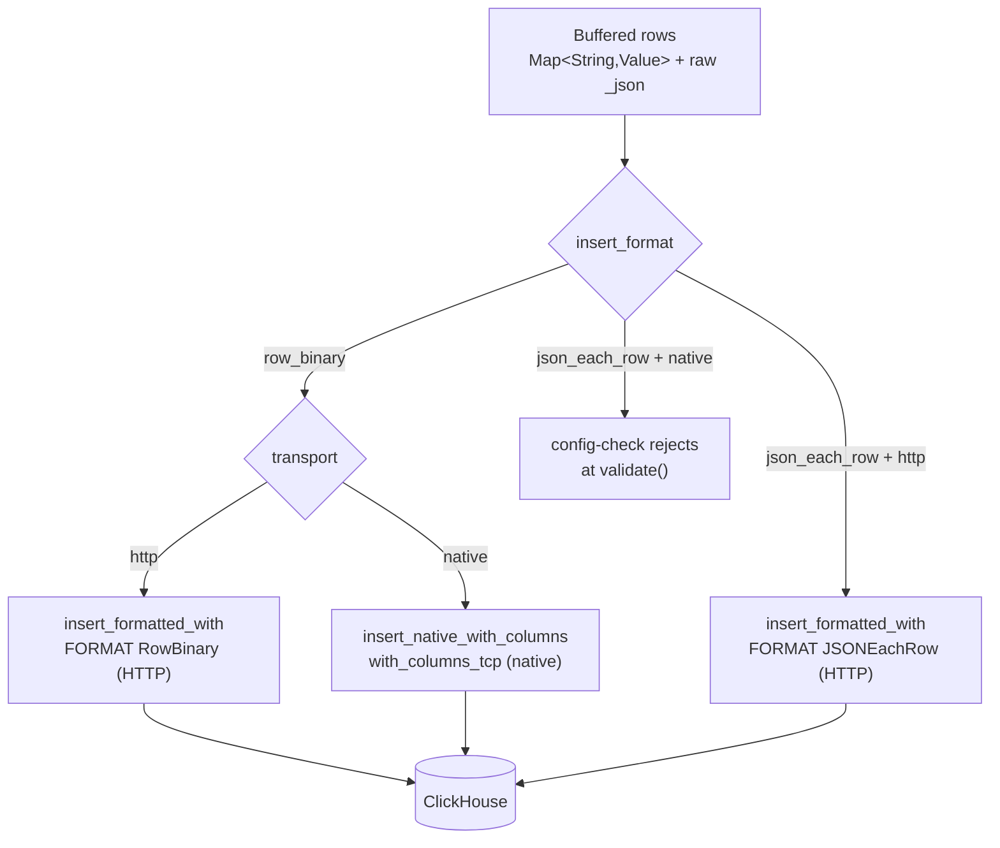

<!--
  Project:      dfe-loader
  File:         docs/clickhouse/INSERT-FORMATS.md
  Purpose:      Insert formats and transports, and how they compose
  Language:     Markdown

  License:      BUSL-1.1
  Copyright:    (c) 2026 HYPERI PTY LIMITED
-->

# Insert formats and transports

dfe-loader has two independent knobs for how rows reach ClickHouse:
`clickhouse.transport` (how the bytes travel) and `clickhouse.insert_format`
(how the rows are encoded). They compose. The default `native + row_binary` is
the fast path; everything else is a deliberate fallback.

## The matrix

| `insert_format` | `transport = http` | `transport = native` |
|-----------------|--------------------|----------------------|
| `row_binary` (default) | `FORMAT RowBinary` via `insert_formatted_with` | `with_columns_tcp` via `insert_native_with_columns` |
| `json_each_row` | `FORMAT JSONEachRow` via `insert_formatted_with` | rejected at `config-check` |

The rejection is deliberate and surfaced early: JSONEachRow is an HTTP body
format, and a native client has no HTTP insert endpoint for it. The guard lives
in `ClickHouseConfig::validate()` and runs at orchestrator startup, so a bad
combination fails the boot with a clear message rather than at first insert.

## Why RowBinary is the default

RowBinary ships pre-typed bytes. The server does no JSON parse, no type
inference -- it reads the column values straight off the wire in
`system.columns` order. For a high-throughput loader that is the difference
between ClickHouse spending CPU on ingest formatting and spending it on merges.

JSONEachRow is kept because it is self-describing and forgiving: the server
coerces types and tolerates shape drift. That makes it the right tool for
diagnostics ("does the row land at all if the server does the typing?") and for
the rare table whose types the dynamic encoder does not yet cover. It is never
the throughput choice.

## How RowBinary is produced

The dynamic encoder (`clickhouse_ext::encode`) turns one
`Map<String, Value>` plus its reflected `ColumnDef` schema into bytes. It has
two emission modes off the same schema, picked by transport:

- **HTTP** -- row-wise `encode()` bytes, streamed into an
  `INSERT INTO db.table (cols) FORMAT RowBinary` statement opened with
  `Client::insert_formatted_with(...).buffered()`. ClickHouse parses RowBinary
  one row at a time, so the loader never depends on server-side block framing.
  This is the path verified live against the devex cluster.
- **native/TCP** -- per-column `Serialize`, handed to
  `Client::insert_native_with_columns(table, &columns)` which dispatches to
  `with_columns_tcp`. The native binary protocol frames its own columnar
  blocks. See
  [hyperi-io/clickhouse-rs#14](https://github.com/hyperi-io/clickhouse-rs/issues/14)
  for the runtime-column TCP constructor and
  [#15](https://github.com/hyperi-io/clickhouse-rs/issues/15) for the FORMAT
  Native block-framing fix.

Either way the column subset is fixed from the first row of the batch: every
column present in the row, every raw-passthrough column (e.g. `_json`), and
every column without a server-side default. Columns that have a default and are
not supplied are omitted, so ClickHouse fills them (`_uuid`,
`_timestamp_load`).

## JSON columns on the wire

A JSON-typed column (including `_json`) is written as a length-prefixed string.
On the RowBinary path the loader sets
`input_format_binary_read_json_as_string=1` on the insert so the server reads
that string back as a JSON value rather than a literal `String`. The setting is
applied automatically whenever the resolved schema contains a JSON column -- no
configuration needed. See [CLICKHOUSE-EXT.md](CLICKHOUSE-EXT.md) for the seam
and [TYPES.md](TYPES.md) for per-type encoding.

## When the schema drifts

An insert can fail because the cached schema no longer matches the table (an
`ALTER ... ADD COLUMN`, a type change). `DynamicInsert` classifies the server
error: a drift signal (`TYPE_MISMATCH`, `NO_SUCH_COLUMN`, `CANNOT_PARSE`, code
117, and friends) surfaces as `DynamicError::SchemaMismatch`, and the cache is
invalidated so the next attempt re-fetches from `system.columns` and re-encodes.
A non-drift error (network, auth) is returned as-is. See
[SCHEMA-CACHE.md](SCHEMA-CACHE.md).

## Configuring it

| Setting | Values | Default |
|---------|--------|---------|
| `clickhouse.transport` | `native`, `http` | `native` |
| `clickhouse.insert_format` | `row_binary`, `json_each_row` | `row_binary` |

Both are restart-required -- they are baked into the `Client` at build time, so
a hot-reload of either is logged and deferred to the next start. See
[../CONFIGURATION.md](../CONFIGURATION.md).
