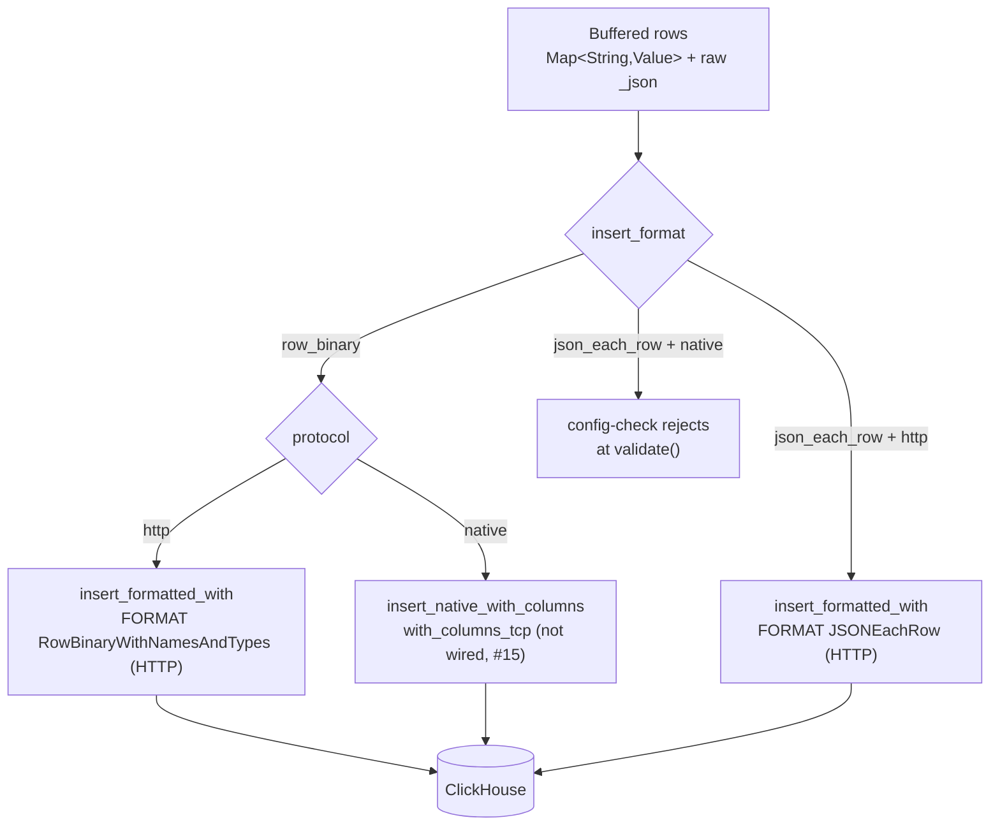

<!--
  Project:      dfe-loader
  File:         docs/clickhouse/INSERT-FORMATS.md
  Purpose:      Insert formats and transports, and how they compose
  Language:     Markdown

  License:      BUSL-1.1
  Copyright:    (c) 2026 HYPERI PTY LIMITED
-->

# Insert formats and transports

dfe-loader has two knobs for how rows reach ClickHouse: `clickhouse.protocol`
(how the bytes travel) and `clickhouse.insert_format` (how the rows are
encoded). The default `http + row_binary` is the fast path; `json_each_row` is
a deliberate fallback. `protocol: native` is rejected at startup -- the pinned
client has no TCP row fetch, so the schema query behind every insert stalls
([#115](https://github.com/hyperi-io/dfe-loader/issues/115)) -- and the native
column below is the planned shape, not code: the native/TCP insert sink is not
wired and waits on
[clickhouse-rs#15](https://github.com/hyperi-io/clickhouse-rs/issues/15).

## The matrix

| `insert_format` | `protocol = http` | `protocol = native` |
|-----------------|--------------------|----------------------|
| `row_binary` (default) | `FORMAT RowBinaryWithNamesAndTypes` via `insert_formatted_with` | rejected at startup; `with_columns_tcp` via `insert_native_with_columns` once clickhouse-rs#15 lands |
| `json_each_row` | `FORMAT JSONEachRow` via `insert_formatted_with` | rejected at `config-check` |

The rejection is deliberate and surfaced early: JSONEachRow is an HTTP body
format, and a native client has no HTTP insert endpoint for it. The guard lives
in `ClickHouseConfig::validate()` and runs at orchestrator startup, so a bad
combination fails the boot with a clear message rather than at first insert.
`Config::validate()` rejects `protocol: native` on its own before that, so the
whole native column fails the boot regardless of the format.

## Why RowBinary is the default

RowBinary ships pre-typed bytes. The server does no JSON parse, no type
inference -- it reads the column values straight off the wire in
`system.columns` order. For a high-throughput loader that is the difference
between ClickHouse spending CPU on ingest formatting and spending it on merges.

JSONEachRow is kept because it is self-describing and forgiving: the server
coerces types and tolerates shape drift. That makes it the right tool for
diagnostics ("does the row land at all if the server does the typing?") and for
the rare table whose types the dynamic encoder does not yet cover. It is never
the throughput choice.

## How RowBinary is produced

The dynamic encoder (`clickhouse_ext::encode`) turns one
`Map<String, Value>` plus its reflected `ColumnDef` schema into bytes. It has
two emission modes off the same schema, and only the first is wired:

- **HTTP** -- row-wise `encode()` bytes, streamed into an
  `INSERT INTO db.table (cols) FORMAT RowBinaryWithNamesAndTypes` statement
  opened with `Client::insert_formatted_with(...).buffered()`, behind a header
  naming each column and the type it was encoded for. ClickHouse parses the
  rows one at a time, so the loader never depends on server-side block framing.
- **native/TCP** (not wired) -- per-column `Serialize`, for
  `Client::insert_native_with_columns(table, &columns)` which dispatches to
  `with_columns_tcp`. The native binary protocol frames its own columnar
  blocks. See
  [hyperi-io/clickhouse-rs#14](https://github.com/hyperi-io/clickhouse-rs/issues/14)
  for the runtime-column TCP constructor and
  [#15](https://github.com/hyperi-io/clickhouse-rs/issues/15) for the FORMAT
  Native block-framing fix.

The column subset is fixed from the first row of the batch: every
column present in the row, every raw-passthrough column (e.g. `_json`), and
every column without a server-side default. Columns that have a default and are
not supplied are omitted, so ClickHouse fills them (`_uuid`,
`_timestamp_load`).

## JSON columns on the wire

A JSON-typed column (including `_json`) is written as a length-prefixed string.
On the RowBinary path the loader sets
`input_format_binary_read_json_as_string=1` on the insert so the server reads
that string back as a JSON value rather than a literal `String`. The setting is
applied automatically whenever the resolved schema contains a JSON column -- no
configuration needed. See [CLICKHOUSE-EXT.md](CLICKHOUSE-EXT.md) for the seam
and [TYPES.md](TYPES.md) for per-type encoding.

## When the schema drifts

An insert can fail because the cached schema no longer matches the table (an
`ALTER ... ADD COLUMN`, a type change). `DynamicInsert` classifies the server
error: a drift signal (`TYPE_MISMATCH`, `NO_SUCH_COLUMN`, `CANNOT_PARSE`, code
117, and friends) surfaces as `DynamicError::SchemaMismatch`, and the cache is
invalidated so the next attempt re-fetches from `system.columns` and re-encodes.
A non-drift error (network, auth) is returned as-is. See
[SCHEMA-CACHE.md](SCHEMA-CACHE.md).

The same codes come back for a row the server can never accept, so a refusal against a table unchanged since the rows were encoded is the rows' own: salvage dead-letters the bad row and the rest land.

A type change is caught before any row is read. RowBinary is positional, so bytes encoded for a column's old type can parse as other rows: ten rows written for `UInt8` are 90 bytes, which a `UInt16` column reads as nine whole rows of garbage, with no error. The header carries the type each column was encoded for, and with `input_format_with_types_use_header=1` (the default, and pinned on the insert with `input_format_with_names_use_header`) the server refuses a mismatch with code 117 ("Type of 'v' must be UInt16, not UInt8"). That refusal against a changed table takes the drift path above. The header costs one column count plus each name and type string once per INSERT, 235 bytes for a 10-column landing table.

## Configuring it

| Setting | Values | Default |
|---------|--------|---------|
| `clickhouse.protocol` | `http` (`native` is rejected at startup) | `http` |
| `clickhouse.insert_format` | `rowbinary` (aliases `row_binary`, `binary`), `jsoneachrow` (aliases `json_each_row`, `json`) | `rowbinary` |

The canonical spellings are the ones `docs/config-schema.json` carries, and the
aliases parse identically -- `row_binary` and `json_each_row` are the spellings
this page used before the key was wired, so both keep working. `native` is not
among them: it names a protocol this config rejects at boot, so accepting it as
a format spelling would have one word mean two opposite things on one page.

Env form: `DFE_LOADER_CLICKHOUSE__INSERT_FORMAT=json_each_row`. The startup log
line `Insert format configured format=...` reports the value that was applied.

Both are restart-required -- they are baked into the `Client` at build time, so
a hot-reload of either is logged and deferred to the next start. See
[../CONFIGURATION.md](../CONFIGURATION.md).
