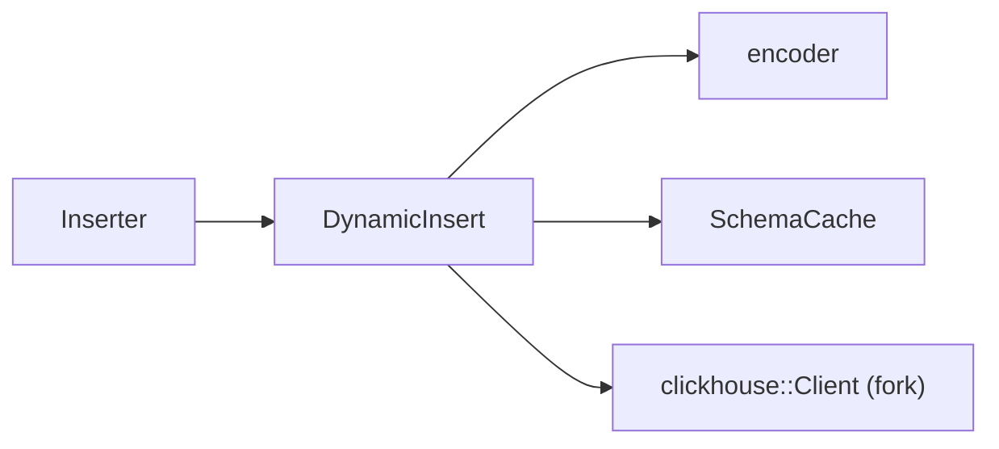

<!--
  Project:      dfe-loader
  File:         docs/clickhouse/README.md
  Purpose:      Index for the ClickHouse insert layer
  Language:     Markdown

  License:      BUSL-1.1
  Copyright:    (c) 2026 HYPERI PTY LIMITED
-->

# ClickHouse insert layer

This is the part of dfe-loader that changed most in the hyperi-port migration:
the dynamic insert path over the HyperI fork of `clickhouse-rs`. The loader
reflects each table's schema at runtime and encodes `Map<String, Value>` rows
straight to binary -- no compile-time `Row` types.

## Read in this order

- [CLICKHOUSE-EXT.md](CLICKHOUSE-EXT.md) -- the `src/clickhouse_ext/` layer:
  what it is, the seam over the fork, and what stays the fork's job.
- [INSERT-FORMATS.md](INSERT-FORMATS.md) -- RowBinary vs JSONEachRow, the
  transport x format matrix, and why RowBinary is the default.
- [SCHEMA-CACHE.md](SCHEMA-CACHE.md) -- reflecting `system.columns`, the TTL
  cache, and mismatch recovery.
- [TYPES.md](TYPES.md) -- the ClickHouse type reference and how each type is
  encoded.
- [DDL-DIRECTIVES.md](DDL-DIRECTIVES.md) -- the `@`-comment directives the
  loader reads off table DDL (capture mode, field mapping).
- [TLS.md](TLS.md) -- TLS transport security and private-CA trust.

## The fork, in one line

dfe-loader inserts through a HyperI fork of `clickhouse-rs` (the
`hyperi-port/*` chain), pinned via `[patch.crates-io]` to an immutable tag, with
the dynamic encoding layer kept in this repo at `src/clickhouse_ext/`. See
[CLICKHOUSE-EXT.md](CLICKHOUSE-EXT.md) for why the split sits where it does.
