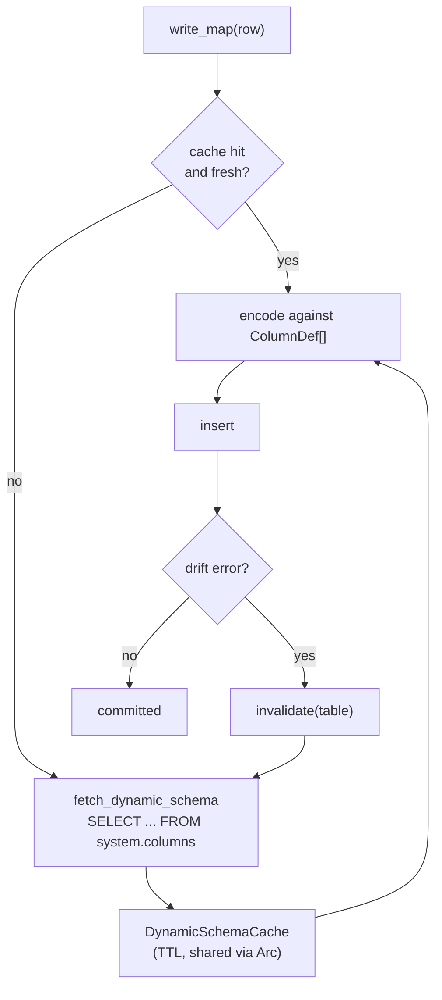

<!--
  Project:      dfe-loader
  File:         docs/clickhouse/SCHEMA-CACHE.md
  Purpose:      Schema reflection, the TTL cache, and mismatch recovery
  Language:     Markdown

  License:      BUSL-1.1
  Copyright:    (c) 2026 HYPERI PTY LIMITED
-->

# Schema reflection and caching

The dynamic insert path needs to know a table's columns and their types before
it can encode a row. dfe-loader never carries a compile-time schema -- it
reflects the live table from `system.columns` and caches the result with a TTL.

## Reflection

`fetch_dynamic_schema` queries `system.columns` for one table and builds a
`DynamicSchema`: the columns in declaration (position) order, each parsed into a
structured `ParsedType` (Nullable, LowCardinality, Array, Map, DateTime64,
Decimal, Enum, ...) that drives encoding. It also records, per column, whether
the column has a server-side default -- that is what lets the encoder omit an
absent-but-defaulted column (`_uuid`, `_timestamp_load`) and include every
required one. See [TYPES.md](TYPES.md).

## The cache

`DynamicSchemaCache` is a TTL map keyed by `database.table`, shared across
insert tasks behind an `Arc`. It is lazy, not background-refreshed:

- `get` returns the schema only if it was fetched within the TTL; an expired
  entry reads as a miss.
- A miss triggers a fetch, and the result is inserted under the key.
- `invalidate(table)` drops one entry; `invalidate_all` clears the map.

Lazy TTL keeps the steady state cheap (no timer threads, no work for idle
tables) while bounding how long a stale schema can persist after a benign
`ALTER`. The TTL is set once when the cache is constructed, from
`schema.cache_ttl_secs` (default 300 s).

## Mismatch recovery

A TTL alone does not cover a schema change that happens mid-batch. So the insert
path also recovers on error. When ClickHouse rejects an insert with a drift
signal -- a code name such as `TYPE_MISMATCH`, `NO_SUCH_COLUMN` or
`INCORRECT_DATA`, or a drift phrase such as "no such column" or "cannot
parse" -- the table's cache entry is invalidated. The retry re-fetches from
`system.columns` and re-encodes against the current schema. A non-drift error (network, auth, server down) is
returned unchanged, so genuine outages are not mistaken for schema drift.

A row the server can never accept draws the same signals: an integer no ClickHouse integer type holds, in a JSON column, comes back as code 117 whatever the schema. So a refusal carrying a payload-rejection code (117, 27, 33, 469 and the rest listed in `src/clickhouse/error.rs`) re-reads `system.columns` before anything else. A table unchanged since the rows were encoded makes the refusal the rows' own: the insert returns it as permanent, salvage isolates the bad row for the DLQ, and the rest land. A changed table is drift, recovered as above.

This is the fix trail for the schema-cache-miss class of bug: a column added by
an out-of-band `ALTER` no longer wedges the loader until a restart -- the first
rejected insert clears the stale entry and the retry succeeds against the new
shape.

`schema.refresh_on_error` (default `true`) switches this recovery. With `false`
a drift error leaves both the encoder's entry and the loader's cached schema in
place until they expire, so the retries run against the stale shape. A schema
fetch that failed is still discarded either way.

## Where it lives

`src/clickhouse_ext/schema.rs` (`DynamicSchema`, `DynamicSchemaCache`,
`fetch_dynamic_schema`). The cache is owned by the `Inserter` and handed to each
`DynamicInsert`. See [CLICKHOUSE-EXT.md](CLICKHOUSE-EXT.md).
