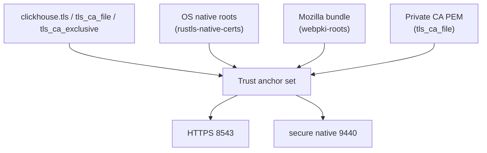

<!--
  Project:      dfe-loader
  File:         docs/clickhouse/TLS.md
  Purpose:      TLS transport security and private-CA trust for ClickHouse
  Language:     Markdown

  License:      BUSL-1.1
  Copyright:    (c) 2026 HYPERI PTY LIMITED
-->

# TLS and private CAs

ClickHouse connections can run over TLS on either transport: HTTPS (8543) for
`transport = http`, secure native (9440) for `transport = native`. One trust
mechanism serves both -- the loader does not carry two TLS code paths, and a
private-CA cluster is trusted the same way regardless of transport.



## Default trust

With `tls = true` and no CA file, a TLS connection trusts the OS native root
store plus the compiled-in Mozilla (webpki) bundle. Public clusters and any
cluster whose CA is already installed in the host trust store work with no extra
configuration.

## Private / internal CAs

Internal clusters behind a private CA are trusted by pointing the loader at the
CA certificate:

| Setting | Effect |
|---------|--------|
| `clickhouse.tls` | enable TLS for the connection |
| `clickhouse.tls_ca_file` | path to a private CA PEM; augments native + webpki |
| `clickhouse.tls_ca_exclusive` | trust ONLY `tls_ca_file`; ignore native + webpki |

The CA file is read with `AppendCertsFromPEM` semantics (the clickhouse-go
model): every PEM certificate block in the file is parsed best-effort and all
valid certificates land in one trust store. A bundle of concatenated certs
(`cat root.pem intermediate.pem > ca.pem`) is loaded in full -- roots and
intermediates both become anchors, which covers servers that do not present
their full chain and multi-tier PKI.

A CA file that yields zero usable certificates, or an unreadable path, is a hard
error. The loader never silently falls back to public roots when a CA file was
asked for -- a misconfigured trust store fails the connection loudly rather than
trusting the wrong anchors.

## Augment vs exclusive

- **Augment (default when `tls_ca_file` is set):** native + webpki + the private
  CA. The cluster's internal CA is trusted alongside public roots. Use this
  unless you have a reason to lock trust down.
- **Exclusive (`tls_ca_exclusive = true`):** only the private CA. Native and
  webpki roots are ignored. Use this to pin trust to your internal PKI and
  refuse anything chaining to a public CA.

## What is deliberately not offered

There is no insecure / skip-verify mode. Trusting an internal cluster is done by
naming its CA, not by turning verification off. If you find yourself wanting to
disable verification, supply the CA PEM instead -- that is the supported and
auditable path.

Client-certificate (mTLS) auth is out of scope today.

## Example: private-CA cluster

```yaml
clickhouse:
  transport: native        # secure native protocol
  tls: true                # 9440
  tls_ca_file: /etc/dfe/internal-ca.pem
  hosts:
    - clickhouse.example.internal:9440
```

The same `tls_ca_file` works unchanged if you switch `transport` to `http`
(8543) -- one trust config, both transports. The CA PEM is non-secret and is
distributed with the deployment; the cluster password stays in the
git-excluded environment, never in committed config. See
[../CONFIGURATION.md](../CONFIGURATION.md) for the cascade and
[../deployment/](../deployment/) for how secrets are supplied at runtime.
