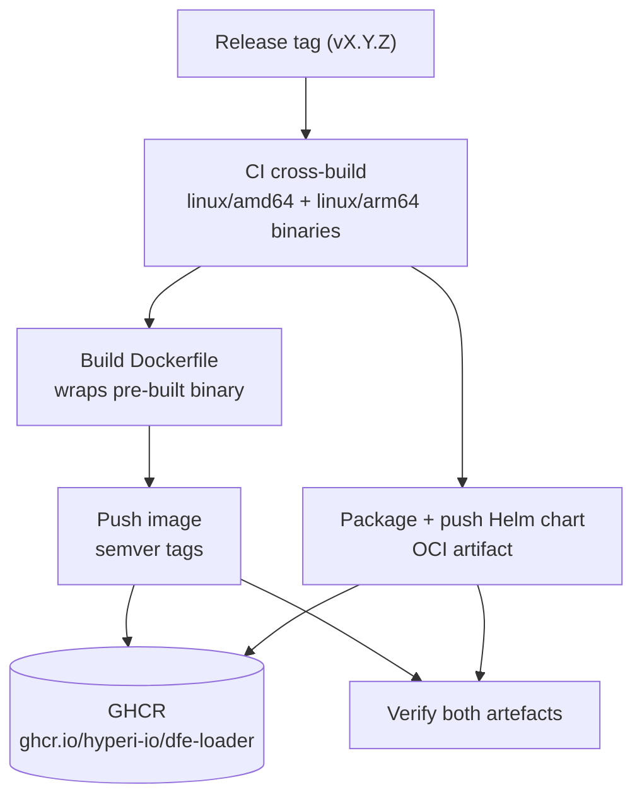

<!--
  Project:      dfe-loader
  File:         docs/deployment/PUBLISHING.md
  Purpose:      Container image + Helm chart publishing via CI
  Language:     Markdown

  License:      BUSL-1.1
  Copyright:    (c) 2026 HYPERI PTY LIMITED
-->

# Container and chart publishing

dfe-loader ships as a multi-arch container image and a Helm chart, built and
pushed by CI on every release. Downstream projects (dfe-docker, dfe-operator)
reference an immutable OCI tag instead of building from source or downloading
loose binaries. This page covers the publishing mechanics: the Dockerfile, the
`.hyperi-ci.yaml` config, the tags CI generates, and how consumers pull.

The current registry is GHCR (`ghcr.io/hyperi-io/dfe-loader`), wired via
`registry: ghcr` in `.hyperi-ci.yaml` and authenticated automatically with
`GITHUB_TOKEN`. JFrog (`hyperi-docker-local` / `hyperi-helm-local`) is legacy
and no longer the publishing path; its mechanics are retained below for
reference only.



## How it works

The CI submodule has built-in container and Helm publishing. On release, it:

1. Builds the Dockerfile for `linux/amd64` and `linux/arm64`
2. Pushes to the configured registry with semantic version tags
3. Packages and pushes the Helm chart as an OCI artifact
4. Verifies both artefacts

GHCR uses `GITHUB_TOKEN` automatically. (Legacy: JFrog publishing used a scoped
token in `ARTIFACTORY_TOKEN`.)

## Tags generated

For a release `v1.6.13` on GHCR, CI emits tags under
`ghcr.io/hyperi-io/dfe-loader`:

- `ghcr.io/hyperi-io/dfe-loader:1.6.13`
- `ghcr.io/hyperi-io/dfe-loader:1.6`
- `ghcr.io/hyperi-io/dfe-loader:1`
- `ghcr.io/hyperi-io/dfe-loader:latest`
- `ghcr.io/hyperi-io/dfe-loader:sha-<commit>`

Pre-release versions (e.g. `1.6.13-beta.1`) only get the full version tag.

(Legacy: the equivalent JFrog tags were published under
`hypersec.jfrog.io/hyperi-docker-local/dfe-loader`.)

## Implementation

### 1. Create Dockerfile

Create `Dockerfile` in the repo root. The binary is already cross-compiled in
CI for both amd64 and arm64, so the Dockerfile wraps the pre-built binary
rather than compiling from source.

**Option A -- Download from the release at build time:**

```dockerfile
FROM debian:bookworm-slim

RUN apt-get update && apt-get install -y --no-install-recommends \
    ca-certificates curl netcat-openbsd iputils-ping \
    && rm -rf /var/lib/apt/lists/*

ARG TARGETARCH
ARG VERSION

# Map Docker platform arch to binary suffix
RUN case "${TARGETARCH}" in \
      amd64) SUFFIX="linux-amd64" ;; \
      arm64) SUFFIX="linux-arm64" ;; \
      *) echo "Unsupported: ${TARGETARCH}" && exit 1 ;; \
    esac && \
    curl -sf -o /usr/local/bin/dfe-loader \
        "https://github.com/hyperi-io/dfe-loader/releases/download/v${VERSION}/dfe-loader-v${VERSION}-${SUFFIX}" && \
    chmod +x /usr/local/bin/dfe-loader

RUN useradd --create-home --uid 1000 appuser
USER appuser

EXPOSE 9090

HEALTHCHECK --interval=30s --timeout=3s --start-period=5s --retries=3 \
    CMD curl -sf http://localhost:9090/livez > /dev/null || exit 1

ENTRYPOINT ["dfe-loader"]
CMD ["--config", "/etc/dfe/loader.yaml"]
```

**Option B -- COPY from CI build artifact (recommended):**

```dockerfile
FROM debian:bookworm-slim

RUN apt-get update && apt-get install -y --no-install-recommends \
    ca-certificates curl netcat-openbsd iputils-ping \
    && rm -rf /var/lib/apt/lists/*

COPY dfe-loader /usr/local/bin/dfe-loader
RUN chmod +x /usr/local/bin/dfe-loader

RUN useradd --create-home --uid 1000 appuser
USER appuser

EXPOSE 9090

HEALTHCHECK --interval=30s --timeout=3s --start-period=5s --retries=3 \
    CMD curl -sf http://localhost:9090/livez > /dev/null || exit 1

ENTRYPOINT ["dfe-loader"]
CMD ["--config", "/etc/dfe/loader.yaml"]
```

**Recommended:** Option B (COPY from CI artifact). The CI publish workflow
already builds the binary before the container step runs -- no circular
dependency.

### 2. Update `.hyperi-ci.yaml`

Add the container publishing section:

```yaml
publish:
  enabled: true
  target: internal
  binaries: both

  container:
    enabled: true
    registry: ghcr          # current path; legacy: jfrog
    dockerfile: Dockerfile
    platforms:
      - linux/amd64
      - linux/arm64

  helm:
    enabled: true
    registry: ghcr
```

(Legacy note: JFrog published to `hyperi-docker-local` (containers) and
`hyperi-helm-local` (charts). Both repos had to be `packageType: docker` with
`enableDockerSupport: true` for OCI push -- helm-type repos do not support OCI.
JFrog is no longer the publishing path.)

### 3. Update CI submodule

```bash
git submodule update --remote ci
```

### 4. Update publish workflow

Regenerate or update `.github/workflows/publish.yml` to include container
publishing inputs. The CI actions/jobs/publish composite action already handles
container publishing when the config is detected.

## Verification

After a release:

```bash
# Pull and verify
docker pull ghcr.io/hyperi-io/dfe-loader:1.6.13
docker run --rm ghcr.io/hyperi-io/dfe-loader:1.6.13 --help

# Check multi-arch
docker manifest inspect ghcr.io/hyperi-io/dfe-loader:1.6.13
```

## Consumer usage

### Docker Compose (dfe-docker)

```yaml
services:
  dfe-loader:
    image: ghcr.io/hyperi-io/dfe-loader:${DFE_LOADER_VERSION:-latest}
    ports:
      - "9090:9090"
    volumes:
      - ./config/loader.yaml:/etc/dfe/loader.yaml:ro
```

### Kubernetes (dfe-operator)

```yaml
containers:
  - name: dfe-loader
    image: ghcr.io/hyperi-io/dfe-loader:1.6.13
    ports:
      - containerPort: 9090
```

## Container checklist

Per HyperI Docker standards:

- [ ] Non-root user (UID 1000)
- [ ] Debug utilities included (curl, netcat)
- [ ] HEALTHCHECK defined
- [ ] EXPOSE ports declared
- [ ] Exec form ENTRYPOINT (receives SIGTERM)
- [ ] No secrets baked in
- [ ] Multi-arch (amd64 + arm64)
