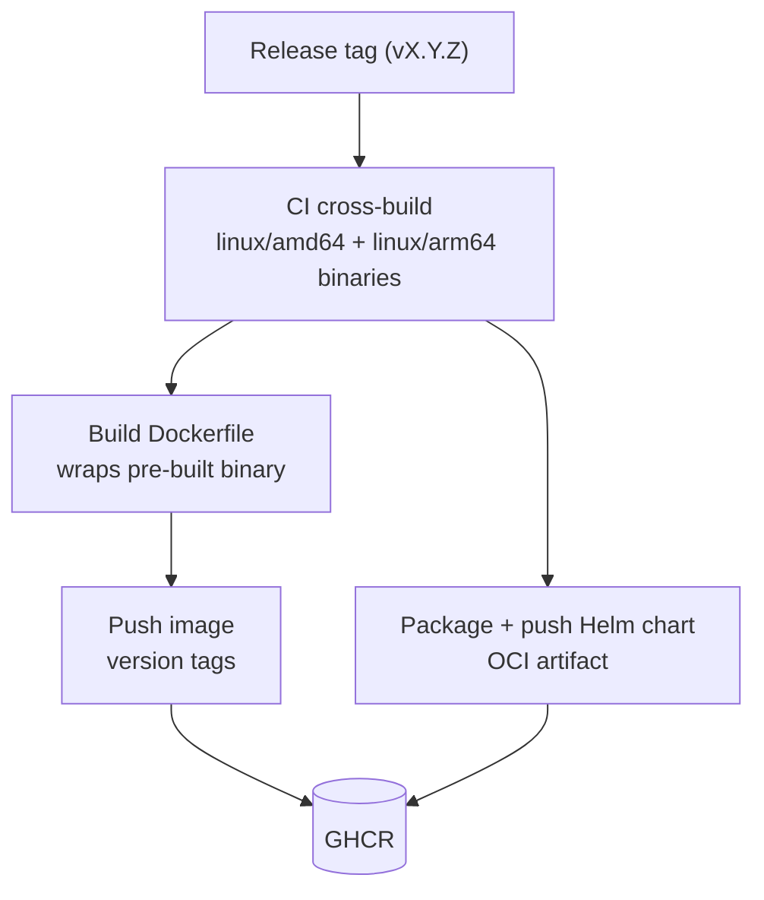

<!--
  Project:      dfe-loader
  File:         docs/deployment/PUBLISHING.md
  Purpose:      Container image + Helm chart publishing via CI
  Language:     Markdown

  License:      BUSL-1.1
  Copyright:    (c) 2026 HYPERI PTY LIMITED
-->

# Container and chart publishing

dfe-loader ships as a multi-arch container image and a Helm chart, built and
pushed by CI on every release. Downstream projects (dfe-docker, dfe-operator)
reference an immutable OCI tag instead of building from source or downloading
loose binaries.

Both artefacts go to GHCR. The image is `ghcr.io/hyperi-io/dfe-loader` and the
chart is pushed to `oci://ghcr.io/hyperi-io/helm-charts`. CI authenticates with
`GITHUB_TOKEN`, so no registry secret is needed.



## How it works

`.github/workflows/ci.yml` calls hyperi-ci's reusable `rust-ci.yml`. On a
release it builds the `Dockerfile` for `linux/amd64` and `linux/arm64`, pushes
the image with version tags, then packages and pushes the Helm chart from
`chart/`. The `release:` block in `.hyperi-ci.yaml` turns both on:

```yaml
release:
  enabled: true
  container:
    enabled: true
    dockerfile: Dockerfile
    platforms:
      - linux/amd64
      - linux/arm64
  helm:
    enabled: true
```

The `Dockerfile` is generated from the app's deployment contract by scalo and
copies in the binary CI has already cross-compiled. Do not edit it by hand.
Regenerate it with `dfe-loader --emit-dockerfile`, and the chart with
`dfe-loader --emit-helm`. `tests/integration/helm_contract.rs` fails when the
committed `Dockerfile` or `chart/values.yaml` drifts from the contract.

## Tags generated

For a stable release `v1.6.13`:

- `ghcr.io/hyperi-io/dfe-loader:v1.6.13`
- `ghcr.io/hyperi-io/dfe-loader:latest`
- `ghcr.io/hyperi-io/dfe-loader:sha-<commit>`

A prerelease (e.g. `v1.6.13-rc.1`) gets its version tag and `sha-<commit>`
only. It never moves `latest`.

## Verification

After a release:

```bash
docker pull ghcr.io/hyperi-io/dfe-loader:v1.6.13
docker run --rm ghcr.io/hyperi-io/dfe-loader:v1.6.13 --help
docker manifest inspect ghcr.io/hyperi-io/dfe-loader:v1.6.13
```

## Consumer usage

### Docker Compose (dfe-docker)

```yaml
services:
  dfe-loader:
    image: ghcr.io/hyperi-io/dfe-loader:${DFE_LOADER_VERSION:-latest}
    ports:
      - "9090:9090"
    volumes:
      - ./config/loader.yaml:/etc/dfe/loader.yaml:ro
```

### Kubernetes (dfe-operator)

```yaml
containers:
  - name: dfe-loader
    image: ghcr.io/hyperi-io/dfe-loader:v1.6.13
    ports:
      - containerPort: 9090
```
