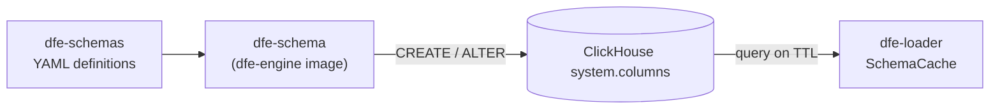

<!--
  Project:      dfe-loader
  File:         docs/deployment/SCHEMAS.md
  Purpose:      Loader-side reference for the shared dfe-schemas definitions
  Language:     Markdown

  License:      BUSL-1.1
  Copyright:    (c) 2026 HYPERI PTY LIMITED
-->

# Shared schema definitions

**The loader reads the DEPLOYED schema, never the YAML.** It queries
`system.columns` at startup and on a TTL, and parses the DFE `@directive`
expressions out of each column's COMMENT. So dfe-schemas is upstream of the
loader by two steps, and nothing here needs a checkout of it.

> **Canonical schema documentation:**
> [`dfe-schemas`](https://github.com/hyperi-io/dfe-schemas)



That is why the loader has no submodule and no bundled profile copies: whatever
the applier put in the table IS the contract, and a second copy on disk could
only disagree with it.

## What the loader takes from a column

A schema YAML's `expr` becomes part of the column COMMENT in the deployed DDL,
alongside any human-readable description:

```sql
COMMENT '@renamed: client_ip -- Source address of the connection'
```

The loader reads the directives it acts on and ignores the rest. Config always
wins over a COMMENT -- the exact resolution order is in
[`src/column_meta/mod.rs`](../../src/column_meta/mod.rs).

| Directive | Config field | Action |
|-----------|--------------|--------|
| `@skip` | `skip: true` | Omit the column from the insert |
| `@default:value` | `default:` | Substitute when the column is null or absent |
| `@renamed:path` | `renamed:` | Source field path(s) for this column |
| `@computed:expr` | `computed:` | CEL expression producing the value |
| `@coerce:category` | `coerce:` | Override the type category for coercion |

The authoring directives -- `@source`, `@generated` -- are consumed
by the applier when it generates the DDL, not by the loader. See
[DDL-DIRECTIVES.md](../clickhouse/DDL-DIRECTIVES.md) for the whole expression
language.

## Getting the tables there in the first place

The `dfe-schema` entry point on the dfe-engine image creates or reconciles every
DFE table from the dfe-schemas YAML. dfe-infra runs it as a Job before the data
plane starts and dfe-docker as a compose init service, so a profile with no
engine still gets its tables. A loader pointed at a database that has not been
applied finds no columns and says so.

## Related docs

- [COMMON-HEADER.md](../transport/COMMON-HEADER.md) -- the common header columns and their DDL
- [DDL-DIRECTIVES.md](../clickhouse/DDL-DIRECTIVES.md) -- field mapping expression language
- [dfe-schemas](https://github.com/hyperi-io/dfe-schemas) -- canonical schema documentation
