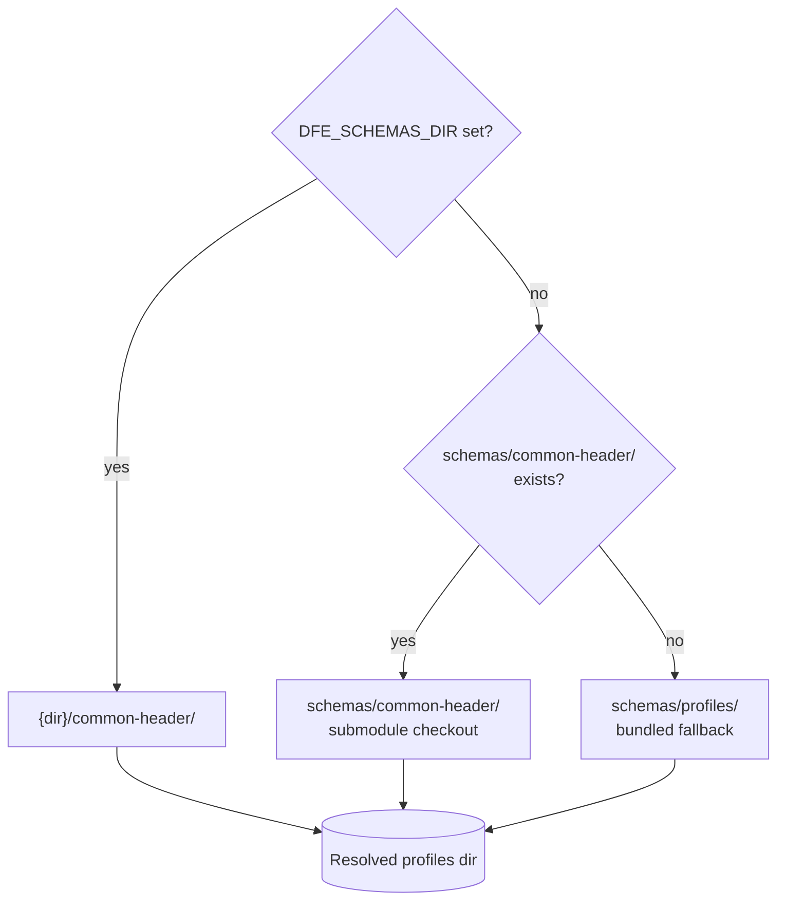

<!--
  Project:      dfe-loader
  File:         docs/deployment/SCHEMAS.md
  Purpose:      Loader-side reference for the shared dfe-schemas definitions
  Language:     Markdown

  License:      BUSL-1.1
  Copyright:    (c) 2026 HYPERI PTY LIMITED
-->

# Shared schema definitions

dfe-loader does not own its table schemas -- they come from the shared
`dfe-schemas` repo, checked out as a submodule. This page is the loader-specific
supplement: how the loader resolves the schema directory, how it reads
per-file versions, and how DFE `expr` directives map to DDL. The full schema
format reference, versioning system, column definitions, and DDL expressions
live in the dfe-schemas repo.

> **Canonical documentation:**
> [`dfe-schemas/README.md`](https://github.com/hyperi-io/dfe-schemas)



## Quick reference for the loader

### Submodule setup

```bash
git submodule add https://github.com/hyperi-io/dfe-schemas.git schemas
git submodule update --init --recursive
```

### Resolution order

```
1. DFE_SCHEMAS_DIR env var  ->  {dir}/common-header/
2. schemas/common-header/   ->  submodule checkout
3. schemas/profiles/        ->  bundled fallback
```

### Rust resolution

```rust
fn resolve_profiles_dir() -> PathBuf {
    // 1. Env var
    if let Ok(dir) = std::env::var("DFE_SCHEMAS_DIR") {
        let candidate = PathBuf::from(dir).join("common-header");
        if candidate.is_dir() { return candidate; }
    }
    // 2. Submodule
    let submodule = PathBuf::from("schemas/common-header");
    if submodule.is_dir() { return submodule; }
    // 3. Bundled fallback
    PathBuf::from("schemas/profiles")
}
```

### Per-file versioning (version tree)

Schema YAML files use a **version tree** -- each version entry contains a
complete column snapshot under `versions.<ver>.columns`. The loader should:

1. Parse `current` from the YAML file as the default version
2. When a version pin is specified (from Source config), read columns from
   `versions.<pinned_version>.columns` directly
3. Files without a `versions` key use the flat `columns:` list (backward compat)

```yaml
current: "1.0.0"
versions:
  "1.0.0":
    date: "2026-01-15"
    type: model
    summary: "Initial 9-column common header"
    columns:
      - name: _timestamp
        type: datetime
        expr: "@source: timestamp | now()"
        comment: "Event timestamp from source data"
      - name: _geo_point
        type: geo_point
        comment: "Geographic coordinates"
        # ... columns only present in this version's snapshot
```

### DFE expressions (expr field)

The `expr` field carries loader directives. The `comment` field is for
human-readable descriptions only.

When both are present, the DDL COMMENT combines them:

```sql
COMMENT '@source: timestamp | now() -- Event timestamp from source data'
```

| Directive | Action |
|-----------|--------|
| `@generated: expr` | Loader omits -- ClickHouse DEFAULT handles it |
| `@source: field` | Extract from source data |
| `@source: field \| fallback` | Extract with fallback expression |
| `@source: first(a/b/c)` | First match from multiple fields |
| `@captured: what` | Capture from raw payload before transforms |
| `@captured: what as TYPE` | Capture and cast (e.g. `as JSON`) |

See [DDL-DIRECTIVES.md](../clickhouse/DDL-DIRECTIVES.md) for the full expression
reference.

### Bundled fallback sync

After updating `dfe-schemas`, copy changed YAML to `schemas/profiles/`
so `cargo install dfe-loader` works without a submodule checkout.

## Related docs

- [COMMON-HEADER.md](../transport/COMMON-HEADER.md) -- detailed common header column reference and DDL
- [DDL-DIRECTIVES.md](../clickhouse/DDL-DIRECTIVES.md) -- field mapping expression language
- [dfe-schemas README](https://github.com/hyperi-io/dfe-schemas) -- canonical schema documentation
