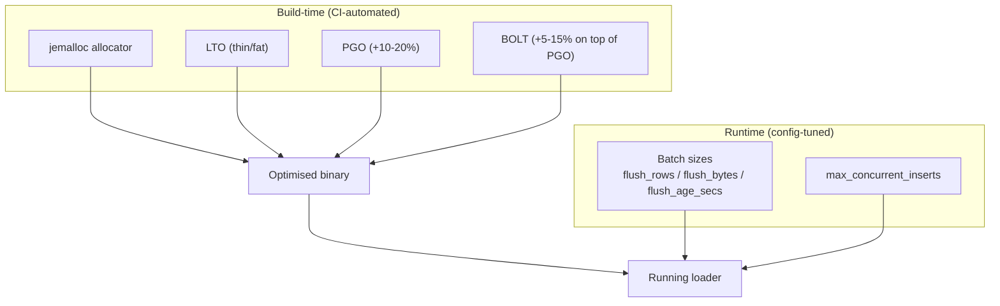

<!--
  Project:      dfe-loader
  File:         docs/performance/OVERVIEW.md
  Purpose:      Performance optimisation guide: build optimisations and runtime tuning
  Language:     Markdown

  License:      BUSL-1.1
  Copyright:    (c) 2026 HYPERI PTY LIMITED
-->

# Performance optimisation

dfe-loader is a high-throughput hot path, so performance work splits cleanly in
two: build-time optimisations (allocator, LTO, PGO, BOLT) that CI now automates,
and runtime tuning (batch sizes, concurrent inserts) that lives in config. This
page covers both, plus the profiling tools to find out where the time goes.



> **CI integration notice (2026-04+):**
> hyperi-ci now applies **Tier 1** build optimisations (jemalloc allocator + fat
> LTO) automatically on `beta` and `release` channels. **Tier 2** (PGO + BOLT)
> is opt-in per project via `.hyperi-ci.yaml`. The manual `cargo pgo` / `cargo
> pgo bolt` commands documented below are now for **local development and
> one-off profiling only** -- CI handles them automatically when configured.
>
> See the project standards for the full contract and the channel x tier
> table that governs CI build optimisation behaviour.
>
> The rest of this document remains relevant for:
> - Understanding *why* each optimisation matters (the CI just automates them)
> - Local profiling / one-off performance investigation
> - Runtime tuning (batch sizes, concurrent inserts -- NOT build-time concerns)

## Build optimisations

### Profile-Guided Optimisation (PGO)

PGO can provide **10-20% performance improvement** by using runtime profiling
data to guide compiler optimisations. See
[cargo-pgo](https://github.com/Kobzol/cargo-pgo).

> **CI:** hyperi-ci runs this automatically on the `release` channel when
> configured. See `TODO.md` -> *Rust Release-Track Optimisation* for the
> opt-in steps. The commands below are for **local profiling only**.

#### Local setup (manual)

```bash
# Install the tool
cargo install cargo-pgo
rustup component add llvm-tools-preview

# Step 1: Build instrumented binary
cargo pgo build

# Step 2: Run with representative workload
./target/x86_64-unknown-linux-gnu/release/dfe-loader \
    --config test-config.yaml \
    # Run for sufficient time to gather profiles

# Step 3: Build optimised binary
cargo pgo optimize
```

#### Best practices for PGO workloads

- Run the instrumented binary with a **representative workload**
- Include all common code paths (various message types, error handling)
- Profile for at least 5-10 minutes of sustained load
- Re-profile when making significant code changes
- **CRITICAL:** The workload must exercise REAL data-processing paths --
  parse, transform, serialise, insert. **Do NOT use port checks, health
  probes, or "does the service start" tests.** Profile data from startup /
  readiness paths misleads the compiler and produces NEGATIVE PGO gains.

### BOLT post-link optimisation

BOLT provides an **additional 5-15% improvement** on top of PGO by optimising
code layout in the final binary. See
[LLVM BOLT](https://github.com/llvm/llvm-project/tree/main/bolt).

> **CI:** hyperi-ci runs BOLT automatically on the `release` channel when
> `optimize.bolt.enabled: true` is set in `.hyperi-ci.yaml` AND `pgo.enabled`
> is also true (BOLT requires PGO profile data). Linux-only. The commands
> below are for **local profiling only**.

#### Local setup (manual)

```bash
# Build with BOLT (requires BOLT installed)
cargo pgo bolt build

# Run with perf profiling
./target/x86_64-unknown-linux-gnu/release/dfe-loader-bolt-instrumented \
    --config test-config.yaml
# BOLT uses perf data, so run: perf record -e cycles:u -j any,u -- ./binary

# Optimise with BOLT
cargo pgo bolt optimize

# Combined PGO + BOLT
cargo pgo optimize
cargo pgo bolt optimize --with-pgo
```

#### Requirements

- Linux only (ELF binaries)
- x86_64 or AArch64
- LLVM BOLT tools installed

### Link-Time Optimisation (LTO)

Already configured in `Cargo.toml`:

```toml
[profile.release]
lto = "thin"           # Use "fat" for max perf, slower compile
codegen-units = 1      # Better optimisation
```

For maximum performance:

```toml
lto = "fat"            # More aggressive, 2-3x longer compile
```

## Memory allocator

DFE policy (2026-04-17): **jemalloc at every channel, no mimalloc**. One
allocator across the fleet means one profiling story (`jeprof`), one set of
perf-trace symbols, one debugging playbook.

hyperi-ci adds `--features jemalloc` automatically on every channel
(spike/alpha/beta/release). For local builds, opt in with:

```bash
cargo build --release --features jemalloc
```

### Verification on stripped release binaries

Release builds set `strip = true`, so `nm` will not see allocator symbols.
Use `strings`:

```bash
strings target/release/dfe-loader | grep -ciE 'jemalloc|je_mallctl'
# Expect > 0
```

Expect a ~3.5% binary-size increase from the static jemalloc link
(per dfe-receiver canary 1, 2026-04-17).

### Benchmark (jemalloc vs system glibc, OLAP-style workload)

| Metric | System (glibc) | jemalloc |
|--------|----------------|----------|
| Throughput | Baseline | +15-25% |
| RSS | Baseline | +5-10% |
| Large-batch p99 latency | Baseline | -10-20% |

## Insert throughput

dfe-loader writes to ClickHouse through the HyperI fork of `clickhouse-rs`
(tag-pinned via `[patch.crates-io]`), with the dynamic RowBinary layer in
`src/clickhouse_ext/`. The default path is RowBinary via `DynamicInsert`
(schema-reflected typed encoding -- ClickHouse skips JSON parsing), over HTTP
through `Client::insert_formatted_with` (`FORMAT RowBinaryWithNamesAndTypes`).
The native/TCP sink waits on clickhouse-rs#15. Set
`insert_format = "json_each_row"` to fall back to `FORMAT JSONEachRow` over HTTP
via `Client::insert_formatted_with`. Tuning below applies to both formats.

### Batch size

Larger batches amortise per-insert overhead. Default flush thresholds:

- `flush_rows = 20000` rows
- `flush_bytes = 1048576` (1MB)
- `flush_age_secs = 5`

Increase `flush_rows` and `flush_bytes` for higher throughput at the cost of
latency.

### Allocator feature

The `jemalloc` feature is declared in `Cargo.toml` and applies globally via
`#[global_allocator]` in `src/main.rs`:

```toml
[features]
jemalloc = ["dep:tikv-jemallocator", "dep:tikv-jemalloc-ctl"]
```

mimalloc was removed on 2026-04-17 per the DFE allocator policy.

## Runtime tuning

### Batch sizes

| Setting | Default | Tuning guidance |
|---------|---------|-----------------|
| `flush_rows` | 20,000 | Increase for throughput, decrease for latency |
| `flush_bytes` | 1MB | Match to typical batch memory size |
| `flush_age_secs` | 5s | Lower for real-time, higher for batch |

### Concurrent inserts

```yaml
clickhouse:
  max_concurrent_inserts: 8  # Default, good for most workloads
```

- Increase for high-latency ClickHouse connections
- Decrease if ClickHouse is CPU-bound

## Profiling

### CPU profiling with perf

```bash
perf record -g ./target/release/dfe-loader --config config.yaml
perf report
```

### Memory profiling with jemalloc

```bash
# Enable jemalloc profiling
export MALLOC_CONF="prof:true,prof_prefix:jeprof.out"
./target/release/dfe-loader --config config.yaml

# Analyse
jeprof --svg ./target/release/dfe-loader jeprof.out.*.heap > heap.svg
```

### Flame graphs

```bash
# Install
cargo install flamegraph

# Generate
cargo flamegraph --bin dfe-loader -- --config config.yaml
```

## Recommended production build

**For production releases: let hyperi-ci do this.** Push to a `release`-channel
project and CI applies the full optimisation pipeline automatically. See
`TODO.md` -> *Rust Release-Track Optimisation* for opt-in steps.

**For local development / one-off profiling:**

```bash
# Full optimisation build
cargo build --release --features jemalloc

# With PGO (if you have profile data)
cargo pgo optimize --features jemalloc

# With PGO + BOLT (maximum optimisation)
cargo pgo optimize --features jemalloc
cargo pgo bolt optimize --with-pgo
```

## References

- [cargo-pgo documentation](https://github.com/Kobzol/cargo-pgo)
- [The Rust Performance Book](https://nnethercote.github.io/perf-book/)
- [LLVM BOLT](https://github.com/llvm/llvm-project/tree/main/bolt)
- [jemalloc tuning](https://github.com/jemalloc/jemalloc/wiki/Getting-Started)
- hyperi-ci's PGO and BOLT runtime guide (`runtime/pgo-bolt.md` in the hyperi-ci
  repo's docs) -- tiers, channels and workload design
