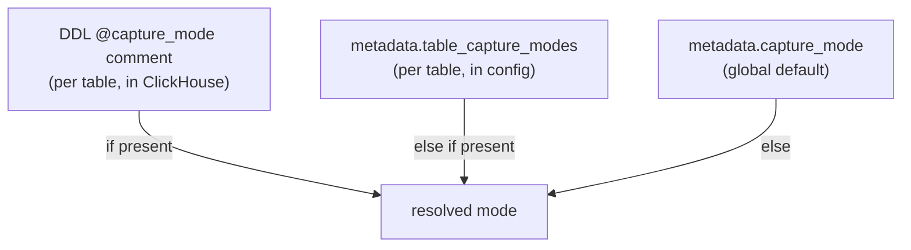

<!--
  Project:      dfe-loader
  File:         docs/pipeline/CAPTURE-MODES.md
  Purpose:      capture_mode: what is stored, and the 3-level precedence
  Language:     Markdown

  License:      BUSL-1.1
  Copyright:    (c) 2026 HYPERI PTY LIMITED
-->

# Capture modes

`capture_mode` decides what is stored alongside the promoted columns: the full
payload as `_json` (native JSON type, path-queryable), the raw bytes as `_raw`
(String), or neither. Promoted columns are always written -- capture mode only
governs the two payload-retention columns.

| Mode | `_json` | `_raw` | Use |
|------|---------|--------|-----|
| `full` (default) | full payload (JSON) | the record's own raw field, else NULL | path queries plus text search |
| `json_only` | full payload (JSON) | NULL | path queries, never a `_raw` copy |
| `raw_only` | NULL | full source payload (String) | save ClickHouse CPU, no JSON-type overhead |
| `extracted_only` | NULL | NULL | promoted columns only |

`_raw` and `_json` are not copies of each other. `_json` is the parsed payload
as a native ClickHouse JSON value (path-based queries). `_raw` is the original
bytes as received (the tailed log line, DB row, or raw syslog). A table can keep
one, both, or neither.

Under `full`, `_raw` is filled only when the source provides raw data: a raw line the receiver captured, or a field an `@renamed` directive (or `metadata.raw_source_fields`) names. A JSON record with no such field is kept once, in `_json`, and `_raw` stays NULL.

## Precedence

Capture mode is resolved per table, highest wins:

- **DDL directive** -- a `@capture_mode: <mode>` comment on the table DDL. The
  table owns its capture policy; this wins over any config. See
  [../clickhouse/DDL-DIRECTIVES.md](../clickhouse/DDL-DIRECTIVES.md).
- **Per-table config** -- `metadata.table_capture_modes` maps a table to a mode.
- **Global default** -- `metadata.capture_mode`, applied to any table without a
  more specific setting.

## The setting drives the action

A capture mode is only worth anything if the row that lands matches it. The
processor tests assert the observable action, not just that the config parsed
(`src/pipeline/processor.rs`):

- `full` -> the written row has `_json` populated, and `_raw` only when the record carried a raw field of its own.
- `json_only` -> the written row has `_json` populated and `_raw` NULL, always.
- `raw_only` -> the written row has `_raw` = the full payload and `_json` NULL.
- `extracted_only` -> the written row has neither `_json` nor `_raw`; only the
  promoted columns.

That is the rule for every config-cascade switch in the loader: the test proves
the cascade setting changes the real outcome (the columns written), so a
"turn it on/off" flag cannot silently no-op. See
[../CONFIGURATION.md](../CONFIGURATION.md#verifying-config-drives-behaviour).
