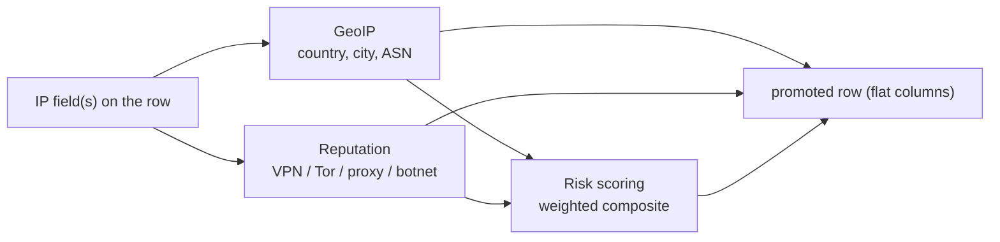

<!--
  Project:      dfe-loader
  File:         docs/pipeline/ENRICHMENT.md
  Purpose:      IP enrichment: GeoIP, reputation, risk scoring
  Language:     Markdown

  License:      BUSL-1.1
  Copyright:    (c) 2026 HYPERI PTY LIMITED
-->

# Enrichment

Enrichment adds derived columns to a row from its IP fields: geographic data,
reputation flags, and a composite risk score. Each provider is an independent
toggle, off by default. Enriched values are written as flat columns on the
promoted row only -- never folded into `_json`, so the payload stays the payload
and the enrichment stays queryable.

## Providers

| Provider | Config | What it adds |
|----------|--------|--------------|
| GeoIP | `enrichment.geoip` | geographic lookup (country, city, ASN) from a local database under `data_dir` |
| Reputation | `enrichment.reputation` | flags for VPN, Tor, proxy, and botnet membership |
| Risk scoring | `enrichment.risk_scoring` | weighted composite score from geo + reputation, with a selectable country-risk preset |

Risk scoring is a composite: it needs at least GeoIP or reputation enabled to
have anything to weigh. Enabling it alone does nothing useful, which the config
documents at the field.

## Cost and placement

Enrichment runs after coercion and before buffering, on the promoted row. The
lookups are cached, so a hot IP is resolved once and reused. Because the columns
are flat and additive, a table opts in simply by declaring the enrichment
columns in its schema -- an enriched value is written only where the target
table has a column for it, the same promotion rule the rest of the pipeline
follows.

## The setting drives the action

Like every config-cascade switch in the loader, an enrichment toggle is only
meaningful if the row that lands reflects it: enable GeoIP and the geo columns
on the written row are populated; leave it off and they are not. See
[../CONFIGURATION.md](../CONFIGURATION.md) and the hot-path context in
[OVERVIEW.md](OVERVIEW.md).
