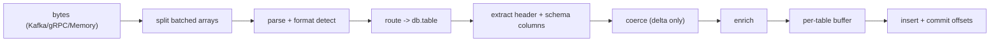

<!--
  Project:      dfe-loader
  File:         docs/pipeline/OVERVIEW.md
  Purpose:      The per-message hot path, stage by stage
  Language:     Markdown

  License:      BUSL-1.1
  Copyright:    (c) 2026 HYPERI PTY LIMITED
-->

# The pipeline

A message becomes a ClickHouse row in one pass. The hot path does the cheap
work per message and defers the expensive work to flush: parse once, promote
only the columns the table declares, keep the full payload as a
reference-counted `Arc<[u8]>`, and splice it in as `_json` only at serialise
time. The tail batches per table and inserts.

The stages, in order, all in `src/pipeline/` (`MessageProcessor::process` is the
per-message entry point):

## 0. Split batched arrays

Every stage below this takes one message to be one record, so a message whose
body is a non-empty JSON array of objects is split into one message per element
before anything else runs. Each element keeps its source message's topic,
partition and offset, so a batch still commits as one unit, and
`dfe_loader_batched_array_messages_total` /
`dfe_loader_batched_array_records_total` count what was split. A scalar array,
an empty one, and a body that does not parse are not batches of records: they go
through untouched so the format check and the DLQ see exactly what arrived.

dfe-receiver splits its own batched POSTs, but any producer can put an array on
a loader topic, so the split is here too. An array that reaches the next stage
unsplit is refused by shape and named as such, rather than being carried into
the capture and coming back as a ClickHouse encode error on an empty column.

## 1. Parse and detect format

The payload is sniffed on its first byte: `{`/`[` is JSON (parsed with
sonic-rs, SIMD), otherwise MessagePack (rmp-serde). The parse is zero-copy where
it can be -- the original bytes are retained as `Arc<[u8]>` so the full payload
can be written as `_raw` or `_json` later without re-serialising. A payload that
parses as neither, or is forced to one format and is the other, is rejected to
the DLQ.

## 2. Route

Routing picks `db.table` from the message before any flattening, using the
configured `routing.db_fields` / `routing.table_fields` (dot-notation for nested
access). No field match falls back to `routing.default_db` /
`routing.default_table`; a per-org mode can route by organisation. A routing
miss is a DLQ event, not a crash. See [ROUTING.md](ROUTING.md).

## 3. Extract

The target table's schema (reflected and cached, see
[../clickhouse/SCHEMA-CACHE.md](../clickhouse/SCHEMA-CACHE.md)) decides which
fields are promoted to typed columns. The header extractor pulls the common
header fields; the rest of the declared columns are pulled from the payload by
name. Anything not promoted stays in the payload, available as `_json`.

## 4. Coerce

Coercion is applied only to the delta between the payload value and the column
type that needs help: epoch vs ISO timestamps, UUID strings, IPv4/IPv6, numeric
strings. It is deliberately narrow -- the encoder handles native types directly,
so coercion only steps in where a wire value needs reshaping to fit the column.
Coercion warnings are sampled, not logged per row, to avoid flooding.

## 5. Enrich

Optional enrichment (`geoip`, `reputation`, `risk`) injects flat columns onto
the promoted row only -- never into `_json`. Each is a toggle; the lookups are
cached. See [ENRICHMENT.md](ENRICHMENT.md).

## 6. Buffer and capture

The promoted row, plus whatever `capture_mode` dictates for `_json` and `_raw`,
lands in the per-table buffer (rows + raw payloads + Kafka offsets). Capture
mode is resolved per table with a three-level precedence (DDL directive >
per-table config > global). See [CAPTURE-MODES.md](CAPTURE-MODES.md).

## 7. Insert and commit

Each table's buffer flushes on its own triggers (`flush_rows` / `flush_bytes` /
`flush_age_secs`). The batch is encoded and inserted through `clickhouse_ext`
(RowBinary by default), and only on success are that table's Kafka offsets
committed -- at-least-once. Failures are isolated per row by batch salvage, and
a wedged table trips its circuit breaker straight to the DLQ until a probe
recovers. See [../ARCHITECTURE.md](../ARCHITECTURE.md#resilience) and
[../clickhouse/INSERT-FORMATS.md](../clickhouse/INSERT-FORMATS.md).

## Parallelism

The hot path scales across a worker pool with per-table batching downstream. The
remediation playbook for parallel correctness is in
[PARALLELISM.md](PARALLELISM.md).
