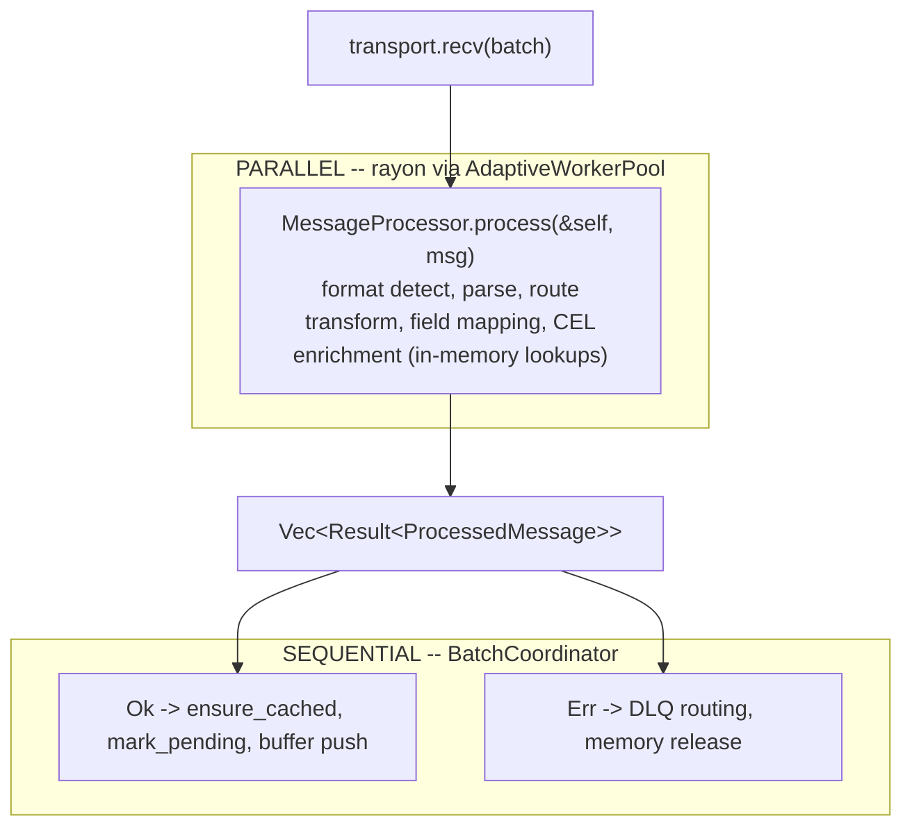

<!--
  Project:      dfe-loader
  File:         docs/pipeline/PARALLELISM.md
  Purpose:      Pipeline parallelisation playbook (parallel-then-sequential)
  Language:     Markdown

  License:      BUSL-1.1
  Copyright:    (c) 2026 HYPERI PTY LIMITED
-->

# Pipeline parallelisation

The hot path is a per-message loop. Most of that work -- format detect, parse,
route, transform, CEL, enrichment -- is pure `&self` computation with no shared
mutable state, so it parallelises cleanly across a worker pool. The part that
mutates state -- buffer push, schema-cache marking, stats, DLQ routing -- stays
sequential. This doc is the playbook for that split.

dfe-loader is the reference implementation; the same pattern applies to all six
DFE projects. The pattern is owned by the scalo `worker` feature
(`AdaptiveWorkerPool`).

## The pattern: parallel-then-sequential

Split the sequential `for msg in batch { process(msg) }` loop into two phases:

- **Parallel phase (rayon via `AdaptiveWorkerPool::process_batch`)** -- pure
  `&self` computation: parse, route, transform, enrich. No mutable state.
  Returns `Vec<Result<ProcessedMessage>>`.
- **Sequential phase (`BatchCoordinator`)** -- state mutation: buffer push,
  cache `mark_pending`, stats, DLQ routing. Runs after all parallel work is
  complete.

The borrow checker enforces the invariant: the processor (immutable borrows) is
dropped before the coordinator (mutable borrows) is created.



## Step-by-step remediation

### 1. Update Cargo.toml

```toml
scalo = { version = ">=2.0.0", features = [..., "worker"] }
```

### 2. Create the Processor struct

Extract the per-message processing logic into a struct with ONLY `&`
references:

```rust
pub struct MessageProcessor<'a> {
    config: &'a Config,
    // ... all immutable dependencies
}

impl MessageProcessor<'_> {
    pub fn process(&self, msg: &InputMessage) -> Result<ProcessedMessage> {
        // Pure computation -- no &mut, no I/O
    }
}
```

**Key check:** every `&mut self` method on the current processing path must be
converted to a pure `&self` equivalent. Common patterns:

| Old (mutable) | New (pure) |
|---|---|
| `cache.get_or_default(&mut self)` | `cache.derive_config(&self)` -- compute without caching |
| `cache.mark_pending(&mut self)` | move to the sequential phase |
| `buffer.push(&mut self)` | move to the sequential phase |

### 3. Create the Coordinator struct

The sequential post-phase. Takes `&mut` references to mutable state:

```rust
pub struct BatchCoordinator<'a> {
    buffer_manager: &'a mut BufferManager,
    // ... all mutable state
}

impl BatchCoordinator<'_> {
    pub fn apply_results(
        &mut self,
        results: Vec<Result<ProcessedMessage>>,
        messages: &[InputMessage],
    ) -> BatchOutcome {
        for (msg, result) in messages.iter().zip(results) {
            match result {
                Ok(processed) => { /* cache, buffer push, stats */ }
                Err(e) => { /* DLQ, memory release */ }
            }
        }
    }
}
```

### 4. Wire the event loop

```rust
// PARALLEL PHASE
let processor = MessageProcessor { config: &self.config, ... };
let results = if let Some(ref pool) = self.worker_pool {
    pool.process_batch(&batch, |msg| processor.process(msg))
} else {
    batch.iter().map(|msg| processor.process(msg)).collect()
};
drop(processor); // release immutable borrows

// SEQUENTIAL PHASE
let mut coordinator = BatchCoordinator { buffer: &mut buffer, ... };
let outcome = coordinator.apply_results(results, &batch);
```

The `else` branch provides graceful degradation when the worker pool is not
configured.

### 5. Wire AdaptiveWorkerPool in main.rs

```rust
let worker_pool = match AdaptiveWorkerPool::from_cascade("worker_pool") {
    Ok(pool) => {
        let pool = Arc::new(pool);
        pool.register_metrics(&manager);
        pool.set_memory_guard(...);
        pool.set_scaling_pressure(...);
        pool.start_scaling_loop(shutdown_token.clone());
        Some(pool)
    }
    Err(_) => None, // fallback to sequential
};
orchestrator = orchestrator.with_worker_pool(pool);
```

### 6. Add parallel execution tests

Three tests minimum:

- **Thread diversity** -- `process_batch` uses multiple thread IDs.
- **Semaphore throttle** -- max concurrent does not exceed `min_threads`.
- **Parallel safety** -- shared read-only state accessed from rayon without
  panics.

### 7. Review and security check

- Code review (`/review`).
- Security review (`/security-review`).
- Generate artefacts (`./binary generate-artefacts --output-dir docs/`).

## File structure (after refactor)

```text
src/pipeline/
  mod.rs              # re-exports
  orchestrator.rs     # thin event loop (select!, hot-reload, shutdown)
  processor.rs        # pure parallel-safe message processing
  coordinator.rs      # sequential state mutation (buffer, DLQ, stats)
  capture.rs          # per-table config derivation (pure &self)
  enrichment.rs       # enrichment pipeline (GeoIP, reputation, risk)
  types.rs            # ProcessedMessage, shared types
```

## Per-project notes

### dfe-loader (done -- reference implementation)

- Orchestrator reduced from 1628 -> ~950 lines.
- CEL evaluation (1-5ms/msg) is the biggest parallel win.
- Enrichment is in-memory (GeoIP cache uses `parking_lot::RwLock`, Sync-safe).
- ClickHouse inserts unchanged (single batch per table, existing semaphore).
- 396 tests pass.

### dfe-archiver

- Compression (zstd/lz4) is the main CPU work -- embarrassingly parallel.
- Use `process_batch` for compression, `fan_out_async` for storage writes.
- `max_parallel_writes: 1` default (cascade-configurable).

### dfe-transform-wasm

- WASM invocation is pure CPU -- create per-thread instances.
- Compiled module is shared (Arc), instances are cheap.
- Linear scaling with cores expected.

### dfe-transform-vrl

- VRL evaluation is pure CPU -- compiled program is Sync.
- Same pattern: parse batch -> parallel VRL evaluate -> sequential produce.

### dfe-receiver

- Custom `Metrics::with_dfe_metrics()` needs refactoring to the standard
  pattern.
- Request batching: accumulate N requests, `process_batch` for validation +
  routing.
- Most complex non-loader refactor.

### dfe-fetcher

- Sources already parallel (per-source `tokio::spawn`).
- Use `fan_out_async` for within-source service parallelism.
- Switch `serde_json` -> `sonic-rs` for JSON parsing.
- Lowest urgency (I/O-bound primarily).

## Config

All projects get this config section for free via cascade:

```yaml
worker_pool:
  min_threads: 2
  max_threads: 0           # 0 = auto-detect from cgroup/available_parallelism
  grow_below: 0.60         # CPU < 60% -> grow
  shrink_above: 0.85       # CPU > 85% -> shrink
  emergency_above: 0.95    # CPU > 95% -> aggressive shrink
  memory_pressure_cap: 0.80
  scale_interval_secs: 5
  async_concurrency: 32
  health_saturation_timeout_secs: 30
```

## Verification checklist

For each remediated project:

- [ ] `cargo check` -- zero errors.
- [ ] `cargo clippy -- -D warnings` -- zero warnings.
- [ ] All existing tests pass.
- [ ] Parallel execution test proves multi-thread (thread ID diversity).
- [ ] Semaphore throttle test proves the concurrency limit.
- [ ] Worker pool falls back to sequential when not configured.
- [ ] `./binary generate-artefacts --output-dir docs/` succeeds.
- [ ] Code review (`/review`).
- [ ] Security review (`/security-review`).
- [ ] `docs/metrics-manifest.json` committed.
- [ ] Push + CI green.

## See also

- [../ARCHITECTURE.md](../ARCHITECTURE.md) -- layers and the per-message hot
  path the worker pool parallelises.
