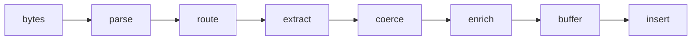

<!--
  Project:      dfe-loader
  File:         docs/pipeline/README.md
  Purpose:      Index for the per-message pipeline
  Language:     Markdown

  License:      BUSL-1.1
  Copyright:    (c) 2026 HYPERI PTY LIMITED
-->

# Pipeline

The hot path: bytes in, ClickHouse row out, one pass per message, batched per
table on the way out.

## Docs

- [OVERVIEW.md](OVERVIEW.md) -- the seven stages, in order.
- [ROUTING.md](ROUTING.md) -- choosing `db.table` from message fields.
- [CAPTURE-MODES.md](CAPTURE-MODES.md) -- what is stored as `_json` / `_raw`,
  and the three-level precedence.
- [ENRICHMENT.md](ENRICHMENT.md) -- GeoIP, reputation, risk scoring.
- [PARALLELISM.md](PARALLELISM.md) -- the parallelisation playbook.

For the buffer-and-insert tail see
[../clickhouse/INSERT-FORMATS.md](../clickhouse/INSERT-FORMATS.md) and the
resilience model in [../ARCHITECTURE.md](../ARCHITECTURE.md#resilience).
