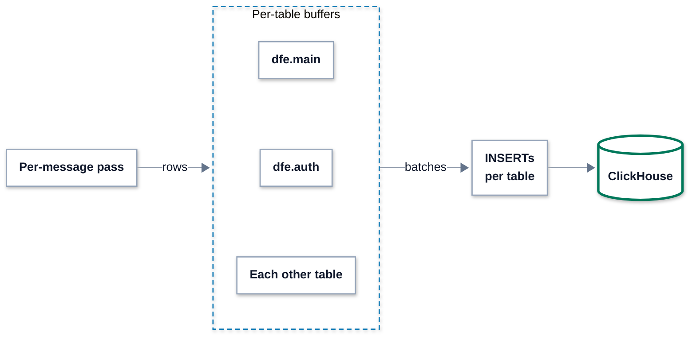

<!--
  Project:      dfe-loader
  File:         docs/pipeline/README.md
  Purpose:      Index for the per-message pipeline
  Language:     Markdown

  License:      BUSL-1.1
  Copyright:    (c) 2026 HYPERI PTY LIMITED
-->

# Pipeline

The hot path: bytes in, ClickHouse row out. The pass runs per message, and the batching is per table: each table has a separate buffer, flushed as INSERTs of its rows.

```mermaid
---
config:
  theme: base
  look: neo
  fontFamily: Inter, -apple-system, Segoe UI, Roboto, Helvetica, Arial, sans-serif
  flowchart:
    curve: linear
    nodeSpacing: 40
    rankSpacing: 64
    padding: 18
    wrappingWidth: 280
    htmlLabels: true
  elk:
    preset: modelOrder
  themeVariables:
    fontSize: 15px
    lineColor: "#64748B"
    primaryTextColor: "#0F172A"
    clusterBorder: "#0072B2"
    edgeLabelBackground: "#FFFFFF"
  themeCSS: >-
    p{margin:0}
    .node[data-look] rect,.node[data-look] path,.node[data-look] polygon,.node[data-look] .outer-path{filter:drop-shadow(0 1px 2px rgba(15,23,42,.10)) drop-shadow(0 6px 14px rgba(15,23,42,.10))}
    .node rect{rx:10px;ry:10px}
    .cluster rect{rx:16px;ry:16px}
    .node .label div{min-width:150px}
    .node.decision .label div{min-width:0}
    .cluster[data-look] rect{filter:none}
    .nodeLabel{line-height:1.35}
    .nodeLabel b{font-weight:600;font-size:15px;letter-spacing:-0.01em}
    .nodeLabel span{font-size:12.5px;font-weight:400;color:#334155}
    .cluster-label span.nodeLabel{display:inline-block;background:#FFFFFF;color:#0B2A3F;border:1.5px solid #0072B2;border-radius:999px;padding:2px 12px;font-size:11.5px;font-weight:700;letter-spacing:.09em;text-transform:uppercase}
    .flowchart-link{stroke-width:1.75px}
    .labelBkg{background:transparent!important}
    span.edgeLabel{display:inline-block;background:#FFFFFF!important;color:#1E293B;border:1px solid #94A3B8;border-radius:999px;padding:2px 10px;font-size:12px;font-weight:500}
    span.edgeLabel p{background:transparent!important}
    .label-icon{width:20px;height:20px;vertical-align:-4px;margin-right:6px}
    .ingest .label-icon{color:#0E8A7D}
    .xform .label-icon{color:#7B4FB0}
    .load .label-icon{color:#0072B2}
    .bus .label-icon{color:#A8517F}
    .store .label-icon{color:#00785A}
    .ui .label-icon{color:#D9480F}
    .ext .label-icon{color:#64748B}
---
flowchart LR
    accTitle: L4 Detail -- Per-message pass, per-table batches
    accDescr: Each message goes through one pass that parses, routes, extracts and enriches it. The row lands in the buffer of the table it was routed to, such as dfe.main or dfe.auth. Each table's buffer flushes as INSERTs into ClickHouse.

    pass["<b>Per-message pass</b>"]

    subgraph buffers["Per-table buffers"]
        direction TB
        main["<b>dfe.main</b>"] ~~~ auth["<b>dfe.auth</b>"] ~~~ other["<b>Each other table</b>"]
    end

    insert["<b>INSERTs<br/>per table</b>"]
    clickhouse[("<b>ClickHouse</b>")]

    pass -->|rows| buffers
    buffers -->|batches| insert
    insert --> clickhouse
  classDef ext fill:#F4F6F8,stroke:#94A3B8,stroke-width:1.5px,stroke-dasharray:5 4,color:#0F172A
  classDef ingest fill:#FFFFFF,stroke:#0E8A7D,stroke-width:3px,color:#0F172A
  classDef xform fill:#FFFFFF,stroke:#7B4FB0,stroke-width:3px,color:#0F172A
  classDef load fill:#FFFFFF,stroke:#0072B2,stroke-width:3px,color:#0F172A
  classDef bus fill:#FFFFFF,stroke:#A8517F,stroke-width:3px,color:#0F172A
  classDef store fill:#FFFFFF,stroke:#00785A,stroke-width:3px,color:#0F172A
  classDef ui fill:#FFFFFF,stroke:#D9480F,stroke-width:3px,color:#0F172A
  classDef decision fill:#FFFFFF,stroke:#9A6700,stroke-width:3px,color:#0F172A
  classDef error fill:#FFFFFF,stroke:#C2410C,stroke-width:3px,color:#0F172A
  classDef control fill:#FFFFFF,stroke:#334155,stroke-width:3px,color:#0F172A
  classDef part fill:#FFFFFF,stroke:#94A3B8,stroke-width:1.5px,color:#0F172A
  class pass,main,auth,other,insert part
  class clickhouse store
  style buffers fill:none,stroke:#0072B2,stroke-width:1.5px,stroke-dasharray:6 4
```

*Figure 1. L4 Detail -- Per-message pass, per-table batches. Each buffer flushes on a row, byte or age trigger.* Up: [L3 Components -- dfe-loader](../README.md).

## Docs

- [overview.md](overview.md) -- the stages, in order.
- [routing.md](routing.md) -- choosing `db.table` from message fields.
- [capture-modes.md](capture-modes.md) -- what is stored as `_json` / `_raw`,
  and the three-level precedence.
- [enrichment.md](enrichment.md) -- GeoIP, reputation, risk scoring.
- [parallelism.md](parallelism.md) -- the parallel and sequential phases of a batch.

For the buffer-and-insert tail see
[../clickhouse/insert-formats.md](../clickhouse/insert-formats.md) and the
resilience model in [../architecture.md](../architecture.md#resilience).
