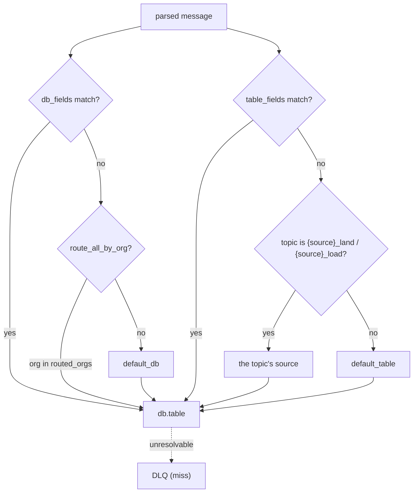

<!--
  Project:      dfe-loader
  File:         docs/pipeline/ROUTING.md
  Purpose:      How a message is routed to a database and table
  Language:     Markdown

  License:      BUSL-1.1
  Copyright:    (c) 2026 HYPERI PTY LIMITED
-->

# Routing

Routing decides the `db.table` a message lands in, before any flattening, from
fields in the message itself. It runs early in the hot path so a routing miss is
a cheap DLQ event rather than wasted downstream work.

## Settings

| Setting | Effect |
|---------|--------|
| `routing.db_fields` | fields whose value selects the database; empty means everything shares `default_db` |
| `routing.table_fields` | fields whose value selects the table; dot-notation reaches nested fields (`event.category`) |
| `routing.default_db` | database used when no `db_fields` value matches -- default `dfe` |
| `routing.default_table` | table used when neither a `table_fields` value nor the topic names one -- default `main`, so an unrouted message lands in `dfe.main` |
| `routing.topic_suffixes` | suffixes that mark a topic as one source's own -- default `_land` / `_load`, so `cisco-ios_load` names the source `cisco-ios` |
| `routing.route_all_by_org` / `routed_orgs` | route by organisation into a per-org database |

## How a field is resolved

`db_fields` and `table_fields` are ordered lists; the first field present in the
message wins, and its value (lower-cased, sanitised to a valid identifier) is the
database or table name. Dot-notation walks nested objects, so
`table_fields = ["event.category"]` reads `category` inside the `event` object.

When no listed field is present, the topic is asked next, and only then do the
configured defaults apply. A message that cannot be resolved to a real
`db.table` -- or that resolves to a table the loader cannot reflect -- goes to
the DLQ; it never wedges the consumer.

## The topic names the source when the record does not

A transform emits ECS. `_source` is a DFE header field the loader itself adds,
so nothing inside the document names the source and the topic name is the only
thing that does. `cisco-ios_load` is the output topic of exactly one source, so
a record arriving there with no `table_fields` value routes to `dfe.cisco-ios`.

A topic names a source only when one of `routing.topic_suffixes` strips off it
AND what is left does not resolve to `default_table`. Both halves matter:
`main_land` strips to the landing table, so its records genuinely have no
source of their own and keep the default fallback; a topic with no suffix to
strip is not `{source}_land` or `{source}_load` and names no source at all.
`source_to_table` is applied before the comparison, so a source mapped onto the
landing table is landing traffic too.

Routing by topic covers for the producer but does not hide it: the record still
named no table, so `dfe_loader_routing_field_absent_total` increments and a
warning names the topic, the table and how many records it stands for, once a
minute per topic.

A table ClickHouse confirms does not exist is held for 60 seconds, then
re-resolved, so a table created later starts receiving its own data without a
pod restart. The warning names the move into absence and not the state: the
re-resolved answer is the one already held, so a dead source name is announced
once rather than once a minute for the life of the deployment.

The default table is never held absent, because nothing falls back from it. A record routed to it while it does not exist waits in the pending-schema buffer and is resolved again while it waits, until the table exists or the record reaches `schema.pending_max_age_secs` and is retired like any record whose schema never arrived.

## The setting drives the action

Routing is config-cascade behaviour, so it is tested by outcome, not by parse:
the processor tests assert the row is actually buffered against the table the
config selects (`process_routes_to_table_from_event_category`,
`process_routes_to_default_when_no_table_field`,
`process_nested_table_field_via_dot_notation`,
`routing_config_drives_actual_table`,
`a_record_with_no_routing_field_on_a_source_topic_lands_in_that_source_table` in
`src/pipeline/processor.rs`). Change the routing fields and the destination
table the row lands in changes with it. See
[../CONFIGURATION.md](../CONFIGURATION.md#routing).
