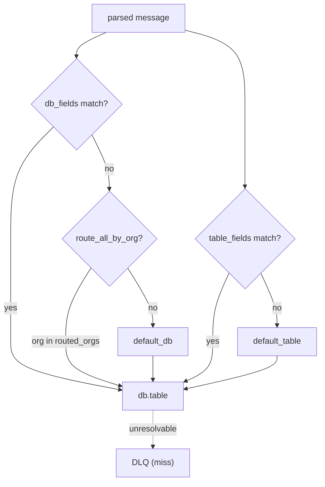

<!--
  Project:      dfe-loader
  File:         docs/pipeline/ROUTING.md
  Purpose:      How a message is routed to a database and table
  Language:     Markdown

  License:      BUSL-1.1
  Copyright:    (c) 2026 HYPERI PTY LIMITED
-->

# Routing

Routing decides the `db.table` a message lands in, before any flattening, from
fields in the message itself. It runs early in the hot path so a routing miss is
a cheap DLQ event rather than wasted downstream work.

## Settings

| Setting | Effect |
|---------|--------|
| `routing.db_fields` | fields whose value selects the database; empty means everything shares `default_db` |
| `routing.table_fields` | fields whose value selects the table; dot-notation reaches nested fields (`event.category`) |
| `routing.default_db` | database used when no `db_fields` value matches -- default `dfe` |
| `routing.default_table` | table used when no `table_fields` value matches -- default `main`, so an unrouted message lands in `dfe.main` |
| `routing.route_all_by_org` / `routed_orgs` | route by organisation into a per-org database |

## How a field is resolved

`db_fields` and `table_fields` are ordered lists; the first field present in the
message wins, and its value (lower-cased, sanitised to a valid identifier) is the
database or table name. Dot-notation walks nested objects, so
`table_fields = ["event.category"]` reads `category` inside the `event` object.

When no listed field is present, routing falls back to the configured defaults.
A message that cannot be resolved to a real `db.table` -- or that resolves to a
table the loader cannot reflect -- goes to the DLQ; it never wedges the
consumer.

## The setting drives the action

Routing is config-cascade behaviour, so it is tested by outcome, not by parse:
the processor tests assert the row is actually buffered against the table the
config selects (`process_routes_to_table_from_event_category`,
`process_routes_to_default_when_no_table_field`,
`process_nested_table_field_via_dot_notation`,
`routing_config_drives_actual_table` in `src/pipeline/processor.rs`). Change the
routing fields and the destination table the row lands in changes with it. See
[../CONFIGURATION.md](../CONFIGURATION.md#routing).
