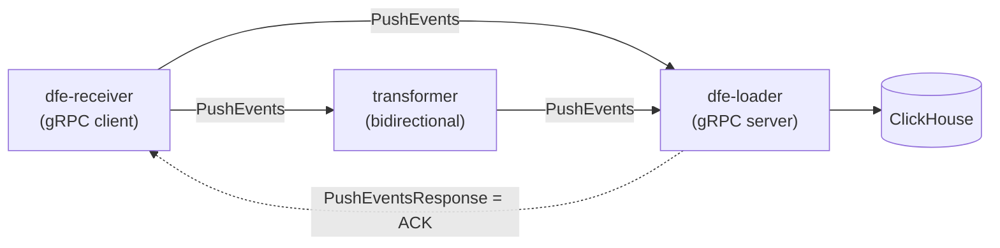

<!--
  Project:      dfe-loader
  File:         docs/transport/GRPC.md
  Purpose:      gRPC transport design: proto, config, modes, K8s integration
  Language:     Markdown

  License:      BUSL-1.1
  Copyright:    (c) 2026 HYPERI PTY LIMITED
-->

# gRPC transport

> **NOTE - partly HISTORICAL.** The later sections capture the original
> gRPC-replaces-Zenoh migration (phased plan, breaking-change-to-2.0.0 notes)
> from the pre-scalo era. That migration is long done; treat the phase plans and
> version-bump notes as history, not current guidance. The transport behaviour
> described at the top remains accurate against the scalo `Transport` trait.

The transports themselves -- Kafka, gRPC, Memory -- live in scalo.
The loader does not implement them; it wires the scalo `Transport` trait into
its pipeline via a thin adapter. This page documents the gRPC transport: the
wire protocol, the proto schema, the config surface, and how the loader consumes
it.

gRPC replaced the old Zenoh transport in scalo. It gives the loader (and
dfe-archiver) a server that receives event batches, and gives dfe-receiver (and
transformers) a client that pushes batches directly -- a Kafka-less path when you
want one.

- **Wire protocol:** gRPC (Protobuf over HTTP/2) via `tonic` 0.14.x.
- **Scope:** scalo transport module + dfe-loader, dfe-archiver, dfe-receiver.
- **Feature flag:** `transport-grpc` (optional `tonic` + `prost` deps).



## Design principles

1. **Same `Transport` trait** -- `GrpcTransport` implements the existing scalo
   trait. No trait changes.
2. **ACK = response** -- the gRPC response is the acknowledgement. No custom
   protocol on top.
3. **Dual mode** -- server (loader/archiver receives) AND client
   (receiver/transformer sends).
4. **Batch-first** -- `PushEvents` sends batches, not individual messages.
5. **Feature-gated** -- `transport-grpc` flag, optional `tonic` + `prost` deps.
6. **K8s native** -- standard gRPC health protocol, Service discovery.
7. **v1/v2 evolution** -- v1 proto includes mesh-ready fields (unused); v2
   activates them.
8. **Held, never dropped** -- the ACK means the loader now holds the only copy.
   When a ClickHouse insert fails the loader keeps the batch, stops pulling
   from the listener, and inserts it again on scalo's jittered exponential
   schedule, capped at `buffer.flush_age_secs` before jitter. The listener's
   queue (`grpc.recv_buffer_size`) fills and Push answers `RESOURCE_EXHAUSTED`,
   which dfe-receiver holds and re-sends. Intake resumes once the batch lands.
   A loader stopped while it holds a batch loses that batch: this path keeps
   no disk copy.

## Proto evolution: v1 -> v2

The proto is designed with forward-compatible fields so the wire format does not
change when mesh capabilities are added. Protobuf ignores unknown/empty fields by
design.

### What v1 implements (now -- dev/test + point-to-point production)

- Unary `PushEvents` RPC -- client sends a batch, server responds with an ACK.
- `origin` field on Event -- **present but empty** (ignored by v1 consumers).
- `accepted_origins` on Response -- **present but empty** (ignored by v1 callers).
- Client -> server topology only (no multi-hop).
- No WAL, no fan-out routing, no topology negotiation.
- `PushEventsStream` -- defined in proto but **not implemented** in v1.

### What v2 activates (future -- Kafka-less mesh)

- `origin` populated by sources, **passed through** transforms untouched.
- `accepted_origins` populated by sinks, used for **end-to-end ACK** across hops.
- `PushEventsStream` streaming RPC for high-throughput pipelines.
- Multi-hop ACK propagation
  (receiver -> transformer -> loader -> CH -> ACK chain).
- Receiver WAL integration (at-least-once without Kafka).
- Fan-out topology support (multiple downstream targets).

### Why this works

Protobuf is forward-compatible. v1 clients/servers ignore fields they do not use.
v2 clients/servers populate the same fields. No proto version bump, no breaking
change. The only change is application logic -- the wire format is identical.

**Vector.dev did exactly this:** their v2 source/sink protocol uses gRPC with
application-level acknowledgement. Events carry metadata (batch notifier
references) through the pipeline. The "worst status wins" pattern across fan-out
sinks ensures the source only ACKs when all copies succeed.

Reference:
[Vector End-to-End Acknowledgements](https://vector.dev/docs/architecture/end-to-end-acknowledgements/)

## Proto definition

File: `proto/dfe/transport/v1/transport.proto` (in scalo)

```protobuf
syntax = "proto3";

package dfe.transport.v1;

// Transport service for DFE pipeline communication.
//
// v1: Point-to-point. Receivers/transformers call PushEvents on loaders/archivers.
//     origin/accepted_origins fields present but unused.
//
// v2 (future): Mesh-ready. origin carries source tracking context through pipeline.
//     accepted_origins enables multi-hop end-to-end ACK without Kafka.
//
service DfeTransport {
    // Push a batch of events. Response is the ACK.
    // Error status = NACK (caller should retry or DLQ).
    rpc PushEvents(PushEventsRequest) returns (PushEventsResponse);

    // Streaming variant for high-throughput pipelines.
    // Each request gets a response -- bidirectional streaming.
    // v1: Defined but not implemented. Reserved for v2 mesh.
    rpc PushEventsStream(stream PushEventsRequest) returns (stream PushEventsResponse);
}

message PushEventsRequest {
    // Batch ID for correlation (caller-generated, UUIDv7 recommended)
    string batch_id = 1;

    // Events in this batch
    repeated Event events = 2;

    // Compression applied to event payloads (none, lz4, zstd)
    Compression compression = 3;

    // Source metadata (for tracing, debugging)
    SourceMetadata source = 4;
}

message Event {
    // Routing key (topic/table destination)
    string key = 1;

    // Raw payload bytes (JSON or MsgPack)
    bytes payload = 2;

    // Payload format hint (auto-detected if not set)
    PayloadFormat format = 3;

    // Event timestamp (milliseconds since epoch, 0 = not set)
    int64 timestamp_ms = 4;

    // Opaque origin tracking context.
    //
    // v1: Empty (unused). Set to empty bytes.
    // v2: Populated by sources. Passed through transforms untouched.
    //     Echoed back in PushEventsResponse.accepted_origins to enable
    //     multi-hop end-to-end ACK without Kafka.
    //
    // Conceptually similar to Vector.dev's EventFinalizer -- the origin
    // travels with the event through the pipeline and is returned to the
    // source when the event reaches its final destination.
    //
    // Format: Opaque to intermediate hops. Source and final ACK consumer
    // agree on encoding (e.g., batch_id + index as varints).
    bytes origin = 5;
}

message PushEventsResponse {
    // Number of events accepted
    uint32 accepted = 1;

    // Number of events rejected (sent to DLQ or dropped)
    uint32 rejected = 2;

    // Batch ID echoed back for correlation
    string batch_id = 3;

    // Per-event errors (only populated if rejected > 0)
    repeated EventError errors = 4;

    // Origin bytes from accepted events, echoed back.
    //
    // v1: Empty (unused). Callers ignore this field.
    // v2: Populated by the final sink. Enables the caller to correlate
    //     which upstream batches are safe to ACK/remove from WAL.
    //
    // The caller matches these against the origin bytes it sent to
    // determine which source events have been durably committed.
    repeated bytes accepted_origins = 5;
}

message EventError {
    // Index of the failed event in the request
    uint32 index = 1;

    // Error code
    ErrorCode code = 2;

    // Human-readable error message
    string message = 3;
}

message SourceMetadata {
    // Source service name (e.g., "dfe-receiver")
    string service = 1;

    // Source instance ID
    string instance_id = 2;

    // Source hostname
    string hostname = 3;
}

enum Compression {
    COMPRESSION_NONE = 0;
    COMPRESSION_LZ4 = 1;
    COMPRESSION_ZSTD = 2;
}

enum PayloadFormat {
    PAYLOAD_FORMAT_AUTO = 0;
    PAYLOAD_FORMAT_JSON = 1;
    PAYLOAD_FORMAT_MSGPACK = 2;
}

enum ErrorCode {
    ERROR_CODE_UNSPECIFIED = 0;
    ERROR_CODE_INVALID_PAYLOAD = 1;     // Can't parse JSON/MsgPack
    ERROR_CODE_ROUTING_FAILED = 2;      // Can't determine destination
    ERROR_CODE_TRANSFORM_FAILED = 3;    // Transform error
    ERROR_CODE_INSERT_FAILED = 4;       // ClickHouse insert failed
    ERROR_CODE_BACKPRESSURE = 5;        // Server overloaded, retry later
    ERROR_CODE_INTERNAL = 6;            // Internal server error
}
```

### Proto design decisions

**`bytes origin` on Event:**
Opaque bytes, not a structured message. The source and the final consumer agree
on encoding. Intermediate hops (transforms) pass it through without parsing. This
avoids coupling the proto schema to the origin tracking format -- it can evolve
independently.

**`repeated bytes accepted_origins` on Response:**
Not `repeated Event` -- the full event is not echoed back. Just the origin bytes.
The caller already knows what events it sent; it just needs to know which ones
were accepted to update its WAL/ACK state.

**`PushEventsStream` defined but not implemented:**
Defining it in v1 proto reserves the RPC method number. Implementing it in v2 is
additive -- no proto change needed.

**`dfe.transport.v1` package naming:**
v2 mesh features use the SAME package. The `v1` is the proto package version
(wire format), not the feature version. origin/accepted_origins are part of the
v1 wire format -- they are just empty in v1 implementations.

### Compression

Payload-level compression (LZ4/zstd) is optional and applies to the event
payloads, not the gRPC frame. gRPC transport-level compression (gzip) is also
available via `tonic::codec::CompressionEncoding` and can be enabled
independently. Both can be used together -- payload compression for CPU
efficiency, gRPC compression for wire.

### Why not streaming-only?

Unary `PushEvents` is simpler and sufficient for point-to-point. The streaming
variant adds value in mesh deployments where connection lifecycle matters.
Starting with unary means fewer moving parts for v1.

## scalo implementation

### New files

```
src/transport/
|- grpc/
|  |- mod.rs          # GrpcTransport (client + server)
|  |- config.rs       # GrpcConfig
|  |- token.rs        # GrpcToken (CommitToken impl)
|  |- server.rs       # tonic server (receives events)
|  |- client.rs       # tonic client (sends events)
proto/
|- dfe/
   |- transport/
      |- v1/
         |- transport.proto
```

### Removed files

```
src/transport/
|- zenoh/              # REMOVED entirely
   |- mod.rs
   |- config.rs
   |- token.rs
```

### build.rs (proto codegen)

```rust
fn main() -> Result<(), Box<dyn std::error::Error>> {
    #[cfg(feature = "transport-grpc")]
    {
        tonic_build::configure()
            .build_server(true)
            .build_client(true)
            .out_dir("src/transport/grpc/generated")
            .compile_protos(
                &["proto/dfe/transport/v1/transport.proto"],
                &["proto"],
            )?;
    }
    Ok(())
}
```

**Note:** Generated code is checked into the repo (`out_dir`), not generated at
build time. This avoids requiring `protoc` on every build machine and in CI.
Regenerate with `cargo build --features transport-grpc` when the proto changes.

Reference: [tonic-build docs](https://docs.rs/tonic-build)

### GrpcConfig

```rust
#[derive(Debug, Clone, Serialize, Deserialize)]
#[serde(default)]
pub struct GrpcConfig {
    /// Server listen address (e.g., "0.0.0.0:6000")
    /// Set to None for client-only mode.
    pub listen: Option<String>,

    /// Target server address (e.g., "dfe-loader:6000")
    /// Set to None for server-only mode.
    /// Supports K8s Service names -- DNS resolution handled by tonic Channel.
    pub target: Option<String>,

    /// Topics/keys to subscribe to (server mode -- filters incoming events by key prefix)
    pub subscribe: Vec<String>,

    /// Connection timeout in milliseconds
    pub connect_timeout_ms: u64,

    /// Request timeout in milliseconds
    pub request_timeout_ms: u64,

    /// Maximum batch size for PushEvents
    pub max_batch_size: usize,

    /// Enable TLS (uses system CA store by default)
    pub tls_enabled: bool,

    /// TLS CA certificate path (optional, uses system store if not set)
    pub tls_ca_cert: Option<String>,

    /// TLS client certificate path (for mTLS)
    pub tls_client_cert: Option<String>,

    /// TLS client key path (for mTLS)
    pub tls_client_key: Option<String>,

    /// Enable gRPC compression (gzip). Default: false.
    /// Applies to transport-level compression via tonic CompressionEncoding.
    pub compression: bool,

    /// Maximum message size in bytes (default: 16MB).
    /// Applies to both encode and decode limits.
    /// tonic default decode limit is 4MB -- we override to 16MB.
    pub max_message_size: usize,

    /// Number of retry attempts on transient failure (UNAVAILABLE, DEADLINE_EXCEEDED)
    pub retry_max_attempts: u32,

    /// Initial retry backoff in milliseconds
    pub retry_initial_backoff_ms: u64,

    /// Maximum retry backoff in milliseconds
    pub retry_max_backoff_ms: u64,

    /// Enable gRPC health check service (server mode).
    /// Uses tonic-health for standard grpc.health.v1.Health protocol.
    /// K8s 1.24+ supports native gRPC health probes.
    pub health_check: bool,

    /// HTTP/2 keep-alive interval in seconds (0 = disabled).
    /// Sends HTTP/2 PING frames at this interval.
    pub keepalive_interval_secs: u64,

    /// HTTP/2 keep-alive timeout in seconds.
    /// Connection dropped if PING not acknowledged within this time.
    pub keepalive_timeout_secs: u64,

    /// Enable TCP_NODELAY (disable Nagle's algorithm). Default: true.
    pub tcp_nodelay: bool,

    /// Server concurrency limit per connection (0 = unlimited).
    /// Maps to tonic Server::concurrency_limit_per_connection().
    pub concurrency_limit: usize,

    /// Enable load shedding (server mode). Default: false.
    /// When enabled, returns RESOURCE_EXHAUSTED immediately if service is not ready.
    /// Maps to tonic Server::load_shed().
    pub load_shed: bool,

    /// Server receive buffer size (events). Default: 10_000.
    /// The mpsc channel capacity between tonic handler and Transport::recv().
    pub recv_buffer_size: usize,
}

impl Default for GrpcConfig {
    fn default() -> Self {
        Self {
            listen: None,
            target: None,
            subscribe: vec![],
            connect_timeout_ms: 5_000,
            request_timeout_ms: 30_000,
            max_batch_size: 10_000,
            tls_enabled: false,
            tls_ca_cert: None,
            tls_client_cert: None,
            tls_client_key: None,
            compression: false,
            max_message_size: 16 * 1024 * 1024, // 16MB
            retry_max_attempts: 3,
            retry_initial_backoff_ms: 100,
            retry_max_backoff_ms: 5_000,
            health_check: true,
            keepalive_interval_secs: 30,
            keepalive_timeout_secs: 10,
            tcp_nodelay: true,
            concurrency_limit: 0,
            load_shed: false,
            recv_buffer_size: 10_000,
        }
    }
}

impl GrpcConfig {
    /// Client-only config (for receiver/transformer sending to loader)
    pub fn client(target: &str) -> Self {
        Self {
            target: Some(target.to_string()),
            ..Default::default()
        }
    }

    /// Server-only config (for loader/archiver receiving events)
    pub fn server(listen: &str, subscribe: Vec<String>) -> Self {
        Self {
            listen: Some(listen.to_string()),
            subscribe,
            ..Default::default()
        }
    }

    /// Client + server (for transformer -- receives from receiver, sends to loader)
    pub fn bidirectional(listen: &str, target: &str, subscribe: Vec<String>) -> Self {
        Self {
            listen: Some(listen.to_string()),
            target: Some(target.to_string()),
            subscribe,
            ..Default::default()
        }
    }

    /// Dev/test preset -- localhost, no TLS, short timeouts, minimal retries
    pub fn devtest(listen: &str, target: &str) -> Self {
        Self {
            listen: Some(listen.to_string()),
            target: Some(target.to_string()),
            connect_timeout_ms: 1_000,
            request_timeout_ms: 5_000,
            retry_max_attempts: 1,
            ..Default::default()
        }
    }
}
```

### GrpcToken

```rust
#[derive(Debug, Clone, PartialEq, Eq, Hash)]
pub struct GrpcToken {
    /// Batch ID from PushEventsRequest
    pub batch_id: Arc<str>,
    /// Event index within the batch
    pub index: u32,
    /// Sequence number (monotonically increasing per transport instance)
    pub seq: u64,
}

impl CommitToken for GrpcToken {}

impl Display for GrpcToken {
    fn fmt(&self, f: &mut fmt::Formatter<'_>) -> fmt::Result {
        write!(f, "grpc:{}:{}:{}", self.batch_id, self.index, self.seq)
    }
}
```

### GrpcTransport

The transport operates in one of three modes:

- **Client mode** (`target` set, `listen` not set): sends events via `PushEvents`
  RPC.
- **Server mode** (`listen` set, `target` not set): receives events, buffers in
  channel.
- **Bidirectional** (both set): transformer pattern -- receives AND sends.

```rust
pub struct GrpcTransport {
    /// Client for sending events (None in server-only mode)
    client: Option<tokio::sync::Mutex<DfeTransportClient<Channel>>>,

    /// Channel handle for health checking (client mode)
    channel: Option<Channel>,

    /// Received events buffer (from server handler)
    receiver: tokio::sync::Mutex<mpsc::Receiver<Message<GrpcToken>>>,

    /// Health reporter for gRPC health protocol (server mode)
    health_reporter: Option<tonic_health::server::HealthReporter>,

    /// Server shutdown signal
    server_shutdown: Option<tokio::sync::oneshot::Sender<()>>,

    /// Server task handle (None in client-only mode)
    server_handle: Option<tokio::task::JoinHandle<()>>,

    /// Sequence counter
    sequence: AtomicU64,

    /// Closed flag
    closed: AtomicBool,

    /// Config snapshot
    config: GrpcConfig,
}

#[async_trait]
impl Transport for GrpcTransport {
    type Token = GrpcToken;

    /// Send events via PushEvents RPC.
    /// Returns Ok on success, Backpressured on RESOURCE_EXHAUSTED, Fatal on other errors.
    async fn send(&self, key: &str, payload: &[u8]) -> SendResult;

    /// Receive events from the server handler buffer.
    /// Server mode: returns events received via PushEvents.
    /// Client mode: always returns empty (no inbound events).
    async fn recv(&self, max: usize) -> TransportResult<Vec<Message<Self::Token>>>;

    /// Commit is a no-op for gRPC v1 -- ACK already sent via response.
    /// v2 (future): Will update health reporter and propagate ACK upstream.
    async fn commit(&self, _tokens: &[Self::Token]) -> TransportResult<()>;

    async fn close(&self) -> TransportResult<()>;

    /// v1: Returns true if not closed AND channel is connected (client mode).
    /// Checks tonic Channel connectivity state, not just the closed flag.
    /// This enables downstream health propagation in v2 mesh readiness.
    fn is_healthy(&self) -> bool;

    fn name(&self) -> &'static str; // "grpc"
}
```

### `is_healthy()` -- downstream state propagation

```rust
fn is_healthy(&self) -> bool {
    if self.closed.load(Ordering::Relaxed) {
        return false;
    }
    // Server mode: always healthy if not closed (accepting connections)
    // Client mode: check if downstream is reachable
    // This enables mesh readiness propagation in v2 -- a transformer's
    // readiness depends on whether its downstream (loader) is reachable.
    true // Refine with Channel state checking in implementation
}
```

### Batch send (client side)

For efficiency, `GrpcTransport` also exposes a batch send method:

```rust
impl GrpcTransport {
    /// Send a batch of events in a single PushEvents RPC.
    /// More efficient than calling send() per event.
    ///
    /// v1: origin bytes are empty on each event.
    /// v2: caller populates origin bytes for end-to-end ACK tracking.
    pub async fn send_batch(
        &self,
        events: Vec<(String, Vec<u8>)>, // (key, payload) pairs
    ) -> TransportResult<PushEventsResponse>;
}
```

### Server handler

The tonic service implementation buffers received events into the mpsc channel:

```rust
struct TransportServiceHandler {
    sender: mpsc::Sender<Message<GrpcToken>>,
    sequence: Arc<AtomicU64>,
    subscribe_filter: Option<Vec<String>>,
}

#[tonic::async_trait]
impl DfeTransport for TransportServiceHandler {
    async fn push_events(
        &self,
        request: Request<PushEventsRequest>,
    ) -> Result<Response<PushEventsResponse>, Status> {
        let req = request.into_inner();

        let mut accepted = 0u32;
        let mut rejected = 0u32;
        let mut errors = Vec::new();
        // v1: empty. v2: collect origin bytes from accepted events.
        let mut accepted_origins = Vec::new();

        for (i, event) in req.events.iter().enumerate() {
            // Filter by subscribe keys if configured
            if let Some(ref filter) = self.subscribe_filter {
                if !filter.iter().any(|f| event.key.starts_with(f)) {
                    continue;
                }
            }

            let seq = self.sequence.fetch_add(1, Ordering::Relaxed);
            let token = GrpcToken {
                batch_id: Arc::from(req.batch_id.as_str()),
                index: i as u32,
                seq,
            };

            let msg = Message::new(
                Some(Arc::from(event.key.as_str())),
                event.payload.clone(),
                token,
                if event.timestamp_ms > 0 { Some(event.timestamp_ms) } else { None },
            );

            match self.sender.try_send(msg) {
                Ok(_) => {
                    accepted += 1;
                    // v1: origin is empty, so this adds empty bytes (zero cost)
                    // v2: passes through the source's tracking context
                    if !event.origin.is_empty() {
                        accepted_origins.push(event.origin.clone());
                    }
                }
                Err(mpsc::error::TrySendError::Full(_)) => {
                    rejected += 1;
                    errors.push(EventError {
                        index: i as u32,
                        code: ErrorCode::Backpressure as i32,
                        message: "Server buffer full".into(),
                    });
                }
                Err(mpsc::error::TrySendError::Closed(_)) => {
                    return Err(Status::unavailable("Transport shutting down"));
                }
            }
        }

        Ok(Response::new(PushEventsResponse {
            accepted,
            rejected,
            batch_id: req.batch_id,
            errors,
            accepted_origins,
        }))
    }
}
```

### Server setup (with health + reflection)

```rust
impl GrpcTransport {
    async fn start_server(
        config: &GrpcConfig,
        sender: mpsc::Sender<Message<GrpcToken>>,
        sequence: Arc<AtomicU64>,
    ) -> TransportResult<(
        tokio::task::JoinHandle<()>,
        tokio::sync::oneshot::Sender<()>,
        Option<tonic_health::server::HealthReporter>,
    )> {
        let addr = config.listen.as_ref()
            .ok_or(TransportError::Config("listen address required for server mode".into()))?
            .parse()
            .map_err(|e| TransportError::Config(format!("Invalid listen address: {e}")))?;

        let handler = TransportServiceHandler {
            sender,
            sequence,
            subscribe_filter: if config.subscribe.is_empty() {
                None
            } else {
                Some(config.subscribe.clone())
            },
        };

        let (shutdown_tx, shutdown_rx) = tokio::sync::oneshot::channel();

        // Health service (tonic-health)
        let (mut health_reporter, health_service) = tonic_health::server::health_reporter();
        health_reporter
            .set_serving::<DfeTransportServer<TransportServiceHandler>>()
            .await;

        let mut builder = tonic::transport::Server::builder()
            .tcp_nodelay(config.tcp_nodelay);

        if config.concurrency_limit > 0 {
            builder = builder.concurrency_limit_per_connection(config.concurrency_limit);
        }
        if config.load_shed {
            // Note: load_shed consumes the builder -- tonic API
        }
        if config.keepalive_interval_secs > 0 {
            builder = builder
                .http2_keepalive_interval(Some(
                    std::time::Duration::from_secs(config.keepalive_interval_secs)
                ))
                .http2_keepalive_timeout(Some(
                    std::time::Duration::from_secs(config.keepalive_timeout_secs)
                ));
        }

        let svc = DfeTransportServer::new(handler)
            .max_decoding_message_size(config.max_message_size)
            .max_encoding_message_size(config.max_message_size);

        let handle = tokio::spawn(async move {
            builder
                .add_service(health_service)
                .add_service(svc)
                .serve_with_shutdown(addr, async {
                    let _ = shutdown_rx.await;
                })
                .await
                .ok();
        });

        Ok((handle, shutdown_tx, Some(health_reporter)))
    }
}
```

## Feature flags (scalo Cargo.toml)

### Before

```toml
transport = ["tokio", "serde_json", "rmp-serde", "chrono", "async-trait"]
transport-memory = ["transport"]
transport-kafka = ["transport", "rdkafka"]
transport-zenoh = ["transport", "zenoh"]
transport-all = ["transport-memory", "transport-kafka", "transport-zenoh"]
```

### After

```toml
transport = ["tokio", "serde_json", "rmp-serde", "chrono", "async-trait"]
transport-memory = ["transport"]
transport-kafka = ["transport", "rdkafka"]
transport-grpc = ["transport", "tonic", "prost", "tonic-health"]
transport-all = ["transport-memory", "transport-kafka", "transport-grpc"]
```

### Dependencies

```toml
[dependencies]
tonic = { version = "0.14", optional = true, features = ["transport", "tls"] }
tonic-health = { version = "0.14", optional = true }
prost = { version = "0.13", optional = true }

[build-dependencies]
tonic-build = { version = "0.14" }
# Note: tonic-build is NOT optional -- always available for proto regen.
# Proto output is checked in; build.rs only runs when proto changes.
```

### Removed dependencies

```toml
# REMOVED
# zenoh = { version = ">=1.7.2, <2", optional = true }
```

## TransportType enum update

### Before

```rust
pub enum TransportType {
    #[default]
    Kafka,
    Zenoh,
    Memory,
}
```

### After

```rust
pub enum TransportType {
    #[default]
    Kafka,
    Grpc,
    Memory,
}
```

### TransportConfig update

```rust
pub struct TransportConfig {
    pub transport_type: TransportType,
    pub payload_format: PayloadFormat,
    #[cfg(feature = "transport-kafka")]
    pub kafka: Option<KafkaConfig>,
    #[cfg(feature = "transport-grpc")]
    pub grpc: Option<GrpcConfig>,
    #[cfg(feature = "transport-memory")]
    pub memory: Option<MemoryConfig>,
}
```

## dfe-loader migration

### Cargo.toml changes

```toml
# Before
[features]
transport-zenoh = ["scalo/transport-zenoh"]
transport-memory = ["scalo/transport-memory"]

# After
[features]
transport-grpc = ["scalo/transport-grpc"]
transport-memory = ["scalo/transport-memory"]
```

### Config changes (loader.rs)

Remove `ZenohConfig`, add `GrpcConfig`:

```rust
// Before
pub zenoh: Option<ZenohConfig>,

// After
pub grpc: Option<GrpcConfig>,
```

Config file / ENV:

```yaml
# Before
transport: "zenoh"
zenoh:
  mode: "peer"
  listen: ["tcp/127.0.0.1:7447"]
  subscribe: ["dfe/**"]

# After
transport: "grpc"
grpc:
  listen: "0.0.0.0:6000"
  subscribe: ["dfe"]
```

ENV override: `DFE_LOADER__GRPC__LISTEN="0.0.0.0:6000"`

### Transport adapter (transport.rs)

Remove `ZenohTransportAdapter`, add `GrpcTransportAdapter`:

```rust
// Remove
#[cfg(feature = "transport-zenoh")]
mod zenoh_adapter { ... }

// Add
#[cfg(feature = "transport-grpc")]
mod grpc_adapter {
    use scalo::transport::{
        Transport, GrpcConfig as TransportGrpcConfig, GrpcTransport,
    };

    pub struct GrpcTransportAdapter {
        transport: GrpcTransport,
    }

    impl GrpcTransportAdapter {
        pub async fn new(config: &GrpcConfig) -> Result<Self> {
            let transport_config = Self::convert_config(config);
            let transport = GrpcTransport::new(&transport_config).await
                .map_err(|e| crate::Error::Transport(format!("gRPC init error: {e}")))?;
            Ok(Self { transport })
        }
    }
}
```

### TransportBackend enum

```rust
// Before
pub enum TransportBackend {
    Kafka(TransportAdapter),
    #[cfg(feature = "transport-zenoh")]
    Zenoh(ZenohTransportAdapter),
    #[cfg(feature = "transport-memory")]
    Memory(MemoryTransportAdapter),
}

// After
pub enum TransportBackend {
    Kafka(TransportAdapter),
    #[cfg(feature = "transport-grpc")]
    Grpc(GrpcTransportAdapter),
    #[cfg(feature = "transport-memory")]
    Memory(MemoryTransportAdapter),
}
```

## dfe-archiver migration

Minimal -- swap the feature flag:

```toml
# Before (Cargo.toml)
scalo = { version = ">=1.3", features = [
    "config", "logger", "metrics", "transport-kafka", "transport-zenoh",
    "http-server", "tiered-sink", "spool",
] }

# After
scalo = { version = ">=2.0", features = [
    "config", "logger", "metrics", "transport-kafka", "transport-grpc",
    "http-server", "tiered-sink", "spool",
] }
```

No adapter code exists in dfe-archiver -- it uses scalo's transport directly.

## dfe-receiver migration

dfe-receiver previously had no Zenoh support. The gRPC transport adds the ability
to send directly to dfe-loader without Kafka:

```toml
# Cargo.toml -- add transport-grpc
scalo = { version = ">=2.0", features = [
    "config", "config-reload", "logger", "metrics", "http-server",
    "transport-kafka", "transport-grpc",
    "spool", "tiered-sink", "runtime", "secrets",
] }
```

Receiver uses gRPC client mode to push events to the loader:

```yaml
# config.yaml
loader:
  transport: "grpc"
  grpc:
    target: "dfe-loader:6000"    # K8s Service name
    request_timeout_ms: 10000
    retry_max_attempts: 3
```

## Migration sequence

### Phase 1: scalo (scalo)

1. Create `proto/dfe/transport/v1/transport.proto`.
2. Add `tonic-build` to build deps, write `build.rs` for proto codegen.
3. Generate code, check into `src/transport/grpc/generated/`.
4. Create `src/transport/grpc/` module (config, token, client, server, mod).
5. Implement `GrpcTransport` with the Transport trait.
6. Wire up `tonic-health` for the gRPC health protocol.
7. Update `TransportType` enum (Zenoh -> Grpc).
8. Update `TransportConfig` struct.
9. Update feature flags in Cargo.toml.
10. Remove `src/transport/zenoh/` directory.
11. Remove `zenoh` dependency from Cargo.toml.
12. Write unit tests (config, token, round-trip, bidirectional, backpressure,
    shutdown).
13. Publish (major bump -- v2.0.0).

### Phase 2: dfe-loader

1. Update Cargo.toml -- `transport-zenoh` -> `transport-grpc`.
2. Update `src/config/` -- remove `ZenohConfig`, add `GrpcConfig`.
3. Update `src/kafka/transport.rs` -- remove `ZenohTransportAdapter`, add
   `GrpcTransportAdapter`.
4. Update `TransportBackend` enum.
5. Update config examples and docs.
6. Run tests, verify CI passes.

### Phase 3: dfe-archiver

1. Update Cargo.toml -- swap `transport-zenoh` for `transport-grpc`.
2. No code changes needed (uses scalo transport directly).

### Phase 4: dfe-receiver

1. Add `transport-grpc` to Cargo.toml features.
2. Add gRPC client config to `LoaderConfig`.
3. Wire up gRPC client for direct-to-loader delivery.
4. Test: receiver -> gRPC -> loader -> ClickHouse.

## K8s integration

### Service definition

```yaml
apiVersion: v1
kind: Service
metadata:
  name: dfe-loader
spec:
  selector:
    app: dfe-loader
  ports:
    - name: grpc
      port: 6000
      targetPort: 6000
    - name: metrics
      port: 9090
      targetPort: 9090
```

### Health probes

tonic-health implements the standard `grpc.health.v1.Health` protocol. K8s 1.24+
supports native gRPC health probes (no sidecar needed):

```yaml
livenessProbe:
  grpc:
    port: 6000
  initialDelaySeconds: 10
  periodSeconds: 10

readinessProbe:
  grpc:
    port: 6000
  initialDelaySeconds: 5
  periodSeconds: 5
```

For older K8s, use the `grpc-health-probe` binary or HTTP health endpoints on the
metrics port (which dfe-loader already serves on :9090).

Reference: [tonic-health](https://docs.rs/tonic-health)

### KEDA scaling

KEDA can scale on gRPC metrics via Prometheus. The transport exposes:

- `grpc_requests_total` -- total PushEvents calls.
- `grpc_events_accepted_total` -- events successfully buffered.
- `grpc_events_rejected_total` -- events rejected (backpressure).
- `grpc_request_duration_seconds` -- PushEvents latency histogram.

```yaml
triggers:
  - type: prometheus
    metadata:
      serverAddress: http://prometheus:9090
      query: sum(rate(grpc_events_accepted_total[1m]))
      threshold: "10000"
```

## Testing strategy

### Unit tests (scalo)

1. Config construction (client, server, bidirectional, devtest presets).
2. Token creation and Display formatting.
3. Client send + server recv round-trip (localhost).
4. Batch send/recv with multiple events.
5. **Bidirectional mode** -- receive events, transform, send to another target.
   (This validates the transformer topology works from day one.)
6. Backpressure (full buffer -> RESOURCE_EXHAUSTED status).
7. Connection failure handling (unreachable target -> error).
8. Close/shutdown behaviour (graceful shutdown signal).
9. Health check service (tonic-health status reporting).
10. Subscribe filter matching (key prefix filtering).
11. Origin passthrough -- verify origin bytes survive round-trip unchanged.
    (Empty in v1, but the plumbing is tested.)

### Integration tests (dfe-loader)

1. gRPC transport adapter creation from config.
2. Receive events via gRPC, process through pipeline, insert to ClickHouse.
3. Error propagation (bad payload -> error response with EventError).
4. Backpressure (slow ClickHouse -> RESOURCE_EXHAUSTED to caller).

### End-to-end (multi-process)

1. dfe-receiver -> gRPC -> dfe-loader -> ClickHouse.
2. Loader restart -> receiver retries to new pod.
3. Multiple receivers -> single loader (fan-in).
4. Multiple loaders behind a K8s Service (load balancing).

## Version strategy

This is a **breaking change** to scalo's transport module (removing Zenoh,
adding gRPC).

- scalo: bump to **2.0.0** (breaking: removed `transport-zenoh` feature).
- dfe-loader: update dep to `>=2.0.0`.
- dfe-archiver: update dep to `>=2.0.0`.
- dfe-receiver: update dep to `>=2.0.0`.

Clean break -- all internal projects, no external consumers of `transport-zenoh`.

## v1 -> v2 mesh readiness checklist

Decisions made now in v1 that keep the door open for v2 mesh:

| Decision | Where | v1 behaviour | v2 behaviour | Cost now |
|----------|-------|-------------|-------------|----------|
| `bytes origin` on Event | Proto | Empty, ignored | Source tracking context, passed through | One empty field |
| `repeated bytes accepted_origins` on Response | Proto | Empty, ignored | Echoed origins for multi-hop ACK | One empty list |
| `PushEventsStream` RPC defined | Proto | Not implemented, method reserved | Bidirectional streaming for throughput | Proto definition only |
| Bidirectional mode unit test | Tests | Validates receive+send in same process | Same test covers transformer | One test |
| `is_healthy()` checks channel state | GrpcTransport | Checks closed + channel connectivity | Readiness propagation across hops | Few lines |
| `v1` package naming | Proto | `dfe.transport.v1` | Same package, no breaking change | Naming only |
| Multi-instance (no singleton) | Architecture | One GrpcTransport per target | Fan-out via multiple instances | Already correct |
| `tonic-health` integration | Server | Reports serving/not-serving | Downstream-aware health (v2) | Health service |

**None of these add complexity to v1.** They are empty fields, a test, and a
health check. The mesh implementation itself (WAL, origin tracking logic, fan-out
routing) is entirely v2 scope.

## Open questions (resolved)

1. **Unix Domain Sockets:** tonic supports UDS via `serve_with_incoming` +
   `UnixListener` (server) and `connect_with_connector` + `UnixStream` (client).
   Not needed for v1. Add UDS as a `listen` address variant (e.g.,
   `unix:///var/run/dfe.sock`) in v2 if same-node latency matters.
   Reference: [tonic UDS example](https://github.com/hyperium/tonic/blob/master/examples/src/uds/server.rs)

2. **Streaming vs unary:** v1 implements unary only. `PushEventsStream` is defined
   in proto but not implemented. Add in v2 when benchmarks show connection
   lifecycle overhead.

3. **Proto location:** Proto lives in scalo (`proto/dfe/transport/v1/`).
   Generated code checked into `src/transport/grpc/generated/`. All projects
   import via the scalo dep.

4. **Receiver WAL:** Separate from transport. The gRPC transport works without WAL
   (at-most-once). WAL adds at-least-once on top. WAL + origin tracking =
   end-to-end ACK (v2).

5. **Proto codegen strategy:** Use `tonic-build` with `out_dir` to check in
   generated code. Avoids requiring `protoc` on every build machine. Regen when
   proto changes.
   Reference: [tonic-build docs](https://docs.rs/tonic-build),
   [prost codegen](https://github.com/tokio-rs/prost)

## Sources

- [tonic -- Rust gRPC framework](https://github.com/hyperium/tonic) (0.14.x, 171M+ downloads)
- [tonic-health -- gRPC health checking](https://docs.rs/tonic-health)
- [tonic-build -- proto codegen](https://docs.rs/tonic-build)
- [tonic UDS example](https://github.com/hyperium/tonic/blob/master/examples/src/uds/server.rs)
- [tonic Server configuration](https://docs.rs/tonic/latest/tonic/transport/struct.Server.html)
- [prost -- Protocol Buffers for Rust](https://github.com/tokio-rs/prost)
- [Vector v2 source/sink protocol](https://vector.dev/highlights/2021-08-24-vector-source-sink/)
- [Vector End-to-End Acknowledgements](https://vector.dev/docs/architecture/end-to-end-acknowledgements/)
- [Vector deployment architecture](https://vector.dev/docs/setup/going-to-prod/architecting/)
- [tonic production best practices](https://markaicode.com/building-microservices-with-rust-tonic-grpc-best-practices/)
- [Bidirectional gRPC streaming with tonic](https://oneuptime.com/blog/post/2026-01-25-bidirectional-grpc-streaming-tonic-rust/view)
- [gRPC basics for Rust developers](https://dockyard.com/blog/2025/04/08/grpc-basics-for-rust-developers)

---

**Status:** v1 shipped. `GrpcTransportAdapter` lives in
[../../src/kafka/transport.rs](../../src/kafka/transport.rs) and the
`transport-grpc` feature is enabled in `Cargo.toml`. v2 mesh fields (`cell_id`,
`routing_hints`) are present in the proto but unused.

**Proto version:** v1 (mesh-ready fields present but unused).
