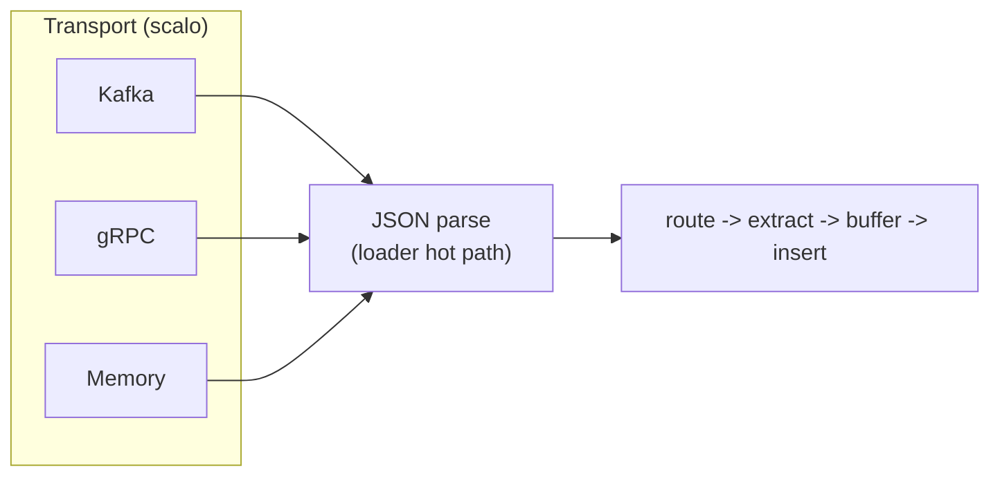

<!--
  Project:      dfe-loader
  File:         docs/transport/README.md
  Purpose:      Index for the transport layer docs (Kafka, gRPC, Memory)
  Language:     Markdown

  License:      BUSL-1.1
  Copyright:    (c) 2026 HYPERI PTY LIMITED
-->

# Transport

The transports themselves -- Kafka, gRPC and Memory -- are provided by
scalo. The loader does not implement them; it consumes the scalo
`Transport` trait and feeds whatever arrives into its parse stage, then on
through routing, extraction and the per-table insert path. Whichever transport
delivers a message, the bytes converge on the same hot path: refuse anything
not JSON, parse, route to `db.table`, promote schema columns, and buffer for
insert.

## In this section

- [GRPC.md](GRPC.md) -- the gRPC transport design: proto schema, config surface,
  client/server/bidirectional modes, K8s health and scaling, and the v1 -> v2
  mesh evolution.
- [COMMON-HEADER.md](COMMON-HEADER.md) -- the common header schema injected into
  every event table regardless of transport: full field reference, DDL, ORDER BY
  / PARTITION BY / codec / index design, and profiles.

See [../ARCHITECTURE.md](../ARCHITECTURE.md) for where the transport layer sits in
the overall system.
